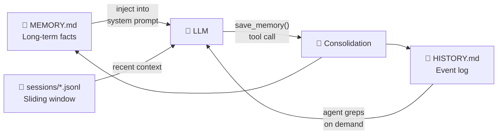
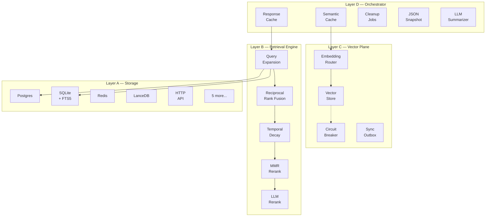
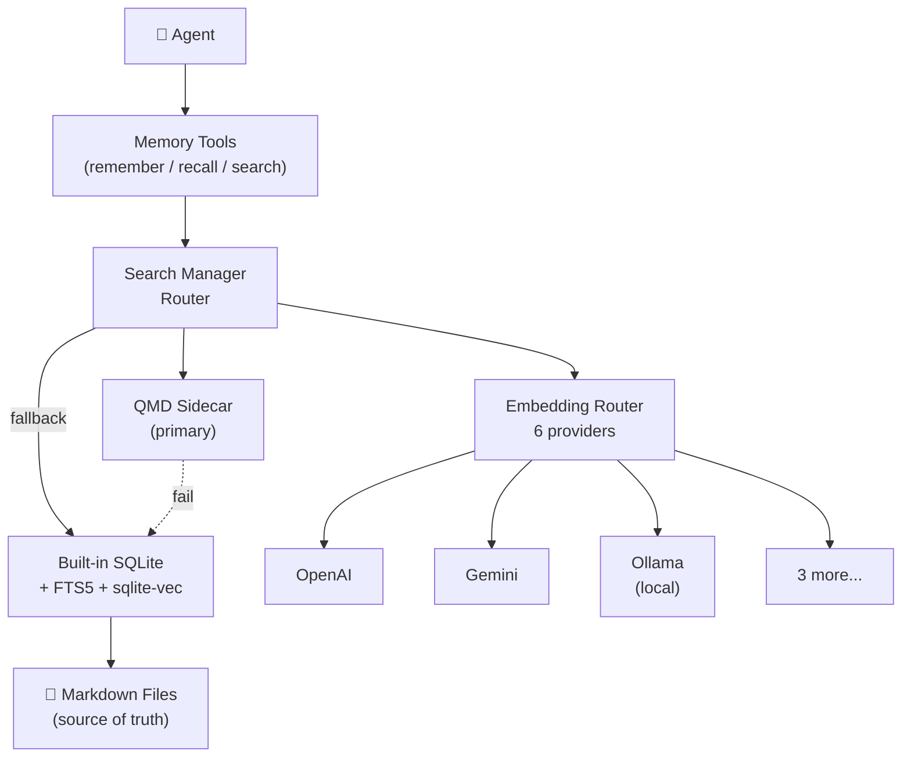
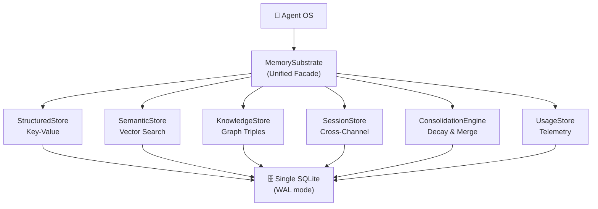
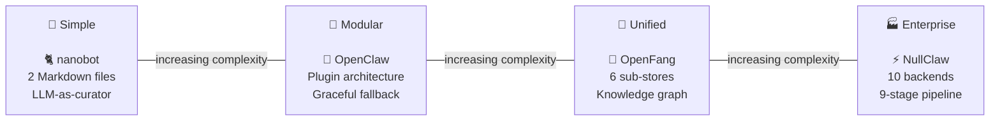

<p align="center">
  
  
  
  
</p>

<h1 align="center">🧠 How AI Agents Remember</h1>

<p align="center">
  <b>Reverse-engineered 4 open-source AI agent bot projects so you don't have to.</b><br/>
  Deep technical breakdowns of how nanobot, NullClaw, OpenClaw, and OpenFang implement persistent memory — architecture diagrams, data models, source-level analysis, and replication guides.
</p>

<p align="center">
  <a href="#featured-projects">Projects</a> •
  <a href="#why-this-exists">Why</a> •
  <a href="#the-4-systems">The 4 Systems</a> •
  <a href="#comparison">Comparison</a> •
  <a href="#quick-start">Quick Start</a> •
  <a href="#contributing">Contributing</a> •
  <a href="README.md">中文</a>
</p>

---

## Featured Projects

Deep source-level analysis was performed on these 4 open-source AI agent bot projects:

<table>
<tr>
<td align="center" valign="top" width="25%">
<p><a href="https://github.com/openclaw/openclaw"></a></p>
<p><a href="https://github.com/openclaw/openclaw"></a></p>
<p><sub>Personal AI Assistant</sub></p>
<p><a href="https://github.com/openclaw/openclaw"></a></p>
<p><sub>22+ Channels · Plugin Architecture</sub></p>
</td>
<td align="center" valign="top" width="25%">
<p><a href="https://github.com/HKUDS/nanobot"></a></p>
<p><a href="https://github.com/HKUDS/nanobot"></a></p>
<p><sub>Ultra-Lightweight AI Assistant</sub></p>
<p><a href="https://github.com/HKUDS/nanobot"></a></p>
<p><sub>~4,000 Lines · Minimalist</sub></p>
</td>
<td align="center" valign="top" width="25%">
<p><a href="https://github.com/nullclaw/nullclaw"></a></p>
<p><a href="https://github.com/nullclaw/nullclaw"></a></p>
<p><sub>678KB · &lt;2ms Startup</sub></p>
<p><a href="https://github.com/nullclaw/nullclaw"></a></p>
<p><sub>3,230+ Tests · 10 Storage Backends</sub></p>
</td>
<td align="center" valign="top" width="25%">
<p><a href="https://github.com/RightNow-AI/openfang"></a></p>
<p><a href="https://github.com/RightNow-AI/openfang"></a></p>
<p><sub>The Agent Operating System</sub></p>
<p><a href="https://github.com/RightNow-AI/openfang"></a></p>
<p><sub>137K LOC · Knowledge Graph</sub></p>
</td>
</tr>
</table>

> This is not another "AI Agent survey". Every line of memory-related code in these 4 projects was read, every data flow traced, and every design tradeoff documented.

---

## Why This Exists

Every AI agent product claims to have "memory". Few explain how it actually works.

Weeks were spent reading source code — Python, TypeScript, Zig, Rust — tracing every code path from "user sends a message" to "agent remembers it next week". Then it was all written down: the architecture, the data models, the retrieval pipelines, the edge cases, and the design tradeoffs.

**This repo is the missing manual for AI agent memory.**

Whether you're building your own agent framework, evaluating existing ones, or just curious about how persistent memory works under the hood — this is for you.

## What You Get

```
├── nanobot/           # 7 docs  — Python, two-layer memory, LLM-driven consolidation
├── nullclaw/          # 9 docs  — Zig, four-layer architecture, 10 storage backends
├── openclaw/          # 10 docs — TypeScript, plugin system, hybrid search
└── openfang/          # 10 docs — Rust, unified SQLite substrate, knowledge graph
```

Each project analysis includes:

- **Architecture Overview** — Layer diagrams, component relationships, data flow
- **Data Model** — Schemas, type definitions, storage formats
- **Storage & Retrieval** — How memories are written, indexed, and retrieved
- **Lifecycle Management** — Consolidation, decay, cleanup, migration
- **Replication Guide** — Step-by-step plan to rebuild it in your own stack

> 📐 All diagrams use **Mermaid** — render natively on GitHub, no images to maintain.

## The 4 Systems

### <a href="https://github.com/HKUDS/nanobot"></a> &nbsp; The Elegant Minimalist

> **Language:** Python &nbsp;|&nbsp; **~4,000 Lines** &nbsp;|&nbsp; **Philosophy:** *Markdown is memory*



Two Markdown files. That's it. `MEMORY.md` holds facts (injected into every prompt). `HISTORY.md` holds timestamped events (grep-searchable). When conversations get long, an LLM call extracts what matters and writes it back. Beautifully simple.

**Key insight:** The LLM is both the consumer and the curator of its own memory.

📄 [Architecture](nanobot/architecture.md) · [Data Model](nanobot/data-model.md) · [Consolidation](nanobot/consolidation.md) · [Context Injection](nanobot/context-injection.md) · [Implementation](nanobot/implementation.md) · [Replication Guide](nanobot/replication-guide.md)

---

### <a href="https://github.com/nullclaw/nullclaw"></a> &nbsp; The Enterprise Powerhouse

> **Language:** Zig &nbsp;|&nbsp; **678KB Binary** &nbsp;|&nbsp; **<2ms Startup** &nbsp;|&nbsp; **Philosophy:** *Every retrieval strategy, all at once*



10 pluggable storage backends. A 9-stage retrieval pipeline with query expansion, RRF fusion, temporal decay, and LLM reranking. Circuit breakers for embedding providers. Shadow/canary rollout for retrieval strategy changes. This is memory engineering at scale.

**Key insight:** Memory retrieval is a search engine problem — treat it like one.

📄 [Architecture](nullclaw/01-architecture.md) · [Data Model](nullclaw/02-data-model.md) · [Storage Backends](nullclaw/03-storage-backends.md) · [Retrieval Pipeline](nullclaw/04-retrieval-pipeline.md) · [Vector Plane](nullclaw/05-vector-plane.md) · [Lifecycle](nullclaw/06-lifecycle.md) · [Rollout](nullclaw/07-rollout-reliability.md) · [Replication Guide](nullclaw/08-replication-guide.md)

---

### <a href="https://github.com/openclaw/openclaw"></a> &nbsp; The Plugin Architect

> **Language:** TypeScript &nbsp;|&nbsp; **22+ Channels** &nbsp;|&nbsp; **Philosophy:** *Everything is a plugin, everything degrades gracefully*



Markdown files are the source of truth — databases are just indexes. A dual-engine architecture routes through an external QMD sidecar first, then falls back to built-in SQLite. Six embedding providers with automatic selection and graceful degradation. Memory is a plugin, not a monolith.

**Key insight:** Make Markdown files the canonical store. Databases rebuild from them.

📄 [Architecture](openclaw/01-architecture-overview.md) · [Data Model](openclaw/02-data-model.md) · [Indexing](openclaw/03-memory-indexing.md) · [Search Pipeline](openclaw/04-search-pipeline.md) · [Embeddings](openclaw/05-embedding-providers.md) · [Flush](openclaw/06-memory-flush.md) · [Plugins](openclaw/07-plugin-system.md) · [Config](openclaw/08-config-reference.md) · [Replication Guide](openclaw/09-replication-guide.md)

---

### <a href="https://github.com/RightNow-AI/openfang"></a> &nbsp; The Rust Substrate

> **Language:** Rust &nbsp;|&nbsp; **137K LOC** &nbsp;|&nbsp; **1,767+ Tests** &nbsp;|&nbsp; **Philosophy:** *One database to rule them all*



Six logical sub-stores — KV, semantic search, knowledge graph, cross-channel sessions, memory consolidation with decay, and usage telemetry — all sharing a single SQLite database through `Arc<Mutex<Connection>>`. Seven schema migrations run at startup. Zero external dependencies.

**Key insight:** A knowledge graph + memory decay engine is what separates "remembering" from "storing".

📄 [Architecture](openfang/01-architecture-overview.md) · [Data Model](openfang/02-data-model.md) · [Storage Layers](openfang/03-storage-layers.md) · [Schema Migration](openfang/04-schema-migration.md) · [Embedding Search](openfang/05-embedding-search.md) · [Canonical Session](openfang/06-canonical-session.md) · [Tool Integration](openfang/07-tool-integration.md) · [Replication Guide](openfang/08-replication-guide.md) · [Runtime Flow](openfang/09-runtime-memory-flow.md)

---

## Comparison

| | <a href="https://github.com/HKUDS/nanobot">🐱 nanobot</a> | <a href="https://github.com/nullclaw/nullclaw">⚡ NullClaw</a> | <a href="https://github.com/openclaw/openclaw">🦞 OpenClaw</a> | <a href="https://github.com/RightNow-AI/openfang">🐍 OpenFang</a> |
|---|---|---|---|---|
| **Language** | Python | Zig | TypeScript | Rust |
| **Storage** | Markdown files | 10 backends (SQLite, PG, Redis...) | SQLite + LanceDB + Markdown | Single SQLite |
| **Vector Search** | ❌ grep only | ✅ Multi-provider + circuit breaker | ✅ 6 providers + fallback | ✅ Cosine similarity (BLOB) |
| **Knowledge Graph** | ❌ | ❌ | ❌ | ✅ Triple store |
| **Memory Decay** | ❌ | ✅ Temporal decay scoring | ❌ | ✅ Confidence decay (7d) |
| **LLM Consolidation** | ✅ Core feature | ✅ Summarizer | ✅ Flush mechanism | ✅ ConsolidationEngine |
| **Cross-Channel** | Shared per workspace | Per session | Per workspace | ✅ CanonicalSession |
| **Complexity** | ⭐ | ⭐⭐⭐⭐⭐ | ⭐⭐⭐ | ⭐⭐⭐⭐ |
| **Best For** | Prototyping, simplicity | Enterprise, scale | Plugin ecosystems | Embedded, Rust stacks |

### The Spectrum



## Quick Start

Clone and browse — all docs render natively on GitHub:

```bash
git clone https://github.com/YOUR_ORG/agent-memory-anatomy.git
cd agent-memory-anatomy
```

**Start here based on your goal:**

| I want to... | Start with |
|---|---|
| Build memory in a weekend | [nanobot/architecture.md](nanobot/architecture.md) |
| Understand vector retrieval | [nullclaw/04-retrieval-pipeline.md](nullclaw/04-retrieval-pipeline.md) |
| Design a plugin-based system | [openclaw/07-plugin-system.md](openclaw/07-plugin-system.md) |
| Build a knowledge graph | [openfang/03-storage-layers.md](openfang/03-storage-layers.md) |
| Compare all approaches | [This page ↑](#comparison) |
| Replicate in LangGraph / Python | Any `replication-guide.md` |

## Lessons from Reverse Engineering

After reading thousands of lines of agent memory code across 4 languages, here are the universal patterns:

1. **Every system has two clocks** — Short-term (session/conversation) and long-term (persisted facts). The difference is how they bridge the two.

2. **LLM-as-curator is the winning pattern** — All 4 systems use the LLM itself to decide what's worth remembering. Rule-based extraction doesn't scale.

3. **The retrieval problem is harder than the storage problem** — Storing memories is easy. Getting the *right* memory at the *right* time is the real challenge. nullclaw's 9-stage pipeline is evidence of this.

4. **Graceful degradation is non-negotiable** — Embeddings fail. Databases corrupt. Every production system needs a fallback path (openclaw's dual-engine, nullclaw's circuit breaker).

5. **Memory decay matters more than you think** — Without decay, old irrelevant memories crowd out new important ones. openfang's confidence-based decay is the most sophisticated approach found.

## Acknowledgments

Thanks to these open-source projects and communities whose excellent engineering made this analysis possible:

- [🦞 **OpenClaw**](https://github.com/openclaw/openclaw) — The most feature-complete personal AI assistant, 22+ channels · [Website](https://openclaw.ai) · [Docs](https://docs.openclaw.ai)
- [🐱 **nanobot**](https://github.com/HKUDS/nanobot) — OpenClaw-inspired minimalist AI assistant, ~4,000 lines · [PyPI](https://pypi.org/project/nanobot-ai/)
- [⚡ **NullClaw**](https://github.com/nullclaw/nullclaw) — 678KB Zig static binary, <2ms cold start · [Website](https://nullclaw.io) · [Docs](https://nullclaw.github.io)
- [🐍 **OpenFang**](https://github.com/RightNow-AI/openfang) — Rust Agent OS, 137K LOC · [Website](https://openfang.sh) · [Docs](https://openfang.sh/docs)

> **Disclaimer:** This documentation is based on technical analysis of publicly available source code, for learning and research purposes only. All code copyrights belong to their respective project owners.

## Contributing

Found an error? Want to add analysis of another project? PRs welcome!

- **Add a project:** Create `{project-name}/` with at minimum `README.md` and architecture docs
- **Fix an error:** Open a PR with the correction and a link to the relevant source code
- **Improve diagrams:** All diagrams use Mermaid — edit the markdown directly

## License

MIT — Use this knowledge freely. Build something amazing.

---

<p align="center">
  <i>If this helped you understand how AI agents remember, consider giving it a ⭐</i><br/><br/>
  <b>Built by humans who read a lot of source code so you don't have to.</b>
</p>
