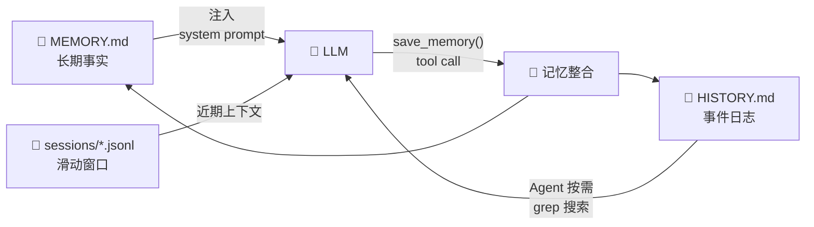
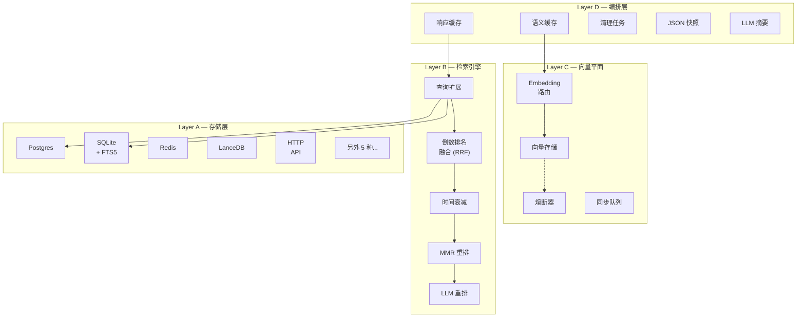
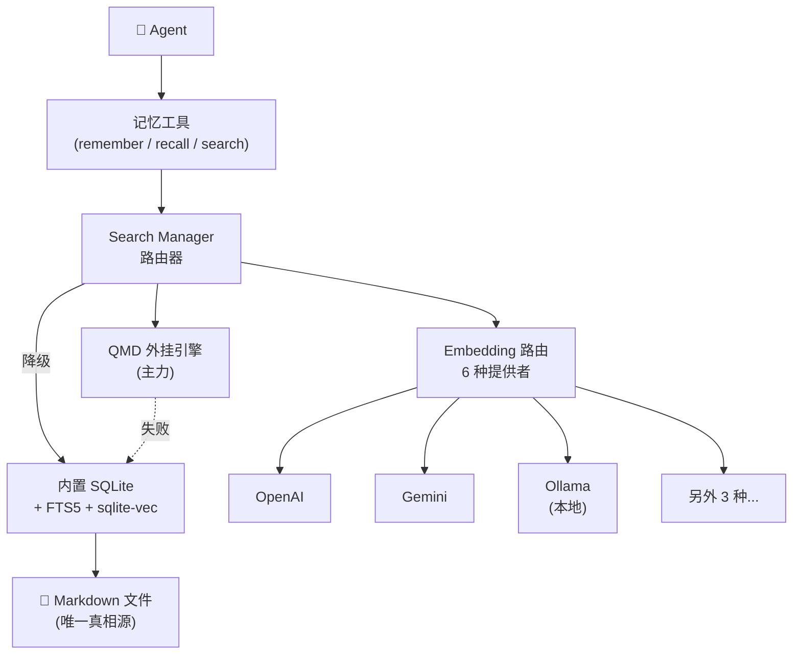
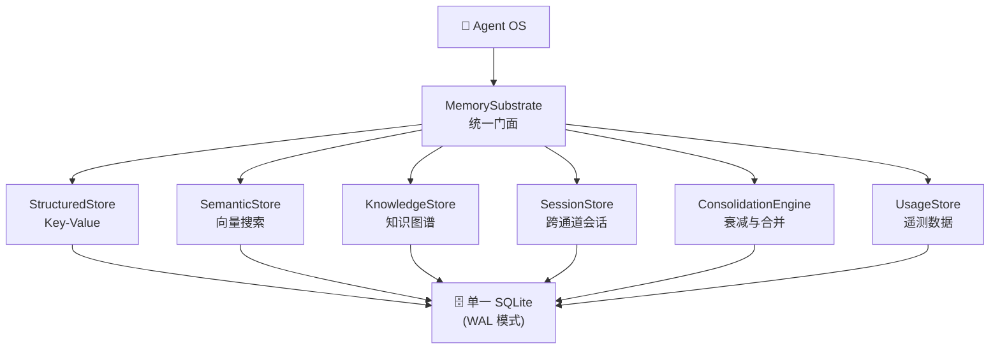
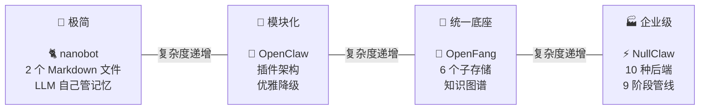

<p align="center">
  
  
  
  
</p>

<h1 align="center">🧠 AI Agent 是怎么"记住"事情的</h1>

<p align="center">
  <b>逆向工程 4 个火爆的、基于 AI Agent 的开源 Bot 项目，源码级拆解记忆系统的每一个细节。</b><br/>
  从 2 个 Markdown 文件到 10 种存储后端、9 阶段检索管线、知识图谱 —— 一次看透。
</p>

<p align="center">
  <a href="#涉及的开源项目">涉及项目</a> •
  <a href="#这是什么">这是什么</a> •
  <a href="#四大记忆系统">四大系统</a> •
  <a href="#横向对比">横向对比</a> •
  <a href="#从哪里开始读">从哪开始</a> •
  <a href="#逆向过程中学到了什么">逆向过程中学到了什么</a> •
  <a href="README.en.md">English</a>
</p>

---

## 涉及的开源项目

本文档深度分析了以下 4 个基于 AI Agent 的开源 Bot 项目的记忆系统实现：

<table>
<tr>
<td align="center" valign="top" width="25%">
<p><a href="https://github.com/openclaw/openclaw"></a></p>
<p><a href="https://github.com/openclaw/openclaw"></a></p>
<p><sub>Personal AI Assistant</sub></p>
<p><a href="https://github.com/openclaw/openclaw"></a></p>
<p><sub>22+ 渠道 · 插件架构</sub></p>
</td>
<td align="center" valign="top" width="25%">
<p><a href="https://github.com/HKUDS/nanobot"></a></p>
<p><a href="https://github.com/HKUDS/nanobot"></a></p>
<p><sub>Ultra-Lightweight AI Assistant</sub></p>
<p><a href="https://github.com/HKUDS/nanobot"></a></p>
<p><sub>~4,000 行 · 极简主义</sub></p>
</td>
<td align="center" valign="top" width="25%">
<p><a href="https://github.com/nullclaw/nullclaw"></a></p>
<p><a href="https://github.com/nullclaw/nullclaw"></a></p>
<p><sub>678KB · &lt;2ms Startup</sub></p>
<p><a href="https://github.com/nullclaw/nullclaw"></a></p>
<p><sub>3,230+ 测试 · 10 存储后端</sub></p>
</td>
<td align="center" valign="top" width="25%">
<p><a href="https://github.com/RightNow-AI/openfang"></a></p>
<p><a href="https://github.com/RightNow-AI/openfang"></a></p>
<p><sub>The Agent Operating System</sub></p>
<p><a href="https://github.com/RightNow-AI/openfang"></a></p>
<p><sub>137K LOC · 知识图谱</sub></p>
</td>
</tr>
</table>

> 这不是又一份"AI Agent 综述"。分析这 4 个项目的每一行记忆相关代码，画出了每一条数据流，记录了每一个设计取舍。

---

## 这是什么

每个基于 AI Agent 的产品都宣称自己有"记忆"能力。但几乎没人解释它到底是怎么实现的。

爆肝 —— 追踪从"用户发送消息"到"Agent 下周还记得"的每一条代码路径。然后把它全部写了下来。

```
├── nanobot/           # 7 篇  — Python，两层记忆，LLM 驱动整合
├── nullclaw/          # 9 篇  — Zig，四层架构，10 种存储后端
├── openclaw/          # 10 篇 — TypeScript，插件体系，混合搜索
└── openfang/          # 10 篇 — Rust，统一 SQLite 底座，知识图谱
```

每个项目的分析都包含：

| 内容 | 说明 |
|------|------|
| **架构总览** | 分层图、组件关系、数据流 |
| **数据模型** | Schema 定义、类型结构、存储格式 |
| **存储与检索** | 记忆怎么写入、索引、检索 |
| **生命周期管理** | 整合、衰减、清理、迁移 |
| **复刻指南** | 在你自己的技术栈中重建的分步方案 |

> 📐 所有架构图均使用 **Mermaid** 绘制，GitHub 原生渲染，无需维护图片文件。

---

## 四大记忆系统

### <a href="https://github.com/HKUDS/nanobot"></a> &nbsp; 极简优雅派

> **语言：** Python &nbsp;|&nbsp; **代码量：** ~4,000 行 &nbsp;|&nbsp; **哲学：** *Markdown 就是记忆*



两个 Markdown 文件，搞定。`MEMORY.md` 存事实（每次对话全量注入 prompt），`HISTORY.md` 存事件日志（用 grep 搜索）。对话变长时，一次 LLM 调用提取关键信息写回文件。简洁到极致。

**核心洞察：** LLM 既是记忆的消费者，也是记忆的策展人。

📄 [架构](nanobot/architecture.md) · [数据模型](nanobot/data-model.md) · [整合机制](nanobot/consolidation.md) · [上下文注入](nanobot/context-injection.md) · [实现细节](nanobot/implementation.md) · [复刻指南](nanobot/replication-guide.md)

---

### <a href="https://github.com/nullclaw/nullclaw"></a> &nbsp; 企业级重炮

> **语言：** Zig &nbsp;|&nbsp; **二进制：** 678KB &nbsp;|&nbsp; **启动：** <2ms &nbsp;|&nbsp; **哲学：** *所有检索策略，一个都不能少*



10 种可插拔存储后端。9 阶段检索管线（查询扩展 → RRF 融合 → 时间衰减 → LLM 重排序）。Embedding 提供者的熔断保护。检索策略的 Shadow/Canary 灰度发布。这是工程化到极致的记忆系统。

**核心洞察：** 记忆检索本质上是搜索引擎问题 —— 就应该按搜索引擎的方式来做。

📄 [架构](nullclaw/01-architecture.md) · [数据模型](nullclaw/02-data-model.md) · [存储后端](nullclaw/03-storage-backends.md) · [检索管线](nullclaw/04-retrieval-pipeline.md) · [向量平面](nullclaw/05-vector-plane.md) · [生命周期](nullclaw/06-lifecycle.md) · [灰度发布](nullclaw/07-rollout-reliability.md) · [复刻指南](nullclaw/08-replication-guide.md)

---

### <a href="https://github.com/openclaw/openclaw"></a> &nbsp; 插件架构师

> **语言：** TypeScript &nbsp;|&nbsp; **渠道：** 22+ &nbsp;|&nbsp; **哲学：** *一切皆插件，一切可降级*



Markdown 文件是唯一真相源 —— 数据库只是索引。双引擎架构优先走 QMD 外挂进程，失败自动降级到内置 SQLite。6 种 Embedding 提供者自动选择、优雅降级。记忆是插件，不是铁板一块。

**核心洞察：** 让 Markdown 文件做规范存储，数据库随时可以从它们重建。

📄 [架构](openclaw/01-architecture-overview.md) · [数据模型](openclaw/02-data-model.md) · [索引构建](openclaw/03-memory-indexing.md) · [搜索管线](openclaw/04-search-pipeline.md) · [Embedding](openclaw/05-embedding-providers.md) · [记忆刷写](openclaw/06-memory-flush.md) · [插件体系](openclaw/07-plugin-system.md) · [配置参考](openclaw/08-config-reference.md) · [复刻指南](openclaw/09-replication-guide.md)

---

### <a href="https://github.com/RightNow-AI/openfang"></a> &nbsp; Rust 底座

> **语言：** Rust &nbsp;|&nbsp; **代码量：** 137K LOC &nbsp;|&nbsp; **测试：** 1,767+ &nbsp;|&nbsp; **哲学：** *一个数据库统治一切*



6 个逻辑子存储 —— KV、语义搜索、知识图谱、跨通道会话、记忆衰减整合、用量遥测 —— 全部共享一个 SQLite 数据库（`Arc<Mutex<Connection>>`）。7 次 Schema 迁移在启动时自动执行。零外部依赖。

**核心洞察：** 知识图谱 + 记忆衰减引擎，是"记住"和"存储"之间的本质区别。

📄 [架构](openfang/01-architecture-overview.md) · [数据模型](openfang/02-data-model.md) · [存储层](openfang/03-storage-layers.md) · [Schema 迁移](openfang/04-schema-migration.md) · [向量搜索](openfang/05-embedding-search.md) · [跨通道会话](openfang/06-canonical-session.md) · [工具集成](openfang/07-tool-integration.md) · [复刻指南](openfang/08-replication-guide.md) · [运行时流程](openfang/09-runtime-memory-flow.md)

---

## 横向对比

| | <a href="https://github.com/HKUDS/nanobot">🐱 nanobot</a> | <a href="https://github.com/nullclaw/nullclaw">⚡ NullClaw</a> | <a href="https://github.com/openclaw/openclaw">🦞 OpenClaw</a> | <a href="https://github.com/RightNow-AI/openfang">🐍 OpenFang</a> |
|---|---|---|---|---|
| **语言** | Python | Zig | TypeScript | Rust |
| **存储方式** | Markdown 文件 | 10 种后端 | SQLite + LanceDB + MD | 单一 SQLite |
| **向量搜索** | ❌ 仅 grep | ✅ 多提供者 + 熔断 | ✅ 6 种提供者 + 降级 | ✅ 余弦 (BLOB) |
| **知识图谱** | ❌ | ❌ | ❌ | ✅ 三元组存储 |
| **记忆衰减** | ❌ | ✅ 时间衰减 | ❌ | ✅ 置信度衰减 |
| **LLM 整合** | ✅ 核心特性 | ✅ 摘要器 | ✅ 刷写机制 | ✅ 整合引擎 |
| **跨通道** | workspace 共享 | session 隔离 | workspace 共享 | ✅ CanonicalSession |
| **复杂度** | ⭐ | ⭐⭐⭐⭐⭐ | ⭐⭐⭐ | ⭐⭐⭐⭐ |
| **适合场景** | 快速原型 | 企业级 | 插件生态 | 嵌入式 |

### 复杂度光谱



---

## 从哪里开始读

| 我想… | 从这里开始 |
|---|---|
| 一个周末搭出记忆系统 | [nanobot/架构](nanobot/architecture.md) |
| 理解向量检索怎么做 | [NullClaw/检索管线](nullclaw/04-retrieval-pipeline.md) |
| 设计插件化的记忆系统 | [OpenClaw/插件体系](openclaw/07-plugin-system.md) |
| 构建知识图谱 | [OpenFang/存储层](openfang/03-storage-layers.md) |
| 对比所有方案 | [本页 ↑](#横向对比) |
| 在 LangGraph / Python 里复刻 | 任意 `replication-guide.md` |

---

## 逆向过程中学到了什么

 4 种语言、数千行 Agent 记忆代码后，这是提炼的 5 条通用规律：

### 1. 每个系统都有两个时钟

短期的（会话/对话）和长期的（持久化事实）。区别只在于——它们怎么在两者之间架桥。

### 2. "LLM 自己管记忆"是最优解

4 个系统全都用 LLM 自身来决定什么值得记住。基于规则的提取扛不住复杂场景。

### 3. 检索比存储难 10 倍

存记忆很简单。在正确的时间取出正确的记忆——这才是真正的挑战。NullClaw 的 9 阶段管线就是证据。

### 4. 优雅降级是刚需

Embedding 会挂。数据库会坏。每个生产系统都需要一条兜底路径（OpenClaw 的双引擎、NullClaw 的熔断器）。

### 5. 记忆衰减比你想象的重要

没有衰减，旧的无关记忆会挤掉新的重要记忆。OpenFang 基于置信度的衰减是见过最精巧的方案之一。

---

## 致谢

感谢以下开源项目和社区，它们的优秀工程实践是本文档的分析基础：

- [🦞 **OpenClaw**](https://github.com/openclaw/openclaw) — 功能最全面的个人 AI 助手，22+ 渠道支持 · [官网](https://openclaw.ai) · [文档](https://docs.openclaw.ai)
- [🐱 **nanobot**](https://github.com/HKUDS/nanobot) — 受 OpenClaw 启发的极简 AI 助手，~4,000 行代码 · [PyPI](https://pypi.org/project/nanobot-ai/)
- [⚡ **NullClaw**](https://github.com/nullclaw/nullclaw) — 678KB Zig 静态二进制，<2ms 冷启动 · [官网](https://nullclaw.io) · [文档](https://nullclaw.github.io)
- [🐍 **OpenFang**](https://github.com/RightNow-AI/openfang) — Rust Agent OS，137K LOC · [官网](https://openfang.sh) · [文档](https://openfang.sh/docs)

> **免责声明：** 本文档基于公开源码的技术分析，仅用于学习和研究目的。所有代码版权归原项目所有者。

## 贡献

发现错误？想补充其他项目的分析？欢迎 PR！

- **添加项目分析：** 创建 `{项目名}/` 目录，至少包含 `README.md` 和架构文档
- **修正错误：** 提交 PR 并附上相关源码链接
- **改进架构图：** 所有图都用 Mermaid —— 直接编辑 Markdown 即可

## 多语言

- **English** → [README.en.md](README.en.md)

## 许可证

MIT — 自由使用这些知识，去构建了不起的东西。

---

<p align="center">
  <i>如果这份文档帮你理解了 AI Agent 的记忆机制，请给个 ⭐</i><br/><br/>
  <b>由读了很多源码的人类编写，省得你再读一遍。</b>
</p>
