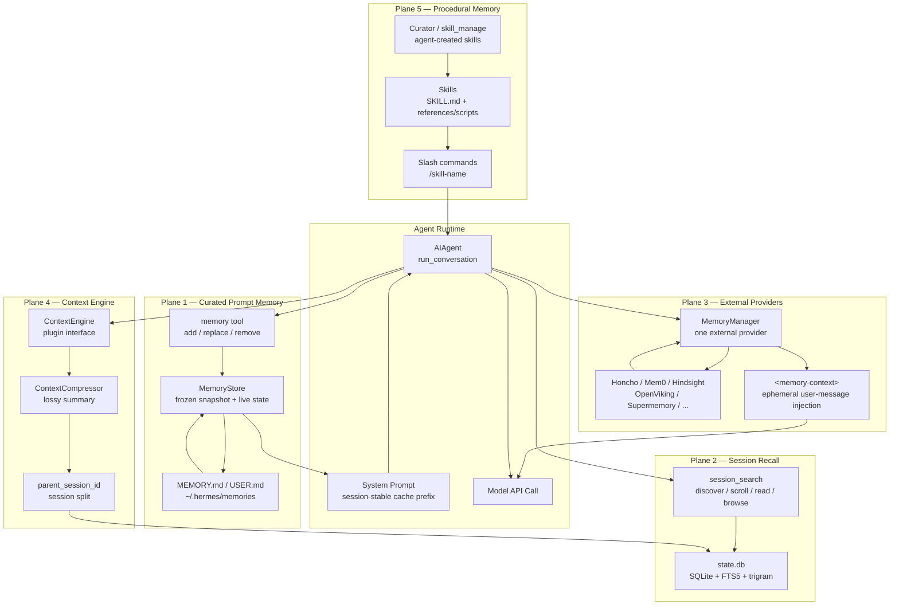
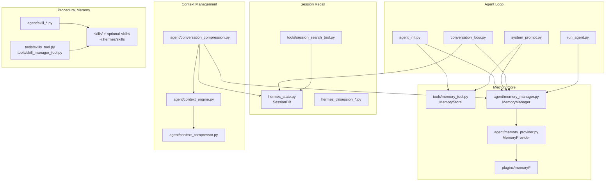

# 01 - 架构概览

## 系统定位

Hermes Agent 是一个跨 CLI、TUI、Desktop、Gateway（Telegram/Discord/Slack 等）运行的个人 AI Agent。它的“记忆”不是单一数据库，而是五条互补的记忆平面：

1. **内置事实记忆**：`MEMORY.md` / `USER.md`，小容量、手工策展、每个 session 注入 prompt。
2. **会话回忆**：`state.db` 持久化完整对话，`session_search` 用 FTS5 按需检索。
3. **外部记忆 Provider**：Honcho、Mem0、Hindsight、Supermemory 等插件，提供语义搜索、知识图谱或用户建模。
4. **上下文压缩记忆**：超长会话通过摘要压缩和 session lineage 延续上下文。
5. **技能型程序记忆**：Skills 保存可复用流程和操作知识，按需渐进加载。

## 五条记忆平面

| 平面 | 存储 | 读取时机 | 写入时机 | 适合保存 |
|------|------|----------|----------|----------|
| 内置事实记忆 | `~/.hermes/memories/MEMORY.md`, `USER.md` | session 启动时注入 system prompt | Agent 调用 `memory` tool | 用户偏好、环境事实、项目约定 |
| 会话回忆 | `~/.hermes/state.db` | Agent 调用 `session_search` | 每轮对话 flush 到 DB | 过去对话、任务过程、决策上下文 |
| 外部 Provider | Provider 自己的后端 | 每轮 prefetch，注入当前 user message | 每轮完成后 async sync，session end hooks | 语义记忆、知识图谱、用户模型 |
| 上下文压缩 | 新旧 session + 摘要消息 | 当前长会话继续运行时 | 上下文接近阈值时 | 被压缩掉的中段对话要点 |
| Skills | `~/.hermes/skills/` | `/skill` 或 `skill_view` 按需加载 | Agent 创建/修订 skill | 程序、流程、排错套路 |

## 模块分层

## 关键设计原则

| 原则 | Hermes 的实现 |
|------|---------------|
| **Prompt cache 优先** | 内置记忆只在 session 启动注入；外部 recall 放到当前 user message copy；system prompt 不在普通 turn 中变动 |
| **窄内核，能力在边缘** | 外部记忆、ContextEngine、model provider、技能都通过插件/文件扩展，而不是扩大核心 tool surface |
| **事实记忆小而精** | `MEMORY.md` 2,200 chars，`USER.md` 1,375 chars，超限时要求 Agent 自己整理 |
| **历史回忆按需拉取** | 完整 session 不进 prompt，只通过 FTS5 搜索窗口读取 |
| **Provider best-effort** | 外部 Provider 失败只记录日志，不阻塞 Agent 响应 |
| **边界事件显式化** | session end、session switch、pre-compress、memory write 都有 Provider hook |
| **安全优先** | 记忆写入扫描、加载时扫描、上下文 fencing、stream scrubber、防漂移备份 |

## 为什么 Hermes 不做“一个记忆数据库”

Hermes 的设计目标不是把所有东西都塞进一个向量库，而是把不同类型的“记住”放到不同载体：

| 记忆类型 | 如果塞进同一个库的问题 | Hermes 的拆法 |
|----------|----------------------|----------------|
| 用户偏好 | 检索漏召会导致每次都忘 | 小容量 prompt snapshot，始终可见 |
| 过去任务过程 | 全量注入太贵，摘要会丢细节 | SQLite 原文保留，FTS5 按需 scroll |
| 语义用户模型 | 内置实现会绑定特定后端 | Provider 插件，用户按需选择 |
| 超长上下文 | 需要改变当前 conversation | ContextEngine 作为唯一允许改上下文的边界 |
| 操作流程 | 事实记忆无法表达脚本和模板 | Skill 文件树 + 渐进披露 |

**核心洞察：** Hermes 把“记忆”拆成 prompt-stable facts、query-time transcripts、plugin-backed models、compression summaries、procedural skills 五种形态，然后用严格的边界规则防止它们互相污染。
