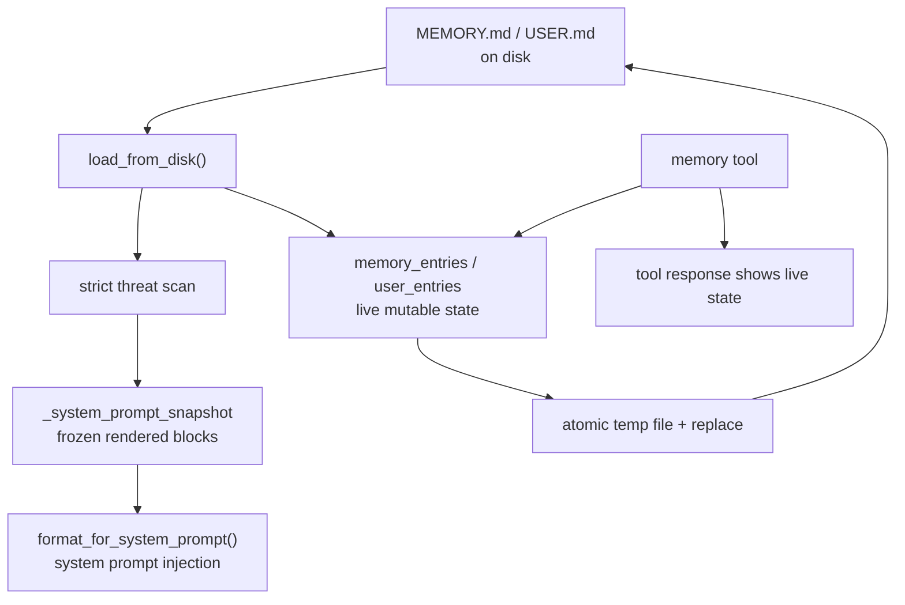
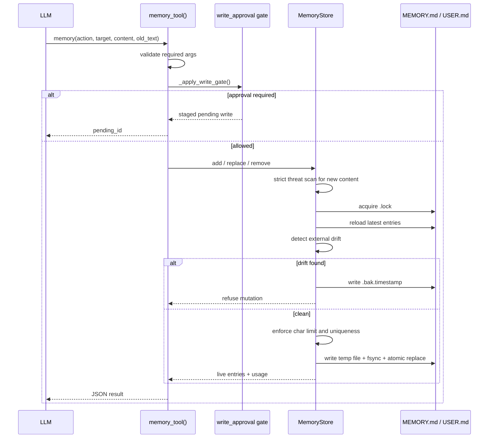

# 02 - 内置事实记忆

## 两个文件

Hermes 内置记忆由两个 Markdown 文件组成：

| 文件 | 目标 | 默认容量 | 内容 |
|------|------|----------|------|
| `MEMORY.md` | `target="memory"` | 2,200 chars | Agent 的个人笔记：环境事实、项目约定、工具怪癖、稳定经验 |
| `USER.md` | `target="user"` | 1,375 chars | 用户画像：偏好、沟通风格、身份、工作习惯 |

路径是 profile-scoped 的：`get_hermes_home() / "memories"`。默认 profile 下通常是 `~/.hermes/memories/`，但多 profile 会变成各自独立的 `HERMES_HOME`。

## MemoryStore 的双状态模型

`tools/memory_tool.py` 的 `MemoryStore` 同时维护两份状态：



| 状态 | 是否中途变化 | 用途 |
|------|--------------|------|
| `_system_prompt_snapshot` | 普通 turn 不变 | 注入 system prompt，保护 prompt cache |
| `memory_entries` / `user_entries` | tool 写入后立即变 | tool 响应、磁盘持久化 |

### 冻结快照规则

普通对话中，Agent 写入内置记忆后：

1. 文件立即落盘。
2. tool response 立即显示新状态。
3. 当前 session 的 system prompt 不变。
4. 下一个 session 启动时重新读取。

唯一例外是**上下文压缩边界**。压缩会主动 invalidate 并重建 system prompt，这是 Hermes 允许变更缓存前缀的少数路径之一，因此压缩后会重新读取内置记忆。

## System Prompt 格式

`format_for_system_prompt()` 返回加载时冻结的渲染块：

```text
══════════════════════════════════════════════
MEMORY (your personal notes) [67% — 1,474/2,200 chars]
══════════════════════════════════════════════
Project uses pnpm and Vitest; run npm test only in ui-tui.
§
Docker daemon is unavailable in this profile.
```

格式包含：

- store 名称：`MEMORY` 或 `USER PROFILE`
- 当前容量百分比和字符数
- `§` 分隔的多行 entry

`§` 是 entry delimiter，不是 Markdown 标题。这样可以让 Agent 做 substring replace/remove，而不依赖 ID。

## memory Tool

Hermes 暴露单个 `memory` tool，通过 `action` 参数区分操作：

| action | 参数 | 行为 |
|--------|------|------|
| `add` | `target`, `content` | 追加新 entry，拒绝空内容、重复内容、注入内容、超容量内容 |
| `replace` | `target`, `old_text`, `content` | 用唯一 substring 找到 entry 并替换 |
| `remove` | `target`, `old_text` | 用唯一 substring 找到 entry 并删除 |

没有 `read` action。读取依赖 system prompt 注入；如果写入失败，tool response 会返回 `current_entries` 帮助 Agent 当场整理。

## 写入流程



## 容量控制

Hermes 不自动压缩内置记忆。超限时，tool 明确失败并要求 Agent 在同一 turn 中整理：

```json
{
  "success": false,
  "error": "Memory at 2,100/2,200 chars. Adding this entry (250 chars) would exceed the limit. Consolidate now...",
  "current_entries": ["..."],
  "usage": "2,100/2,200"
}
```

这是一种很刻意的设计：自动删旧 entry 很容易删掉用户真正重要的偏好。Hermes 让 LLM 自己基于 `current_entries` 做语义合并或删除。

## 加载时安全扫描

内置记忆会进入 system prompt，所以 Hermes 在两个时机扫描：

| 时机 | 行为 |
|------|------|
| 写入前 | `add` / `replace` 的新内容命中 strict threat pattern 时直接拒绝 |
| 加载时 | 如果磁盘上已有恶意 entry，不删除原文，但在 prompt snapshot 中替换为 `[BLOCKED: ...]` 占位 |

加载时保留 live raw entry 是为了让用户仍能通过工具看到并删除被污染的内容；静默丢弃反而会隐藏攻击。

## 外部漂移保护

`MemoryStore` 假设文件是工具写出的 `§` 分隔 entry 列表。如果 patch 工具、shell append、手工编辑或另一个 session 写入了不符合 round-trip 的内容，下一次写入会：

1. 读取原始文件。
2. 判断 round-trip 是否一致，以及单个 entry 是否超过 store 总容量。
3. 写 `.bak.<timestamp>` 备份。
4. 拒绝本次 mutation。

这是为了防止工具在重写文件时把外部追加的内容悄悄覆盖掉。

## 设计取舍

| 选择 | 好处 | 代价 |
|------|------|------|
| 小 Markdown 文件 | 可读、可手工恢复、无外部依赖 | 容量很小，不适合历史查询 |
| 冻结 prompt snapshot | prefix cache 稳定，成本低 | 本 session 普通 turn 看不到刚写入的 prompt 注入效果 |
| substring replace/remove | 无需 ID，LLM 易用 | 多条相似 entry 需要更具体 `old_text` |
| 不自动压缩 | 不误删重要记忆 | Agent 需要在超限时主动整理 |
| strict 扫描 | 降低 prompt 注入持久化风险 | 偶尔可能误拒绝，需要用户重写 |

**核心洞察：** Hermes 的内置记忆不是“长期数据库”，而是一个受 prompt cache 约束的小型事实缓存。它追求稳定、可审计、低成本，而把大规模检索交给 session search 和外部 Provider。
