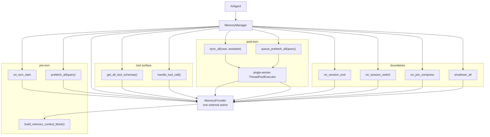

# 03 - 外部记忆 Provider 插件

## 为什么需要 Provider

内置 `MEMORY.md` / `USER.md` 只能保存极少量“必须始终在上下文里”的事实。Hermes 用外部 Memory Provider 承载更重的能力：

- 语义搜索
- 自动事实抽取
- 长期用户建模
- 知识图谱
- 跨 session 上下文
- Provider 自带工具（profile/search/reasoning 等）

但 Provider 不替换内置记忆，而是与它并行运行。

## MemoryProvider ABC

`agent/memory_provider.py` 定义了外部 Provider 的最小接口：

```python
class MemoryProvider(ABC):
    @property
    def name(self) -> str: ...

    def is_available(self) -> bool: ...
    def initialize(self, session_id: str, **kwargs) -> None: ...
    def system_prompt_block(self) -> str: ...
    def prefetch(self, query: str, *, session_id: str = "") -> str: ...
    def queue_prefetch(self, query: str, *, session_id: str = "") -> None: ...
    def sync_turn(self, user_content: str, assistant_content: str, *, session_id: str = "", messages=None) -> None: ...
    def get_tool_schemas(self) -> list[dict]: ...
    def handle_tool_call(self, tool_name: str, args: dict, **kwargs) -> str: ...
    def shutdown(self) -> None: ...
```

可选生命周期 hooks：

| Hook | 触发时机 | 用途 |
|------|----------|------|
| `on_turn_start` | 每轮开始 | 计数、维护 scope、周期任务 |
| `on_session_end` | CLI exit、reset、gateway expiry、压缩前旧 session 结束 | end-of-session 抽取或 flush |
| `on_session_switch` | `/resume`、`/branch`、`/new`、压缩导致 session_id 旋转 | 刷新 Provider 内部 session/document 缓存 |
| `on_pre_compress` | 上下文被压缩丢弃前 | 提取要保留到摘要里的 Provider insight |
| `on_memory_write` | 内置 `memory` tool 成功写入后 | 镜像用户画像或事实到外部后端 |
| `on_delegation` | 父 Agent 收到 subagent 结果时 | 把 delegation 观察写入父 Provider |

`initialize()` 的 kwargs 很关键：`hermes_home`、`platform`、`agent_context`、`agent_identity`、`agent_workspace`、`parent_session_id`、`user_id`、`chat_id`、`thread_id` 等都用于 Provider 做 profile / user / chat 级隔离。

## MemoryManager 编排

`agent/memory_manager.py` 是外部记忆的唯一编排层。



## 一次只允许一个外部 Provider

Hermes 明确拒绝第二个非 `builtin` Provider：

| 原因 | 说明 |
|------|------|
| Tool schema 膨胀 | 每个 Provider 可能暴露多个工具，都会进入每次 API call |
| Recall 冲突 | 多个后端可能返回相互矛盾的用户模型 |
| 写入语义不一致 | 同一 turn 同步到多个后端，故障和重试语义复杂 |
| 配置 UX | `memory.provider` 单值选择，用户知道当前到底启用了谁 |

内置 `MEMORY.md` / `USER.md` 不算外部 Provider，它始终可以和一个外部 Provider 并存。

## Prefetch：召回如何进入模型

外部 Provider 的召回结果不进入 system prompt，而是 API-call-time 注入当前 user message 的 copy：

```mermaid
sequenceDiagram
    participant User as User message
    participant MM as MemoryManager
    participant P as Provider
    participant Loop as conversation_loop.py
    participant API as LLM API

    User->>MM: prefetch_all(query)
    MM->>P: prefetch(query, session_id)
    P-->>MM: recalled context
    MM-->>Loop: raw context
    Loop->>Loop: build_memory_context_block()
    Loop->>API: user content + <memory-context> block
    Note over Loop: original messages list is not mutated
```

包装格式：

```text
<memory-context>
[System note: The following is recalled memory context, NOT new user input...]

...
</memory-context>
```

这解决两个问题：

1. **不破坏 prompt cache**：system prompt bytes 仍然稳定。
2. **不污染持久 session**：`messages` 原始列表不写入这段 recall。

## Context Fencing 和 Scrubbing

Provider 输出可能包含 `<memory-context>`，甚至流式输出可能把内部 context 泄漏给用户。Hermes 在 `MemoryManager` 中做两层防护：

| 组件 | 作用 |
|------|------|
| `sanitize_context()` | 去掉 Provider 返回文本中的内部 fence 和 system note |
| `StreamingContextScrubber` | 跨 stream delta 的状态机，防止 split tag 泄漏 |

这说明 Hermes 把外部 recall 当成“权威背景数据”，但仍然不信任 Provider 的输出形状。

## 异步写入

`sync_turn()` 和 `queue_prefetch()` 都通过单 worker 后台执行：

- Provider 慢或卡住不阻塞用户看到回复。
- 单 worker 保证 turn N 先于 turn N+1 写入。
- shutdown 时最多等待 5 秒 drain，超过就放弃，避免进程退出被 Provider 卡死。
- 如果 executor 创建失败，回退 inline，保证不丢写入。

## 插件发现和配置

Provider 位于：

```text
plugins/memory/<name>/
~/.hermes/plugins/<name>/
```

`plugins/memory/__init__.py` 支持两种注册方式：

1. `register(ctx)` 调用 `ctx.register_memory_provider()`。
2. 直接发现 `MemoryProvider` 子类并实例化。

CLI 配置入口：

```bash
hermes memory setup      # 交互式选择和配置 provider
hermes memory setup mem0 # 直接配置某个 provider
hermes memory status
hermes memory off
```

核心配置：

```yaml
memory:
  provider: honcho
```

秘密写 `.env`，非秘密配置写 Provider 自己的 config 文件或 `config.yaml`，这符合 Hermes “`.env` 只放 secrets” 的策略。

## 内置 Provider 列表

源码中的 `plugins/memory/` 包含 8 个 bundled Provider：

| Provider | 能力概括 |
|----------|----------|
| Honcho | 跨 session 用户建模、peer card、语义搜索、conclusions、dialectic Q&A |
| OpenViking | context database、自动抽取、tiered retrieval、文件系统式知识浏览 |
| Mem0 | LLM fact extraction、语义搜索、rerank、去重 |
| Hindsight | 长期记忆、知识图谱、实体解析、多策略检索 |
| Holographic | 本地 SQLite fact store、FTS5、trust scoring、HRR 组合检索 |
| RetainDB | 云端 hybrid search、7 类 memory type |
| ByteRover | `brv` CLI 驱动的持久知识树 |
| Supermemory | semantic long-term memory、profile recall、search、explicit memory tools |

Docs 里还提到可外部安装的 Memori；但源码 bundled 目录是上面 8 个。

## Honcho 示例

Honcho 是最能体现 Provider 接口能力的插件：

| 面 | 实现 |
|----|------|
| 初始化 | 解析 `$HERMES_HOME/honcho.json`、env、profile identity、chat/session key |
| Prefetch | 返回 base peer/session context + dialectic supplement |
| Sync | 完成 turn 后异步写入 Honcho session |
| Tool | `honcho_profile`、`honcho_search`、`honcho_reasoning`、`honcho_context`、`honcho_conclude` |
| Memory mirror | 内置 `USER.md` 写入可转成 Honcho conclusion |
| Session end | flush pending messages |

Honcho 也会跳过 `cron` / `flush` 等非 primary agent context，避免系统任务污染用户模型。

## 设计取舍

| 选择 | 好处 | 代价 |
|------|------|------|
| Provider 插件化 | 后端能力可替换，不绑死核心 | Provider 接口要非常稳定 |
| 一次一个外部 Provider | 工具和 recall 不爆炸 | 无法同时对比多个后端 |
| recall 注入 user message copy | 不破坏 prompt cache，不污染 DB | Provider 内容每轮都要重新注入 |
| async sync | 低延迟、容错 | 写入最终一致，退出前只能 bounded drain |
| best-effort | 记忆后端坏了也能聊天 | 用户可能不知道某些写入失败，依赖日志/状态命令 |

**核心洞察：** Hermes 把长期语义记忆当作可插拔边缘能力：核心只提供生命周期、tool routing 和 cache-safe 注入协议，具体“怎么记住”交给 Provider。
