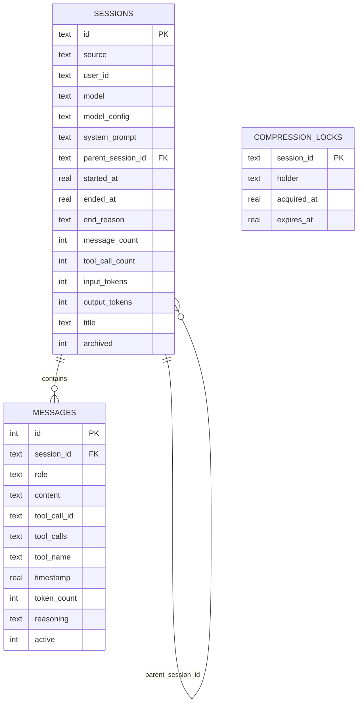
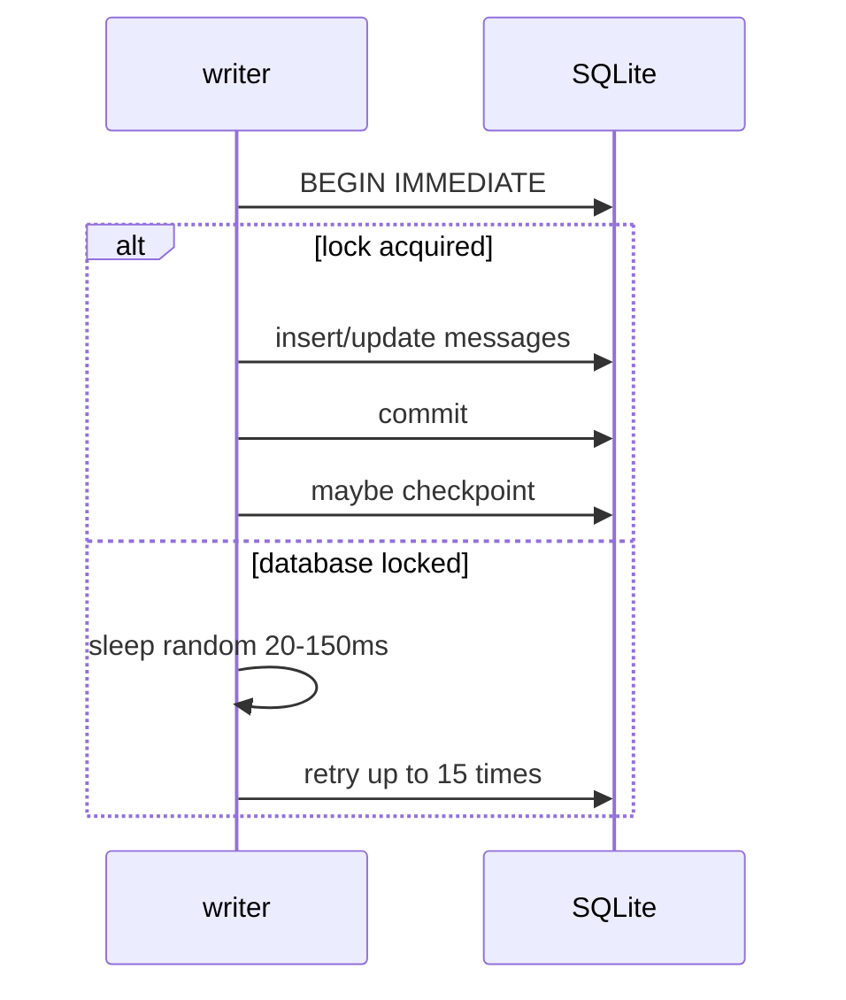
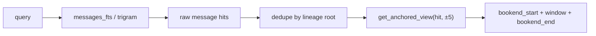

# 04 - 会话存储与搜索

## state.db 的定位

Hermes 不把历史对话塞进内置记忆，而是完整写入本地 SQLite：

```text
~/.hermes/state.db
├── sessions                # session 元数据、token、成本、title、lineage
├── messages                # 完整消息历史、tool call、reasoning 字段
├── messages_fts            # FTS5 全文检索
├── messages_fts_trigram    # trigram tokenizer，支持 CJK / substring search
├── state_meta              # 元数据
├── compression_locks       # 压缩锁
└── schema_version          # 迁移版本
```

源码中 `hermes_state.py` 的 `SCHEMA_VERSION` 是 16；网站文档中的 v11 是较早快照。分析以源码为准。

## 核心 Schema



### 为什么存完整原文

Hermes 的 session recall 返回的是 DB 中真实消息，不是 LLM 重新总结：

- 没有 LLM 成本。
- 不引入总结幻觉。
- 可以 scroll 到命中点前后。
- 保留 tool call、tool result、reasoning metadata。

这和 `MEMORY.md` 的定位形成互补：关键事实常驻 prompt，历史细节按需搜索。

## 并发与可靠性

`SessionDB` 针对“多个 Hermes 进程共享一个 state.db”做了专门设计：

| 机制 | 作用 |
|------|------|
| WAL mode | 多读单写，适合 gateway + CLI 并发 |
| WAL fallback | NFS/SMB/FUSE 不支持 WAL 时降级 `journal_mode=DELETE` |
| SQLite timeout 1s | 不让 SQLite 内部 deterministic busy handler 卡 30s |
| app-level jitter retry | `database is locked` 时 20-150ms 随机退避，最多 15 次 |
| `BEGIN IMMEDIATE` | 事务开始就拿写锁，尽早暴露争用 |
| passive checkpoint | 每 50 次成功写入尝试 WAL checkpoint |
| malformed schema repair | 对 duplicate FTS schema 等问题做备份和 sqlite_master 修复 |



## Session Lineage

Hermes 用 `parent_session_id` 表达多个“看起来还是同一件事”的物理 session：

| 来源 | 子 session 可见性 | 说明 |
|------|------------------|------|
| context compression | 通常隐藏为 continuation | 旧 session 以 `end_reason="compression"` 结束，新 session 接着跑 |
| `/branch` | 可见 | 从历史 session 分叉，保留为独立工作线 |
| delegation subagent | 隐藏 / cascade target | 子 Agent 的临时工作 transcript |

`session_search` 检索时会按 lineage 去重，避免同一个压缩链返回多个碎片。

## session_search 的四种形态

`tools/session_search_tool.py` 用参数形状推断模式，没有显式 `mode` 参数。

| 形态 | 调用 | 行为 |
|------|------|------|
| Discovery | `session_search(query="auth refactor")` | FTS5 搜索，按 lineage 去重，返回命中窗口和 bookends |
| Scroll | `session_search(session_id="...", around_message_id=123)` | 围绕某条消息取前后窗口，不跑 FTS5 |
| Read | `session_search(session_id="...")` | 读取一个 session；大 session 返回 head + tail |
| Browse | `session_search()` | 浏览最近 session title / preview |

### Discovery 返回结构



返回内容故意组合了三块：

| 字段 | 作用 |
|------|------|
| `bookend_start` | session 最开始几条消息，恢复任务目标 |
| `messages` | FTS 命中点附近窗口，恢复局部上下文 |
| `bookend_end` | session 末尾几条消息，恢复结论/决策 |

这样通常不用一次读完整 transcript，就能回答“上次我们在 X 上做到哪了”。

## Cross-profile 读取

Hermes 支持多个 profile，每个 profile 有自己的 `state.db`。`session_search` 支持：

```python
session_search(session_id="abc", profile="work")
```

如果模型拿到了 `@session:<profile>/<id>` 形式的链接，即使把 profile 和 id 混在 `session_id` 参数里，tool 也会拆开处理。

如果指定 profile 没找到，还会 read-only 扫描所有 profile 的 `state.db` 查找 session id。这对 Desktop / Dashboard 的跨 profile session link 很重要。

## 当前 session 保护

`session_search` 会拒绝 scroll 当前活跃 session lineage：

- 当前 session 消息已经在上下文里。
- 再从 DB 读回来会重复注入，浪费 token。
- 如果当前 turn 尚未 flush，DB 也可能不是最新。

Discovery 也会跳过当前 lineage，重点找“过去”的会话。

## 与内置记忆的边界

| 问题 | 用 `MEMORY.md` | 用 `session_search` |
|------|---------------|---------------------|
| 用户偏好是什么 | 是 | 否，除非偏好没被保存 |
| 上周某个 bug 修到哪 | 否 | 是 |
| 某项目测试命令 | 如果稳定，保存 | 如果忘了，可搜索历史 |
| 完整 task log | 否 | 是 |
| 某次工具输出 | 否 | 是 |

**核心洞察：** Hermes 的长期回忆不是靠大 prompt，而是靠“完整 transcript 本地持久化 + 快速 FTS5 + 可滚动窗口”。这让事实记忆保持小而稳定，同时不牺牲历史细节。
