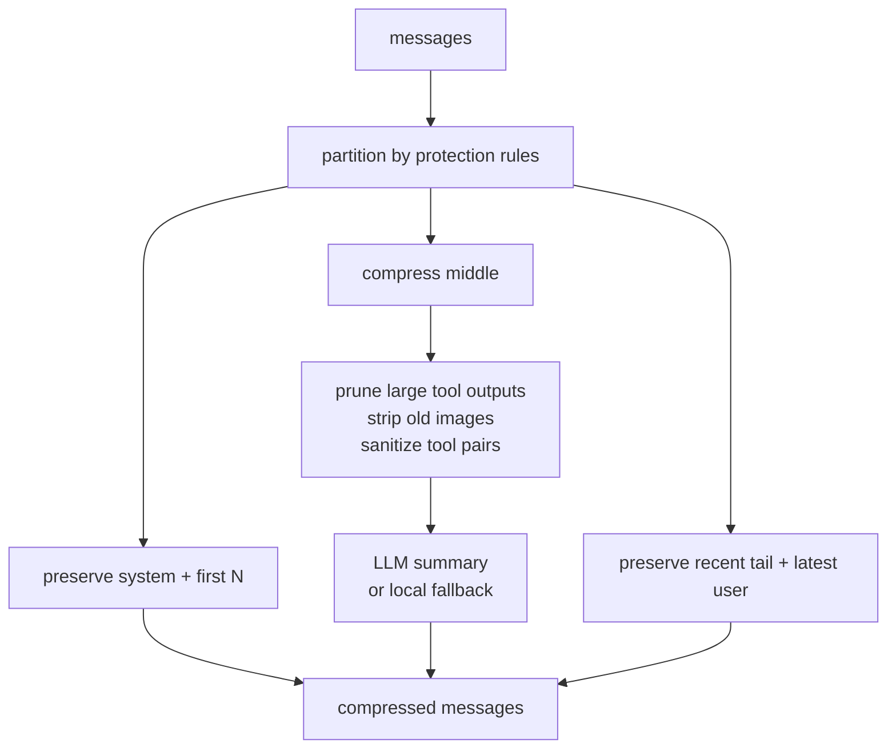

# 05 - 上下文压缩与 ContextEngine

## ContextEngine 抽象

Hermes 把“长上下文如何处理”抽象成 `ContextEngine`：

```python
class ContextEngine(ABC):
    @property
    def name(self) -> str: ...
    def update_from_response(self, usage) -> None: ...
    def should_compress(self, prompt_tokens=None) -> bool: ...
    def compress(self, messages, current_tokens=None, focus_topic=None) -> list[dict]: ...
```

内置实现是 `ContextCompressor`。外部插件可以通过：

```yaml
context:
  engine: lcm
```

替换为别的 context engine。插件不会自动启用，必须显式配置，避免无意改变核心上下文行为。

## 内置 ContextCompressor

`agent/context_compressor.py` 是 lossy summarization 压缩器，核心思想是：保留头尾和当前任务，把中段折叠为“reference only”摘要。



它会保护：

- system prompt
- 最早的若干非 system messages
- 最近 tail messages
- 最新 user message
- 最新 visible assistant reply
- tool call / tool result 配对完整性

它会压缩或清理：

- 中段对话
- 重复 tool result
- 旧的大型 tool output
- 旧的大型 tool call arguments
- 旧截图 / image parts
- orphan tool result 或缺 result 的 tool call

摘要会标记为 reference-only，避免模型把旧任务当作当前指令继续执行。

## 压缩触发

`ContextEngine` 接收 provider 返回的 token usage，达到阈值后 `should_compress()` 返回 true。默认阈值由 `compression.threshold` 控制，Hermes 还会对部分模型做 context length 和阈值特例处理。

手动 `/compress` 使用 `force=True`，可以绕过 summary failure cooldown。

## 压缩编排流程

`agent/conversation_compression.py` 的 `compress_context()` 不只是调用 compressor。它是一个 session boundary 编排器：

```mermaid
sequenceDiagram
    participant Loop as Agent Loop
    participant Lock as compression_locks
    participant MM as MemoryManager
    participant CE as ContextEngine
    participant DB as SessionDB
    participant Prompt as System Prompt

    Loop->>Lock: try_acquire_compression_lock(old_session_id)
    alt another compressor active
        Lock-->>Loop: skip, return messages unchanged
    else acquired
        Loop->>MM: on_pre_compress(messages)
        Loop->>CE: compress(messages)
        alt compression aborted
            Loop->>Lock: release
            Loop-->>Loop: keep original messages/session
        else success
            Loop->>Prompt: invalidate + rebuild
            Loop->>MM: commit_memory_session(messages)
            Loop->>DB: end old session, reason=compression
            Loop->>DB: create child session(parent_session_id=old)
            Loop->>CE: on_session_start(new, boundary_reason=compression)
            Loop->>MM: on_session_switch(new, parent=old, reset=false)
            Loop->>Lock: release after bookkeeping
        end
    end
```

关键点：

| 步骤 | 为什么重要 |
|------|------------|
| 压缩锁 keyed by old session | 防止同一个 session 被两个 Agent 实例同时压缩成两个 child |
| `on_pre_compress` | Provider 有机会在消息被丢弃前提取 insight |
| `commit_memory_session` | 旧 session 结束前做 end-of-session extraction |
| 新 child session | 保留完整旧 transcript，又让当前上下文继续变短 |
| `on_session_switch(reset=false)` | Provider 更新内部 session/document id，但知道逻辑对话仍连续 |
| 释放锁在最后 | 确保其他路径醒来时看到的是完成后的 canonical 新 session |

## Prompt 重建的唯一例外

Hermes 极度强调 system prompt 在普通 turn 中 byte-stable。但压缩是例外：压缩本身会改变历史上下文，因此它会：

1. invalidate `_cached_system_prompt`
2. 重新 load memory from disk
3. rebuild system prompt
4. 写入新 child session 的 `system_prompt`

这意味着 session 中途写入的 `MEMORY.md` / `USER.md` 有机会在压缩边界后进入新的 prompt snapshot。

## Summary 失败处理

Hermes 不让 summary LLM 失败直接摧毁对话：

| 情况 | 行为 |
|------|------|
| 辅助 summary model 失败 | 可回退主模型 |
| 所有 summary 失败且允许 fallback | 插入 deterministic local fallback summary |
| `abort_on_summary_failure=true` | 返回原 messages，不旋转 session |
| 连续失败 | cooldown 防止重复打失败调用 |
| 手动 `/compress` | `force=True` 清 cooldown |

## ContextEngine 插件

ContextEngine 插件可以暴露自己的工具：

- `get_tool_schemas()`
- `handle_tool_call()`

Agent 初始化时只有在 `context_engine` toolset 启用时注入这些工具，并跳过重复 tool name。这样插件能提供 `lcm_grep` / `lcm_expand` 类工具，但不会在禁用 toolset 的平台上增加 schema 负担。

## 与记忆系统的关系

上下文压缩和记忆不是一回事：

| 机制 | 保存什么 | 作用范围 |
|------|----------|----------|
| `MEMORY.md` / `USER.md` | 长期稳定事实 | 跨 session |
| External Provider | 语义记忆 / 用户模型 | 跨 session / 跨平台 |
| Context compression summary | 当前长会话被压缩中段 | 当前 lineage |
| SessionDB | 历史原文 | 跨 session 搜索 |

压缩摘要不替代长期记忆。相反，压缩前会通知记忆 Provider，因为被压缩掉的内容可能包含值得长期保存的事实。

**核心洞察：** Hermes 把上下文压缩当作一种“可追踪的 session 分裂”，而不是简单覆盖 history。旧 transcript 保留在 DB，新上下文继续运行，Provider 和 ContextEngine 都收到边界事件。
