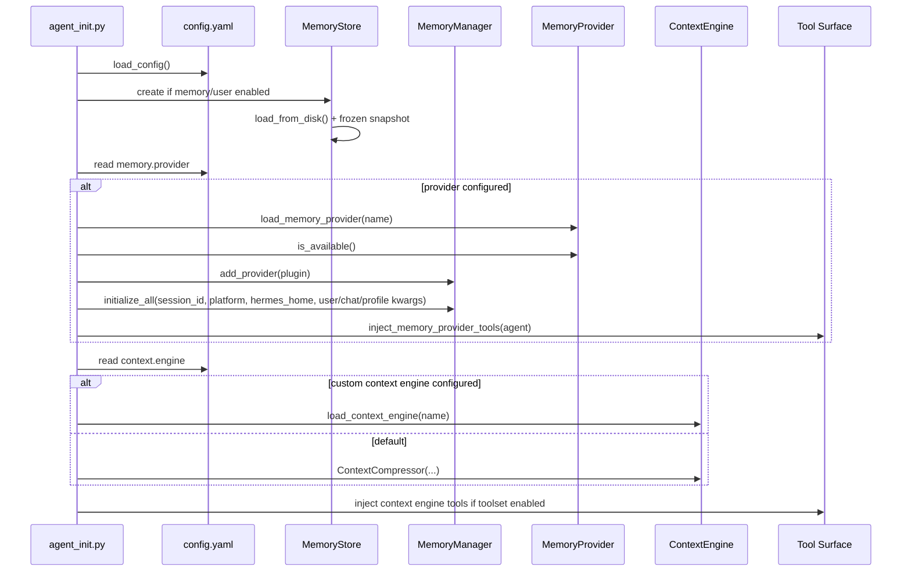
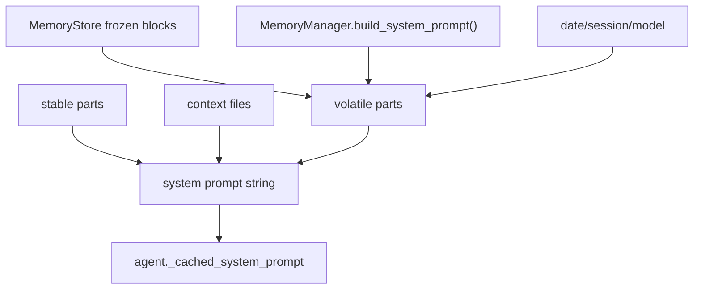
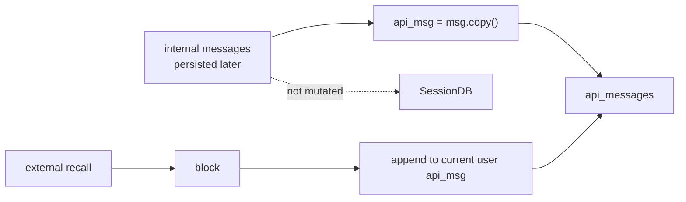
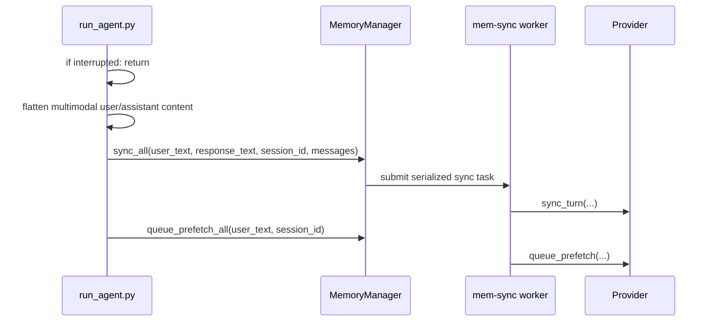
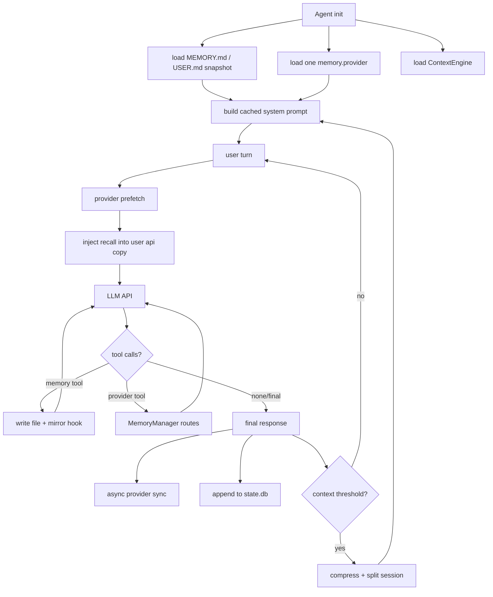

# 06 - 运行时记忆流程

## 启动阶段

Agent 初始化时，Hermes 按固定顺序组装记忆相关组件：



初始化时传给 Provider 的身份信息很丰富：

- `session_id`
- `platform`
- `hermes_home`
- `agent_context`
- `session_title`
- `user_id` / `user_id_alt` / `user_name`
- `chat_id` / `chat_name` / `chat_type` / `thread_id`
- `gateway_session_key`
- `agent_identity` / `agent_workspace`

这让 Provider 能做 per-user、per-chat、per-profile 的隔离。

## System Prompt 构造

`agent/system_prompt.py` 把 prompt 分三层：

| 层 | 内容 | 稳定性 |
|----|------|--------|
| stable | Hermes 核心身份、平台提示、工具规则等 | 最稳定 |
| context | `SOUL.md` / `AGENTS.md` / cwd 相关 context files | session-stable |
| volatile | 内置记忆 snapshot、外部 Provider static block、日期、session id、model | 每个 session 构造一次 |



外部 Provider 的 `system_prompt_block()` 只能放静态说明或状态，不放每轮 recall。每轮 recall 走 user message injection。

## 每轮开始：turn_start + prefetch

每个 user turn 进入模型前，Hermes 会让 Provider 先准备记忆上下文：

```mermaid
sequenceDiagram
    participant Loop as run_conversation
    participant TC as turn_context.py
    participant MM as MemoryManager
    participant P as Provider

    Loop->>TC: prepare turn
    TC->>MM: on_turn_start(turn_number, message, runtime kwargs)
    TC->>MM: prefetch_all(user_message, session_id)
    MM->>MM: strip skill scaffolding
    MM->>P: prefetch(clean_query, session_id)
    P-->>MM: context text
    MM-->>Loop: _ext_prefetch_cache
```

Skill scaffolding stripping 很重要：用户调用 `/some-skill do X` 时，Hermes 会把技能正文展开成模型可见消息。如果把这个展开文本喂给 Provider，会污染语义记忆。`MemoryManager` 统一还原出用户真正的 instruction。

## API Call 前：ephemeral injection

`conversation_loop.py` 在构造 `api_messages` copy 时做注入：



注入只发生在当前 turn 的 user message copy 上：

- 不改原始 `messages`。
- 不写入 `state.db`。
- 不进入 cached system prompt。
- 不影响 role alternation。

## Tool 执行：内置写入和 Provider tool routing

记忆相关 tool 有两类：

| Tool 类型 | 调度方 | 例子 |
|-----------|--------|------|
| 内置 `memory` | Agent-level tool executor 直接调用 `memory_tool()` | `memory(add/replace/remove)` |
| Provider tools | `MemoryManager.handle_tool_call()` | `honcho_search`、`honcho_profile` |

内置 memory 写入成功后，tool executor 会调用：

```python
MemoryManager.on_memory_write(action, target, content, metadata)
```

这样外部 Provider 可以镜像用户画像或关键事实，而不用截获内置 tool 本身。

## 每轮结束：sync + next prefetch

当 response 完成后，Hermes 调用 `_sync_external_memory_for_turn()`：



中断 turn 不会同步：部分 assistant 输出或中断的 tool chain 不是可靠事实，写进长期记忆会污染未来 recall。

## Session 边界

真正 session 结束时调用：

```text
shutdown_memory_provider(messages)
├── memory_manager.on_session_end(messages)
├── memory_manager.shutdown_all()
└── context_engine.on_session_end(session_id, messages)
```

中途 session_id 旋转但 Provider 不下线时调用：

```text
commit_memory_session(messages)
├── memory_manager.on_session_end(messages)
└── context_engine.on_session_end(session_id, messages)
```

随后再通过 `on_session_switch()` 通知 Provider 刷新内部 state。

## 运行时全景



**核心洞察：** Hermes 的 runtime 不是“先检索再回答”这么简单。它在 prompt、user message copy、tool execution、turn-end sync、session boundary、compression boundary 六个位置都插入了不同记忆逻辑，并且严格区分哪些会持久化、哪些只是 API-call-time。
