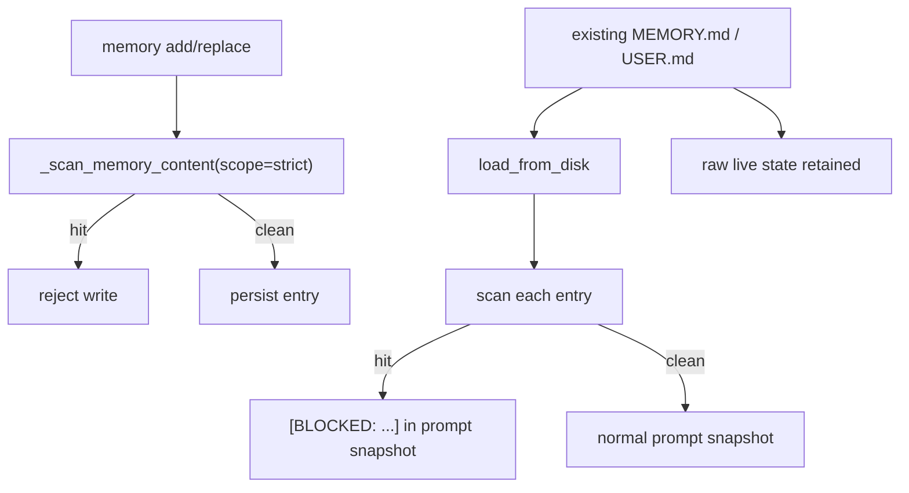
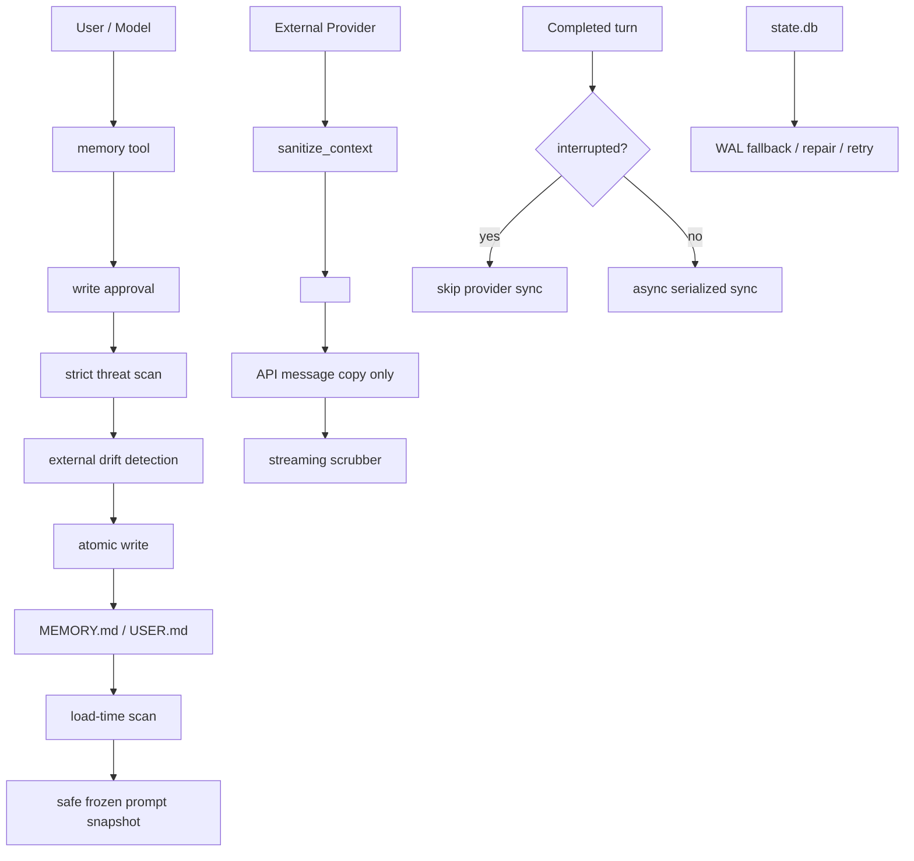

# 07 - 安全与可靠性机制

Hermes 的记忆系统很重视“记住但不污染”。下面是源码中最关键的安全和可靠性防线。

## 1. Prompt 注入防护

内置记忆会进入 system prompt，所以写入和加载都走 strict threat pattern：



关键点：加载时命中的恶意 entry 不会进入 prompt，但原文仍保留在 live entries，方便用户检查和删除。

## 2. 外部漂移检测

`MEMORY.md` / `USER.md` 是工具管理的 `§` 分隔 entry 列表。外部工具或人工编辑可能追加任意文本，下一次 tool 写入如果直接 rewrite，会造成数据丢失。

Hermes 的保护：

| 信号 | 意义 |
|------|------|
| parse -> serialize 后 bytes 不一致 | 文件不是工具预期格式 |
| 单个 entry 长度超过整个 store limit | 可能是 shell append 或 patch 写入的大块内容 |

发现漂移后：

1. 备份为 `.bak.<timestamp>`。
2. 拒绝 mutation。
3. 返回 remediation 指引。

## 3. 写入审批

`memory.write_approval` 控制内置记忆写入：

| 配置 | 行为 |
|------|------|
| `false` | 默认，直接写 |
| `true` | CLI 前台可 inline prompt；gateway/background 写入 staged pending |

用户用 slash command 审核：

```text
/memory pending
/memory approve <id>
/memory reject <id>
/memory approval on
```

Skills 也有独立的 `skills.write_approval`，因为 Skill 文件太大，不适合 inline 审批。

## 4. Memory Context Fencing

外部 Provider recall 通过 `<memory-context>` 注入，Hermes 同时防止它泄漏：

| 组件 | 风险 | 防护 |
|------|------|------|
| Provider 输出 | Provider 自己带 `<memory-context>` 或 system note | `sanitize_context()` 去掉内部 tag/note |
| Streaming response | tag 分裂到多个 delta，普通 regex 漏掉 | `StreamingContextScrubber` 状态机跨 chunk 丢弃 span |
| Session persistence | recalled context 写入 transcript | 只修改 `api_msg` copy，不改原 `messages` |

## 5. Interrupted Turn 不同步

外部 Provider 的 `sync_turn()` 只有在 turn 正常完成后执行。中断时跳过：

- 用户没有看到完整回答。
- tool chain 可能处于半完成状态。
- 下一条消息通常是 retry；基于中断内容 prefetch 会更糟。

这避免把“未完成的尝试”写成长期事实。

## 6. Skill Scaffolding Stripping

Skill 调用会把技能正文展开给模型。如果 Provider 把这段内容当成用户输入保存，会污染记忆库。

`MemoryManager._strip_skill_scaffolding()` 在 prefetch、sync、queue_prefetch 前统一抽取真实用户 instruction：

```text
model-facing skill-expanded message
        ↓
extract_user_instruction_from_skill_message()
        ↓
provider sees only user's actual request
```

## 7. Provider best-effort 和异步隔离

Provider 错误不会阻断主 Agent：

| 场景 | 行为 |
|------|------|
| `system_prompt_block()` 抛错 | warning，跳过 block |
| `prefetch()` 抛错 | debug，返回其他 Provider 结果 |
| `sync_turn()` 抛错 | warning，继续 |
| `handle_tool_call()` 抛错 | 返回 tool error JSON |
| shutdown 卡住 | executor drain 最多 5 秒 |

Hermes 把外部记忆视为增强能力，不允许它破坏基本聊天路径。

## 8. Tool Name 防冲突

Memory Provider 可暴露工具，但不能 shadow Hermes core tool：

- 注册时检查 `_HERMES_CORE_TOOLS`。
- shadow core tool 的 Provider schema 不进入 routing table。
- 重名 Provider tool 只保留先注册者。

这防止第三方 Provider 劫持 `clarify`、`delegate_task` 等核心工具。

## 9. SessionDB 自愈

`hermes_state.py` 对 SQLite 失败做了大量兜底：

| 故障 | 防护 |
|------|------|
| NFS/SMB/FUSE 不支持 WAL | fallback 到 `journal_mode=DELETE`，只降低并发 |
| FTS5 不可用 | 禁用 full-text session search，但消息写入继续 |
| `messages_fts` schema malformed / duplicate | 备份 DB，尝试 `sqlite_master` 去重或 drop FTS schema 后重建 |
| 写锁竞争 | `BEGIN IMMEDIATE` + jitter retry |
| 压缩并发 | `compression_locks` 防止同 session 双压缩 fork |

## 10. Current Session Recall Guard

`session_search` scroll 当前 session lineage 会被拒绝，因为：

- 当前消息已经在上下文。
- 读回来会重复注入。
- 当前 turn 可能还没 flush 到 DB。

Discovery 也跳过当前 lineage，把 recall 聚焦到过去 sessions。

## 安全边界总图



**核心洞察：** Hermes 的安全模型不是只拦“恶意用户输入”，而是把记忆文件、Provider 输出、streaming delta、DB schema、并发压缩都当成可能失控的边界逐个加护栏。
