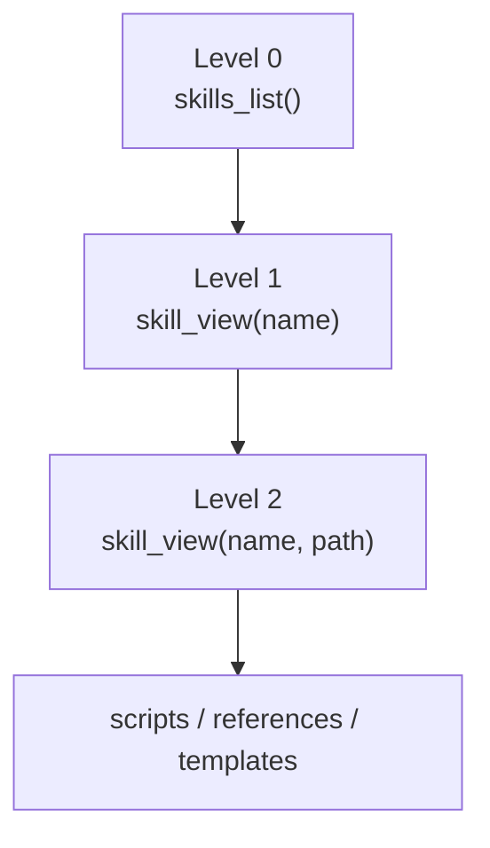
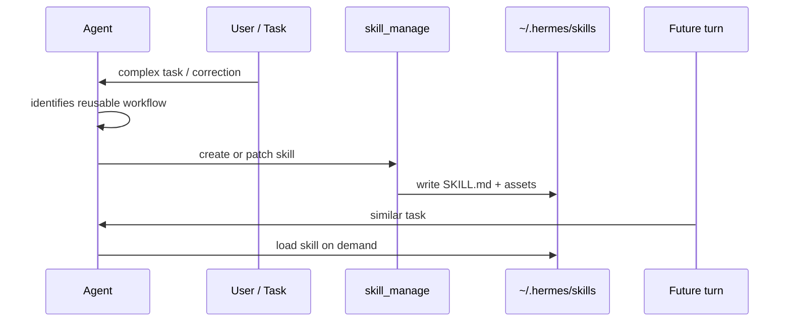

# 08 - Skills 作为程序性记忆

## 为什么 Skills 属于记忆系统

Hermes 的 `memory` tool 明确不鼓励保存任务日志或复杂流程。对于“以后还会用的做法”，Hermes 的答案是 Skill。

事实记忆回答：

> 用户偏好什么？这个项目用什么命令？

程序性记忆回答：

> 遇到某类任务时，应该按什么流程做？要调用哪些工具？有哪些脚本和模板？

## Skill 文件树

Hermes 的技能来源：

```text
skills/                 # repo bundled skills
optional-skills/        # heavier/niche official skills, opt-in install
~/.hermes/skills/       # installed + agent-created skills, primary source of truth
```

一个典型 Skill：

```text
my-skill/
├── SKILL.md
├── scripts/
├── references/
└── templates/
```

`SKILL.md` 是入口，脚本、参考材料和模板按需读取，不会全部塞进 prompt。

## 渐进披露

Skills 使用 progressive disclosure，避免把所有 procedural memory 都注入上下文：



| 层级 | 内容 | Token 成本 |
|------|------|------------|
| Level 0 | 技能名称和简短描述 | 很低 |
| Level 1 | `SKILL.md` 主体 | 中等 |
| Level 2 | 某个 reference/script/template | 按需 |

这和 `MEMORY.md` 的“始终注入”形成对比：Skill 只有被需要时才进入上下文。

## Slash Command 化

每个安装的 Skill 都可以成为 slash command：

```text
/github-pr-workflow create a PR for the auth refactor
/plan design a migration rollout
```

Slash command 不是直接改 system prompt，而是把 skill-expanded message 作为 user message 注入当前 turn。这仍然遵守 prompt cache 的大原则：不在中途重建 system prompt。

## Agent-created Skills

Hermes 可以用 `skill_manage` 创建和维护技能。触发场景通常是：

- 完成复杂任务后沉淀流程。
- 反复遇到同类错误。
- 用户纠正了某个工作流。
- 发现某个非平凡操作步骤。
- 多工具调用组合形成稳定套路。



## Curator：技能生命周期

Hermes 有后台 curator 系统维护 agent-created skills：

| 能力 | 说明 |
|------|------|
| usage tracking | 记录 use/view/patch count 和 last activity |
| stale detection | 长期不用的 agent-created skill 标记 stale |
| archive | 不删除，移动到 `.archive/` 可恢复 |
| pin | pinned skill 免于自动归档 |
| backup | curator 运行前可做 tar.gz 备份 |

这让 Skills 成为可演化的程序记忆，而不是一次性文档。

## 写入审批

技能写入也支持 gate：

```yaml
skills:
  write_approval: true
```

审核命令：

```text
/skills pending
/skills diff <id>
/skills approve <id>
/skills reject <id>
/skills approval on
```

与 memory 不同，Skill diff 往往很大，所以总是 staged，而不是在聊天气泡里全文展示。

## 与其他记忆平面的关系

| 信息 | 应该放哪里 |
|------|------------|
| “用户喜欢简洁回答” | `USER.md` |
| “这个 repo 用 scripts/run_tests.sh” | `MEMORY.md`，如果长期稳定 |
| “上次怎么修某个 bug” | `session_search` |
| “以后处理新 skill PR 的完整流程” | Skill |
| “某 Provider 的用户画像/语义事实” | 外部 Memory Provider |
| “当前超长会话中段摘要” | Context compression summary |

## 设计取舍

| 选择 | 好处 | 代价 |
|------|------|------|
| Skills 不常驻 prompt | Token 成本低，prompt cache 稳定 | Agent 必须知道何时加载 |
| 文件树而非数据库 | 可读、可审查、可 version control | 需要文件权限和路径隔离 |
| Slash command 入口 | 用户可显式调用，模型也容易发现 | 技能太多时需要好的检索/列表 |
| Agent 可写 | 自我改进闭环 | 需要 write approval / curator 控制质量 |

**核心洞察：** Hermes 把“怎么做事”的记忆从事实记忆中分离出来，放进可审查、可演化、按需加载的 Skill 文件树。这避免 `MEMORY.md` 变成流程垃圾桶。
