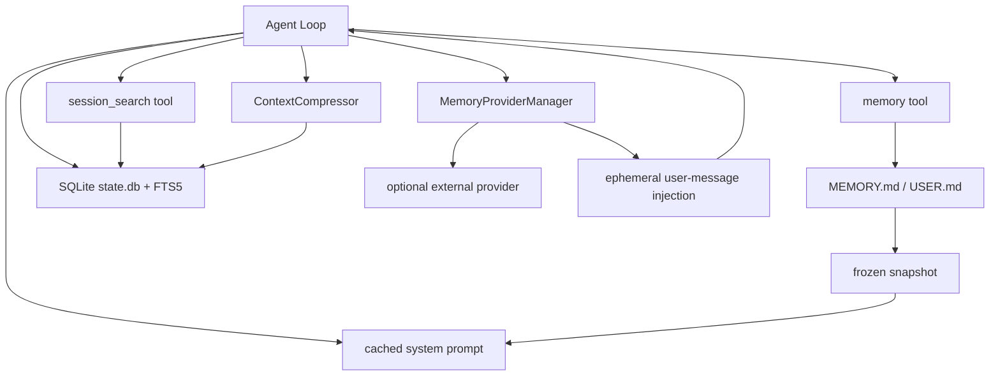
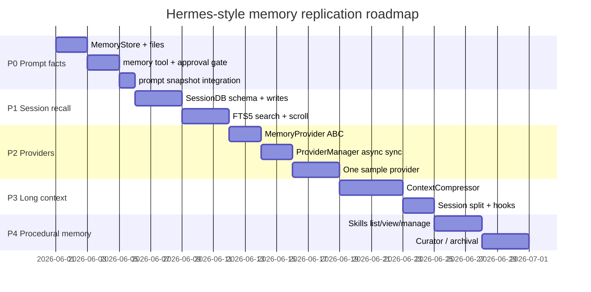

# 09 - 复刻方案与适配建议

## 目标

在 Python/LangGraph 或自研 Agent Loop 中复刻 Hermes 的核心记忆能力，不要求一开始就实现所有 Provider 和 UI。

## 最小可用架构



## P0：内置事实记忆

### 数据模型

```python
class MemoryStore:
    def __init__(self, memory_limit=2200, user_limit=1375):
        self.memory_entries: list[str] = []
        self.user_entries: list[str] = []
        self._system_prompt_snapshot = {"memory": "", "user": ""}

    def load_from_disk(self) -> None: ...
    def format_for_system_prompt(self, target: str) -> str | None: ...
    def add(self, target: str, content: str) -> dict: ...
    def replace(self, target: str, old_text: str, content: str) -> dict: ...
    def remove(self, target: str, old_text: str) -> dict: ...
```

### 必须保留的 Hermes 约束

| 约束 | 为什么 |
|------|--------|
| session 启动时冻结 snapshot | 保持 prompt cache 稳定 |
| tool 写入立即落盘但不改当前 prompt | 避免中途 cache bust |
| `add/replace/remove` 而不是任意文件写 | 容量、扫描、漂移检测集中控制 |
| 容量超限返回 current entries | 让 LLM 主动合并，避免自动误删 |
| 加载时扫描 | 防止磁盘已污染 entry 进入 system prompt |

## P1：SessionDB + session_search

### SQLite Schema

```sql
CREATE TABLE sessions (
    id TEXT PRIMARY KEY,
    source TEXT NOT NULL,
    user_id TEXT,
    model TEXT,
    model_config TEXT,
    system_prompt TEXT,
    parent_session_id TEXT REFERENCES sessions(id),
    started_at REAL NOT NULL,
    ended_at REAL,
    end_reason TEXT,
    title TEXT,
    archived INTEGER NOT NULL DEFAULT 0
);

CREATE TABLE messages (
    id INTEGER PRIMARY KEY AUTOINCREMENT,
    session_id TEXT NOT NULL REFERENCES sessions(id),
    role TEXT NOT NULL,
    content TEXT,
    tool_call_id TEXT,
    tool_calls TEXT,
    tool_name TEXT,
    timestamp REAL NOT NULL,
    token_count INTEGER,
    active INTEGER NOT NULL DEFAULT 1
);

CREATE VIRTUAL TABLE messages_fts USING fts5(content);
CREATE VIRTUAL TABLE messages_fts_trigram USING fts5(content, tokenize='trigram');
```

### Search Tool 形态

实现一个 tool，用参数形状推断模式：

| 参数 | 模式 |
|------|------|
| `query` | discovery |
| `session_id + around_message_id` | scroll |
| `session_id` | read |
| 无参数 | browse |

Discovery 建议返回：

- `session_id`
- `title`
- `source`
- `match_message_id`
- `snippet`
- `bookend_start`
- `messages` window
- `bookend_end`
- `messages_before` / `messages_after`

## P2：外部 Provider 接口

### ABC

```python
class MemoryProvider(ABC):
    name: str
    def is_available(self) -> bool: ...
    def initialize(self, session_id: str, **kwargs) -> None: ...
    def system_prompt_block(self) -> str: return ""
    def prefetch(self, query: str, *, session_id: str = "") -> str: return ""
    def queue_prefetch(self, query: str, *, session_id: str = "") -> None: pass
    def sync_turn(self, user_content: str, assistant_content: str, *, session_id: str = "", messages=None) -> None: pass
    def get_tool_schemas(self) -> list[dict]: return []
    def handle_tool_call(self, tool_name: str, args: dict, **kwargs) -> str: ...
    def on_session_end(self, messages: list[dict]) -> None: pass
    def on_session_switch(self, new_session_id: str, *, parent_session_id="", reset=False, **kwargs) -> None: pass
    def on_pre_compress(self, messages: list[dict]) -> str: return ""
    def shutdown(self) -> None: pass
```

### Manager 规则

| 规则 | 建议 |
|------|------|
| 外部 Provider 数量 | 一次只允许一个 |
| Provider sync | 单 worker 后台执行，保持 turn 顺序 |
| Provider prefetch | 当前 turn 同步返回 cached result，下一 turn 可 background warm |
| Provider recall 注入 | 放到当前 user message API copy，不进 system prompt |
| Tool name | 禁止 shadow core tools |
| 错误 | best-effort，不能阻断主 Agent |

## P3：Context Compression + Session Split

不要只在内存中替换 messages。按 Hermes 模式做成可追踪边界：

1. 获取 per-session compression lock。
2. 调用 Provider `on_pre_compress(messages)`。
3. 压缩 messages，保留头尾、当前 user、tool pair 完整性。
4. invalidate system prompt，并在这个边界重新读取内置 memory。
5. 旧 session `end_reason="compression"`。
6. 新 session `parent_session_id=old_session_id`。
7. 通知 ContextEngine 和 MemoryProvider `on_session_switch(reset=False)`。

这样历史原文仍可被 `session_search` 找到，当前上下文也缩短。

## P4：Skills 作为程序性记忆

如果你的 Agent 会长期使用同一批工作流，不要把流程塞进 facts。实现一个最小 Skill 系统：

```text
skills/<name>/
├── SKILL.md
├── scripts/
├── references/
└── templates/
```

最小工具：

| Tool | 作用 |
|------|------|
| `skills_list()` | 列可用 skill 的名称和短描述 |
| `skill_view(name)` | 读 `SKILL.md` |
| `skill_view(name, path)` | 读 reference/script/template |
| `skill_manage(...)` | 创建/修改 agent-owned skill，可加审批 |

## 安全清单

| 项 | 必做 |
|----|------|
| 记忆写入扫描 | prompt injection / exfiltration / invisible unicode |
| 加载时扫描 | 不信任磁盘已有内容 |
| 文件写入 | temp file + fsync + atomic replace |
| 外部漂移 | round-trip 检测 + backup + refuse write |
| Prompt cache | 普通 turn 不 rebuild system prompt |
| Provider recall | fenced block + API copy only |
| Streaming scrub | 防止内部 context tag 泄漏 |
| Interrupted turn | 不同步外部记忆 |
| Session DB | WAL fallback、write retry、FTS rebuild |
| Compression | per-session lock，失败不旋转 session |

## 实施路线图



## 最重要的移植决策

| 决策 | 推荐 | 理由 |
|------|------|------|
| 内置记忆容量 | 小，1-2K tokens 总量 | 保持 prompt 成本和质量 |
| 历史对话 | 完整存 DB，不总结覆盖 | recall 时需要原文证据 |
| 外部 Provider | 插件化，一次一个 | 控制 tool surface 和语义冲突 |
| recall 注入位置 | user message API copy | cache-safe，DB-safe |
| compression | session split，不覆盖旧 transcript | 可追溯、可搜索、可恢复 |
| procedural memory | Skills，不放 facts | 避免事实记忆变流程垃圾桶 |

**复刻重点不是“多加一个向量库”，而是先建立边界纪律：什么常驻 prompt、什么按需搜索、什么插件增强、什么只在当前 API call 注入、什么形成新的 session。**
