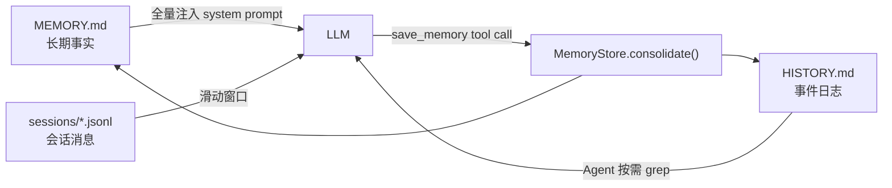

# nanobot 记忆系统 — 逆向工程文档

> 基于 `references/nanobot` 源码逆向分析，目标是完全可复刻。

## 目录

| 文档 | 内容 |
|------|------|
| [architecture.md](architecture.md) | 整体架构、两层记忆模型、组件关系 |
| [data-model.md](data-model.md) | 数据结构、文件格式、存储方案 |
| [consolidation.md](consolidation.md) | LLM 驱动的记忆整合机制（核心） |
| [context-injection.md](context-injection.md) | 记忆如何注入 LLM prompt |
| [implementation.md](implementation.md) | 逐文件实现细节与关键代码 |
| [replication-guide.md](replication-guide.md) | 复刻指南：应用到我们项目的方案 |

## 快速概览

nanobot 采用 **两层记忆 + 会话持久化** 架构：

**设计哲学**：LLM 既是记忆的消费者，也是记忆的生产者。整合不是简单截断，而是 LLM 提取关键信息后结构化存储。
