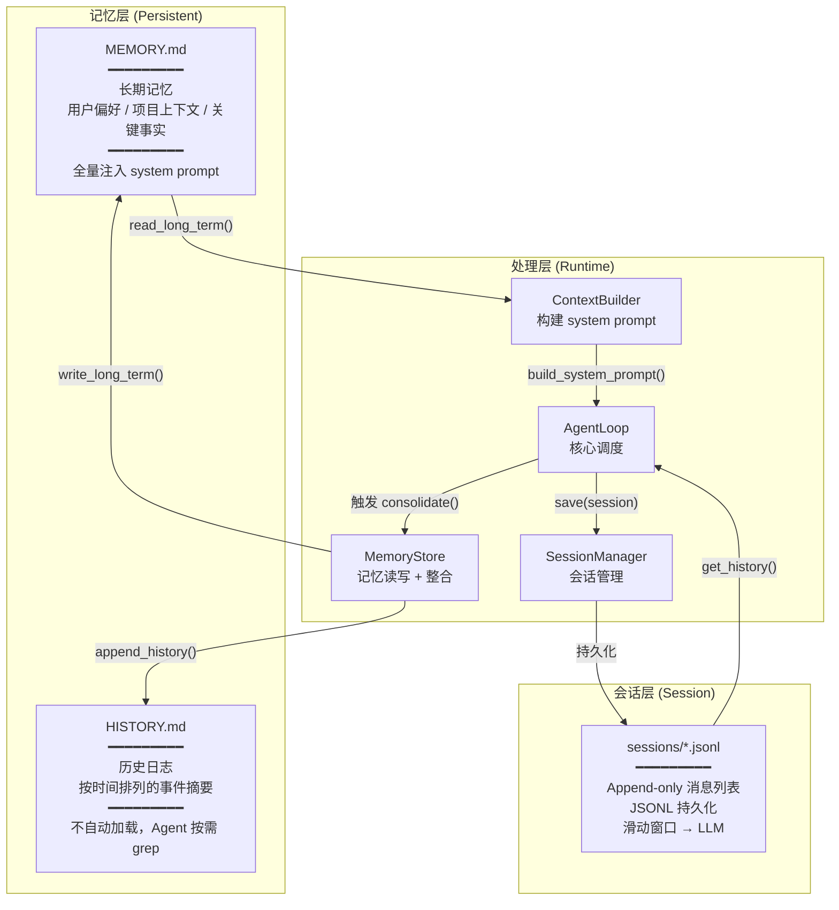
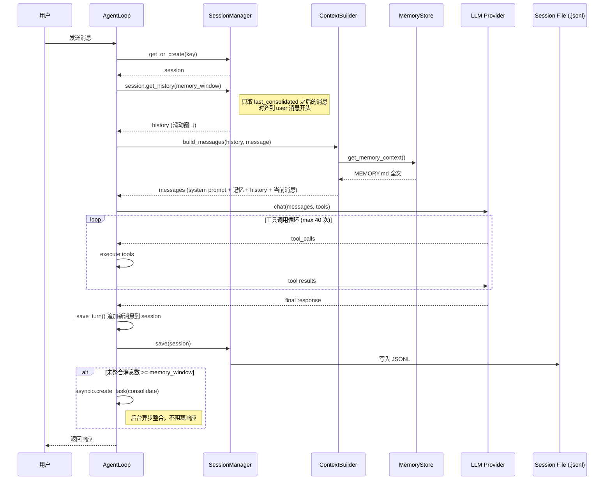
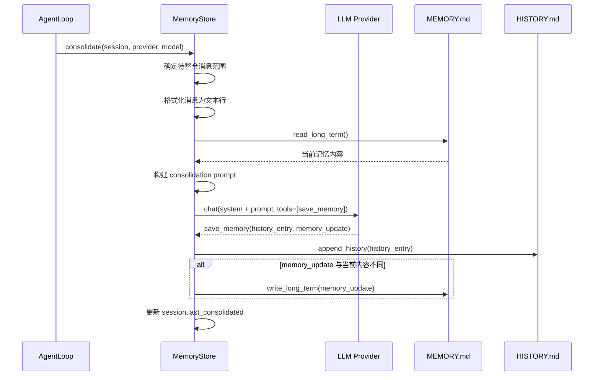
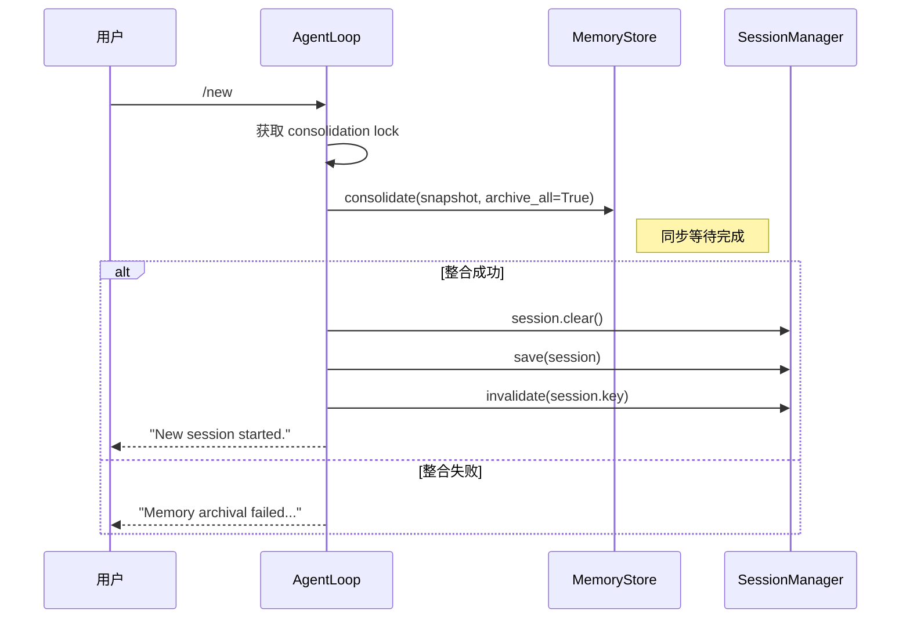

# 架构设计

## 1. 两层记忆模型



## 2. 核心组件

| 组件 | 源文件 | 职责 |
|------|--------|------|
| `MemoryStore` | `nanobot/agent/memory.py` | 记忆文件读写 + LLM 驱动的整合 |
| `ContextBuilder` | `nanobot/agent/context.py` | 将记忆注入 system prompt |
| `Session` | `nanobot/session/manager.py` | 会话数据结构（append-only 消息列表） |
| `SessionManager` | `nanobot/session/manager.py` | 会话生命周期管理（加载/保存/缓存） |
| `AgentLoop` | `nanobot/agent/loop.py` | 核心调度，触发自动整合 |
| `SkillsLoader` | `nanobot/agent/skills.py` | 加载 memory skill 到 Agent 上下文 |
| Memory Skill | `nanobot/skills/memory/SKILL.md` | 教 Agent 如何使用记忆系统 |

## 3. 组件交互时序

### 3.1 正常对话流



### 3.2 记忆整合流



### 3.3 `/new` 命令流



## 4. 目录结构

```
workspace/                          # 用户工作区
├── memory/
│   ├── MEMORY.md                   # 长期记忆（LLM 维护 + Agent 主动写入）
│   └── HISTORY.md                  # 历史日志（追加式，grep 可搜索）
├── sessions/
│   ├── telegram_12345.jsonl        # 会话持久化文件
│   └── dingtalk_67890.jsonl
├── skills/
│   └── memory/
│       └── SKILL.md                # 用户可覆盖的记忆技能
└── AGENTS.md, SOUL.md, ...         # Bootstrap 文件

nanobot/                            # 源码
├── agent/
│   ├── memory.py                   # MemoryStore 核心
│   ├── context.py                  # ContextBuilder
│   ├── loop.py                     # AgentLoop（触发整合逻辑）
│   └── skills.py                   # SkillsLoader
├── session/
│   └── manager.py                  # Session + SessionManager
├── templates/
│   └── memory/
│       └── MEMORY.md               # 初始模板
├── skills/
│   └── memory/
│       └── SKILL.md                # 内置记忆技能
├── config/
│   └── schema.py                   # memory_window 等配置
└── utils/
    └── helpers.py                  # sync_workspace_templates()
```

## 5. 设计原则

| 原则 | 说明 |
|------|------|
| **LLM 驱动整合** | 不做简单截断，由 LLM 提取关键信息，确保重要内容不丢失 |
| **双层分离** | 高频事实 (MEMORY.md) 全量加载；低频历史 (HISTORY.md) 按需 grep |
| **Append-only** | 消息只追加不删除，利于 LLM prompt cache |
| **Agent 自治** | Agent 既能被动依赖自动整合，也能主动读写记忆文件 |
| **Skill 驱动** | 通过 always-on skill 教 Agent 使用记忆，而非硬编码行为 |
| **容错优先** | 整合失败不影响正常对话，不清空 session |
