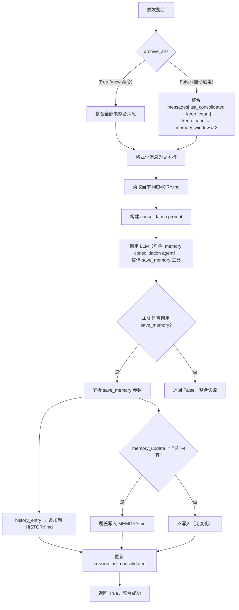
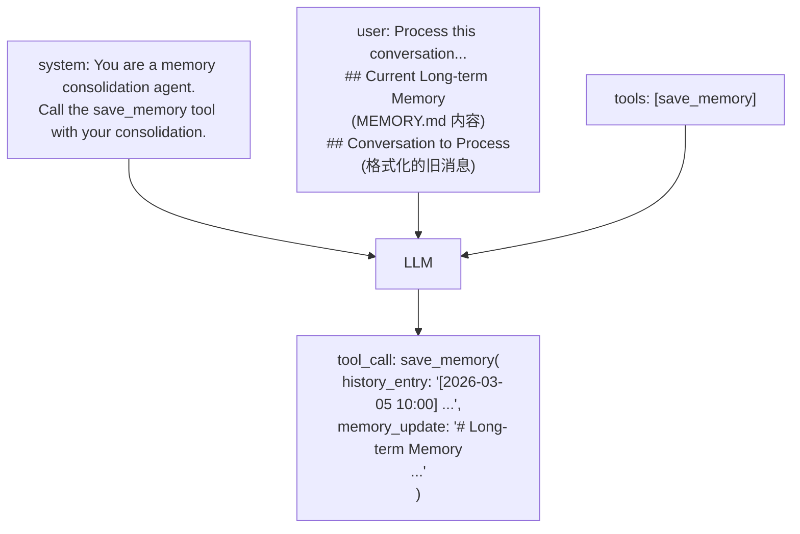
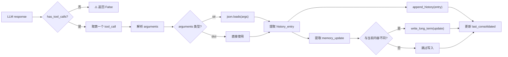
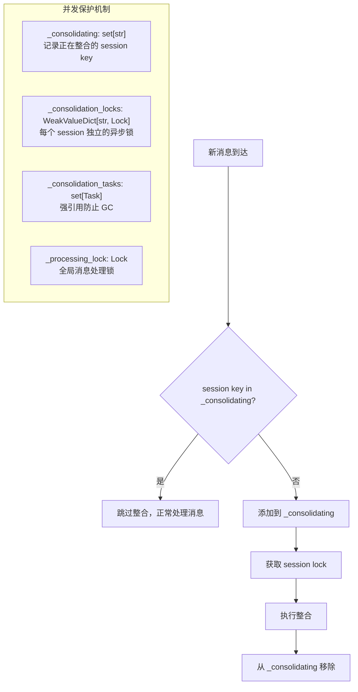

# LLM 驱动的记忆整合机制

> 这是 nanobot 记忆系统的**核心创新点**：用 LLM 自身来提取和整理记忆，而非简单截断或规则摘要。

## 1. 整合流程总览



## 2. 触发机制

### 2.1 自动触发（后台异步）

**位置**：`AgentLoop._process_message()` 的消息处理末尾

```python
unconsolidated = len(session.messages) - session.last_consolidated
if unconsolidated >= self.memory_window and session.key not in self._consolidating:
    self._consolidating.add(session.key)
    lock = self._consolidation_locks.setdefault(session.key, asyncio.Lock())

    async def _consolidate_and_unlock():
        try:
            async with lock:
                await self._consolidate_memory(session)
        finally:
            self._consolidating.discard(session.key)

    task = asyncio.create_task(_consolidate_and_unlock())
    self._consolidation_tasks.add(task)  # 强引用，防止 GC
```

**条件**：未整合消息数 ≥ `memory_window`（默认 100）

**特点**：
- `asyncio.create_task()` — 后台执行，不阻塞当前响应
- `_consolidating` 集合 — 防止同一 session 并发整合
- `_consolidation_locks` — `WeakValueDictionary` 管理锁，避免内存泄漏
- `_consolidation_tasks` — 强引用集合，防止任务被 GC 回收

### 2.2 `/new` 命令触发（同步）

**位置**：`AgentLoop._process_message()` 的 `/new` 命令处理

```python
# 1. 快照未整合消息
snapshot = session.messages[session.last_consolidated:]
if snapshot:
    temp = Session(key=session.key)
    temp.messages = list(snapshot)  # 深拷贝，避免数据冲突
    # 2. 同步等待整合完成
    if not await self._consolidate_memory(temp, archive_all=True):
        return "Memory archival failed..."

# 3. 整合成功后清空 session
session.clear()
self.sessions.save(session)
self.sessions.invalidate(session.key)
```

**特点**：
- `await` 同步阻塞 — 确保整合完成后才清空
- 使用临时 Session 快照 — 避免积整合期间新消息干扰
- 失败不清空 — 容错设计

## 3. save_memory 工具定义

```json
{
  "type": "function",
  "function": {
    "name": "save_memory",
    "description": "Save the memory consolidation result to persistent storage.",
    "parameters": {
      "type": "object",
      "properties": {
        "history_entry": {
          "type": "string",
          "description": "A paragraph (2-5 sentences) summarizing key events/decisions/topics. Start with [YYYY-MM-DD HH:MM]. Include detail useful for grep search."
        },
        "memory_update": {
          "type": "string",
          "description": "Full updated long-term memory as markdown. Include all existing facts plus new ones. Return unchanged if nothing new."
        }
      },
      "required": ["history_entry", "memory_update"]
    }
  }
}
```

**关键设计**：
- 这是**内部专用工具**，不暴露给 Agent 的正常对话
- `history_entry` 要求以 `[YYYY-MM-DD HH:MM]` 开头，便于 grep 搜索
- `memory_update` 是**完整的更新后记忆**（不是增量），LLM 需要返回所有现有事实 + 新事实

## 4. Consolidation Prompt 构建

```python
prompt = f"""Process this conversation and call the save_memory tool with your consolidation.

## Current Long-term Memory
{current_memory or "(empty)"}

## Conversation to Process
{formatted_messages}
"""
```

**发送给 LLM 的消息结构**：



### 4.1 消息格式化

每条消息格式化为一行文本：

```
[YYYY-MM-DD HH:MM] ROLE [tools: tool1, tool2]: content
```

示例：
```
[2026-03-05 10:00] USER: Help me debug the API
[2026-03-05 10:01] ASSISTANT [tools: read_file, exec]: I'll check the error logs first...
[2026-03-05 10:02] USER: The error is in the auth module
```

**实现细节**：
- 跳过无 content 的消息
- timestamp 截取前 16 字符 (`[:16]`)
- 附带 `tools_used` 信息

## 5. 整合结果处理



**容错处理**：
- LLM 未调用 save_memory → 返回 False，不修改任何文件
- arguments 可能是 str 或 dict → 兼容两种格式
- 异常捕获 → 记录日志，返回 False
- memory_update 没变化 → 不写入，避免无意义 I/O

## 6. 并发控制



**设计要点**：
1. `_consolidating` 集合：快速检查，避免重复触发
2. `_consolidation_locks`：`WeakValueDictionary`，锁用完后自动 GC
3. `_consolidation_tasks`：强引用集合，确保后台任务不被意外回收
4. `_processing_lock`：全局消息处理序列化（一次处理一条消息）

## 7. 配置参数

| 参数 | 默认值 | 影响 |
|------|--------|------|
| `memory_window` | `100` | 未整合消息达到此数触发自动整合 |
| *隐含参数* | `memory_window // 2` | 自动整合时保留的最近消息数（`keep_count`） |

配置方式（`config.yaml`）：
```yaml
agents:
  defaults:
    memoryWindow: 100
```
