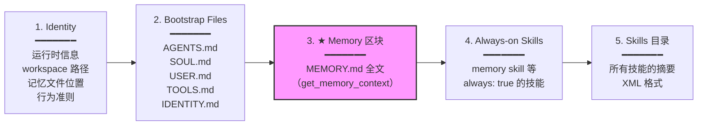
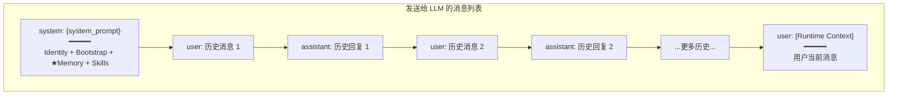
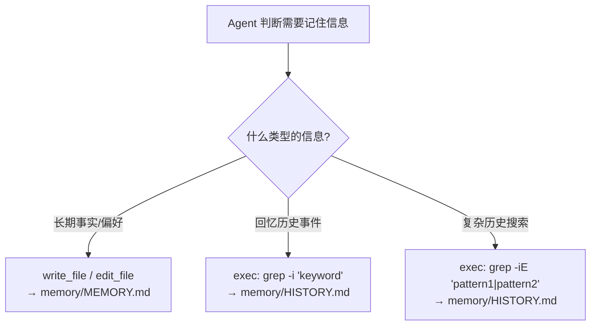
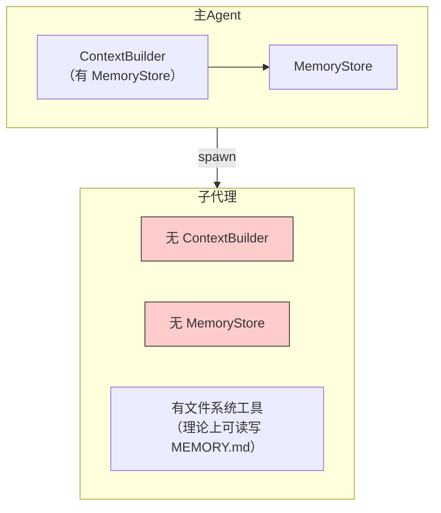

# 记忆注入 — 如何进入 LLM Prompt

## 1. System Prompt 组装顺序



各部分之间用 `\n\n---\n\n` 分隔。

## 2. 各部分详解

### 2.1 Identity 区块

告知 Agent 记忆文件位置，使其能主动操作：

```markdown
## Workspace
Your workspace is at: /home/user/.nanobot/workspace
- Long-term memory: /home/user/.nanobot/workspace/memory/MEMORY.md (write important facts here)
- History log: /home/user/.nanobot/workspace/memory/HISTORY.md (grep-searchable). Each entry starts with [YYYY-MM-DD HH:MM].
- Custom skills: /home/user/.nanobot/workspace/skills/{skill-name}/SKILL.md
```

### 2.2 Memory 区块

```python
def get_memory_context(self) -> str:
    long_term = self.read_long_term()  # 读取 MEMORY.md
    return f"## Long-term Memory\n{long_term}" if long_term else ""
```

在 `build_system_prompt()` 中：
```python
memory = self.memory.get_memory_context()
if memory:
    parts.append(f"# Memory\n\n{memory}")
```

**注入效果示例**：
```markdown
# Memory

## Long-term Memory
# Long-term Memory

## User Information
- Name: Alice
- Role: Backend developer
- Timezone: UTC+8

## Preferences
- Prefers dark mode
- Uses YAML over JSON
- Coding style: PEP 8 strict

## Project Context
- Working on API gateway, uses OAuth2
- Database: PostgreSQL 15
```

### 2.3 Memory Skill（Always-on）

Memory skill 标记为 `always: true`，始终加载到 Agent 上下文：

```markdown
# Memory

## Structure
- `memory/MEMORY.md` — Long-term facts. Always loaded into your context.
- `memory/HISTORY.md` — Append-only event log. NOT loaded. Search with grep.

## Search Past Events
```bash
grep -i "keyword" memory/HISTORY.md
```

## When to Update MEMORY.md
Write important facts immediately using `edit_file` or `write_file`:
- User preferences ("I prefer dark mode")
- Project context ("The API uses OAuth2")
- Relationships ("Alice is the project lead")

## Auto-consolidation
Old conversations are automatically summarized. You don't need to manage this.
```

### 2.4 运行时上下文

每条用户消息前会注入一个运行时上下文块（**在 user message 中，不在 system prompt 中**）：

```
[Runtime Context — metadata only, not instructions]
Current Time: 2026-03-05 10:00 (Wednesday) (CST)
Channel: telegram
Chat ID: 12345
```

## 3. 完整消息结构



```python
def build_messages(self, history, current_message, ...):
    runtime_ctx = self._build_runtime_context(channel, chat_id)
    user_content = self._build_user_content(current_message, media)
    
    # 合并运行时上下文和用户消息到一个 user message
    # 避免连续同 role 消息被某些 provider 拒绝
    merged = f"{runtime_ctx}\n\n{user_content}"
    
    return [
        {"role": "system", "content": self.build_system_prompt()},
        *history,  # 来自 session.get_history()
        {"role": "user", "content": merged},
    ]
```

## 4. Agent 主动记忆操作

除了被动注入，Agent 还可以**主动**操作记忆文件：



**Agent 主动写入场景**：
- 用户明确表达偏好：*"I prefer dark mode"*
- 项目关键信息：*"The API uses OAuth2 with Google provider"*
- 重要关系：*"Alice is the tech lead, Bob handles DevOps"*

**Agent 搜索历史场景**：
- 用户问 *"When did we discuss the deadline?"*
- Agent 执行 `grep -i "deadline" memory/HISTORY.md`
- 返回相关历史记录

## 5. 子代理与记忆的关系



**设计决策**：子代理**不继承**记忆上下文。
- 子代理没有 MemoryStore 或 ContextBuilder
- 子代理有文件工具，理论上可读写 MEMORY.md，但不会自动加载
- 子代理的对话不触发记忆整合
- 原因：子代理是短期任务执行者，不需要完整记忆上下文
