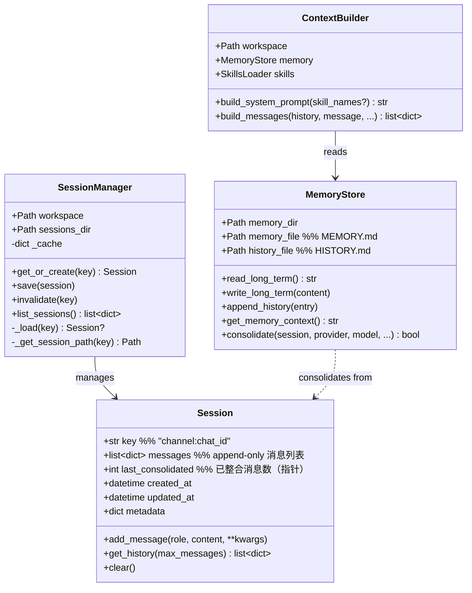
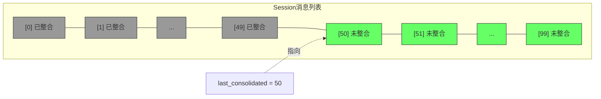
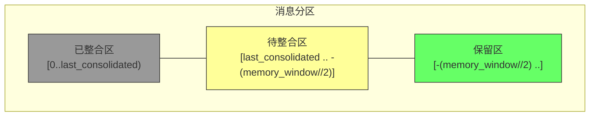
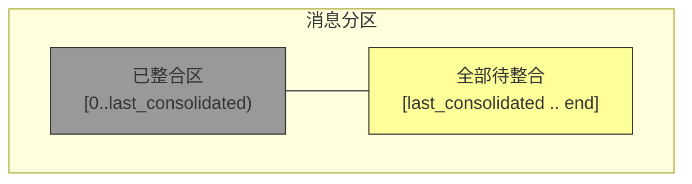

# 数据模型与存储

## 1. 核心数据结构

### 1.1 Session



### 1.2 消息结构

单条消息（存储在 `session.messages` 中）：

```python
{
    "role": "user" | "assistant" | "tool",
    "content": str | list,              # 文本或多模态内容
    "timestamp": "2026-03-05T10:00:00", # ISO 8601
    # 可选字段
    "tool_calls": [...],                # assistant 消息的工具调用
    "tool_call_id": str,                # tool 消息的关联 ID
    "name": str,                        # tool 消息的工具名
    "tools_used": [str],                # 记录使用了哪些工具（整合时用）
}
```

## 2. 文件格式

### 2.1 Session JSONL 文件

路径：`workspace/sessions/{channel}_{chat_id}.jsonl`

**格式**：每行一个 JSON 对象，第一行是元数据。

```jsonl
{"_type":"metadata","key":"telegram:12345","created_at":"2026-03-05T09:00:00","updated_at":"2026-03-05T12:00:00","metadata":{},"last_consolidated":50}
{"role":"user","content":"Hello","timestamp":"2026-03-05T10:00:00"}
{"role":"assistant","content":"Hi! How can I help?","timestamp":"2026-03-05T10:00:01"}
{"role":"user","content":"Read my config file","timestamp":"2026-03-05T10:01:00"}
{"role":"assistant","content":null,"tool_calls":[{"id":"tc_1","type":"function","function":{"name":"read_file","arguments":"{\"path\":\"config.yaml\"}"}}],"timestamp":"2026-03-05T10:01:01"}
{"role":"tool","tool_call_id":"tc_1","name":"read_file","content":"port: 8080\nhost: localhost","timestamp":"2026-03-05T10:01:02"}
{"role":"assistant","content":"Your config has port 8080 on localhost.","timestamp":"2026-03-05T10:01:03"}
```

**关键设计**：
- 元数据行 `_type: metadata` 包含 `last_consolidated` 指针
- 消息行按时间追加，不修改不删除
- 写入时全量重写（`save()` 方法）

### 2.2 MEMORY.md（长期记忆）

路径：`workspace/memory/MEMORY.md`

**初始模板**：

```markdown
# Long-term Memory

This file stores important information that should persist across sessions.

## User Information
(Important facts about the user)

## Preferences
(User preferences learned over time)

## Project Context
(Information about ongoing projects)

## Important Notes
(Things to remember)
```

**维护方式**：
1. LLM 整合时通过 `save_memory` tool call 的 `memory_update` 参数覆盖写入
2. Agent 在对话中通过 `write_file` / `edit_file` 工具主动写入
3. **覆盖写入**（非追加），每次写入完整内容

### 2.3 HISTORY.md（历史日志）

路径：`workspace/memory/HISTORY.md`

**格式**：每条记录以 `[YYYY-MM-DD HH:MM]` 开头，2-5 句话摘要，空行分隔。

```markdown
[2026-03-05 10:00] User asked about project configuration. Discussed config.yaml structure, 
port settings (8080), and localhost deployment. User prefers YAML over JSON for configs.

[2026-03-05 14:30] Helped debug a database connection issue. Root cause was missing SSL 
certificate. Added SSL_CERT_PATH to environment variables. User noted this is a recurring 
issue in their staging environment.
```

**维护方式**：
1. LLM 整合时通过 `save_memory` tool call 的 `history_entry` 参数追加
2. **追加式**（append-only），不修改不删除
3. Agent 通过 `exec` 工具执行 `grep -i "keyword" memory/HISTORY.md` 搜索

## 3. 消息保留与指针模型



- **灰色区**：`[0..49]` — 已整合，不再发送给 LLM
- **绿色区**：`[50..99]` — 未整合，通过 `get_history()` 返回给 LLM
- `last_consolidated` 是**逻辑指针**，消息物理上仍保留在 session 文件中

### 3.1 自动整合时的分区

当 `未整合消息数 >= memory_window` 时触发：



- **待整合区**（黄色）：发送给整合 LLM 提取摘要
- **保留区**（绿色）：保留最近 `memory_window // 2` 条消息不整合，确保上下文连续性

### 3.2 `/new` 命令的分区

`archive_all=True` 模式：



- 所有未整合消息全部发送给整合 LLM
- 整合成功后 `session.clear()` 清空所有消息

## 4. get_history() 滑动窗口

```python
def get_history(self, max_messages: int = 500) -> list[dict]:
    # 1. 取未整合区
    unconsolidated = self.messages[self.last_consolidated:]
    # 2. 取尾部 max_messages 条
    sliced = unconsolidated[-max_messages:]
    # 3. 对齐到 user 消息开头（避免孤立 tool_result）
    for i, m in enumerate(sliced):
        if m.get("role") == "user":
            sliced = sliced[i:]
            break
    # 4. 清理输出（只保留 role, content, tool_calls 等标准字段）
    return [clean(m) for m in sliced]
```

**关键点**：
- 不返回已整合消息（避免重复）
- 对齐到 user 消息开头（避免孤立的 tool_result 导致 LLM 困惑）
- 只返回标准字段（去除内部 metadata）
