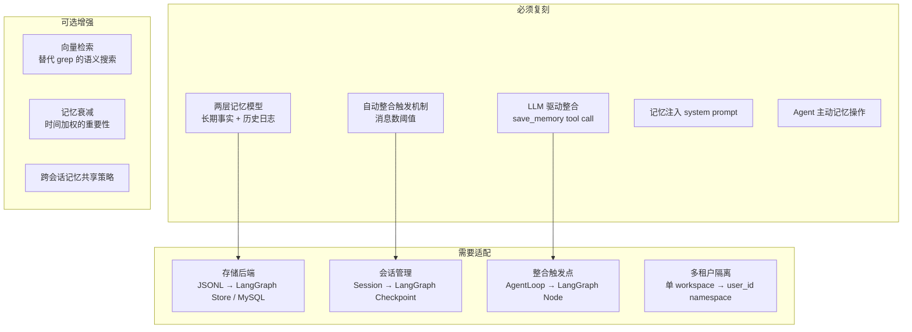
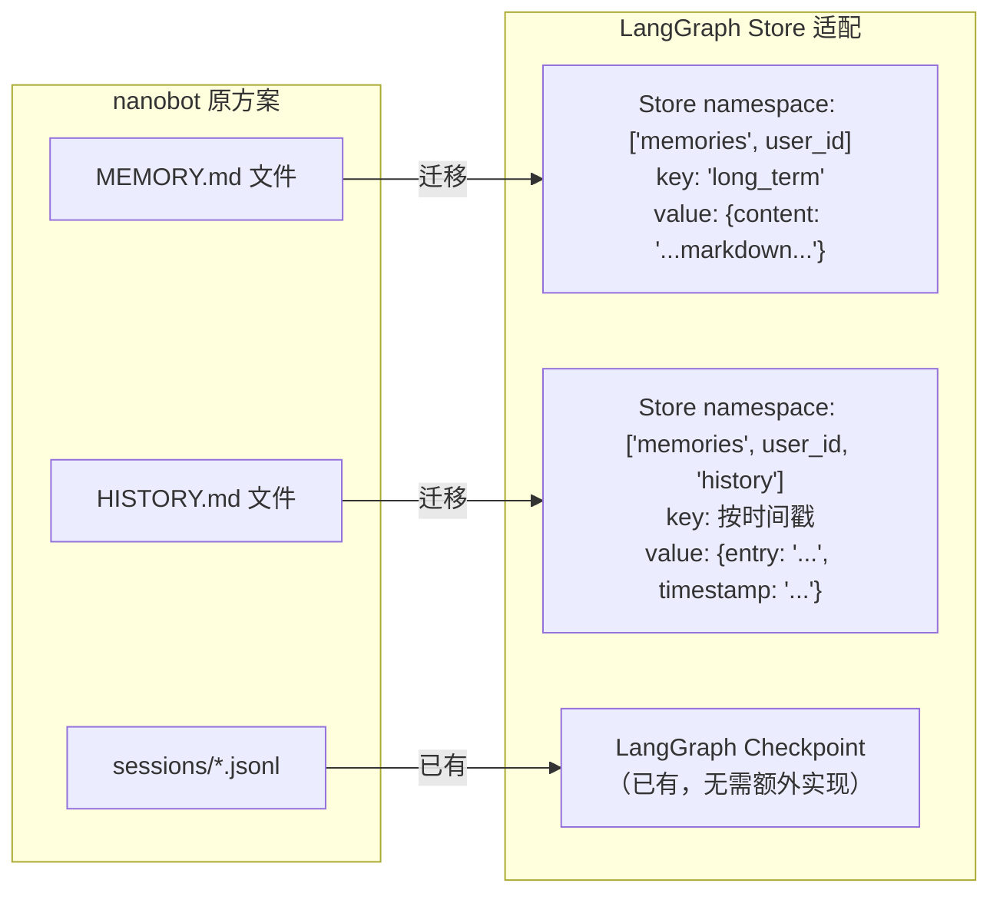
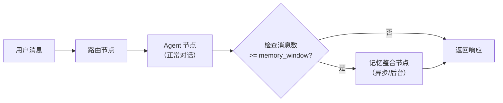
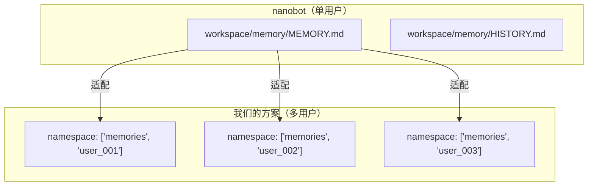

# 复刻指南 — 应用到我们项目的方案

> 基于 nanobot 记忆系统的逆向分析，规划如何在 CRC AI Insight Pilot Assistant 中复刻。

## 1. 架构差异分析

| 维度 | nanobot | 我们的项目 |
|------|---------|-----------|
| 后端框架 | 自研 AgentLoop + LiteLLM | LangGraph + deepagents |
| 会话存储 | JSONL 文件 | MySQL (LangGraph checkpoint) |
| 部署模型 | 单进程 | Docker 多服务 (agent-api, ops-server, chat-ui) |
| 多租户 | 单用户 workspace | 多用户 (user_id) |
| LLM 调用 | 直接 provider.chat() | LangGraph node |
| 记忆存储 | 文件系统 (MEMORY.md, HISTORY.md) | 待定（LangGraph Store / 文件 / DB） |

## 2. 需要复刻的核心能力



## 3. 复刻方案

### 3.1 存储层适配

**方案 A：LangGraph Store（推荐）**



**方案 B：MySQL 表**

```sql
CREATE TABLE agent_memory (
    id BIGINT PRIMARY KEY AUTO_INCREMENT,
    user_id VARCHAR(64) NOT NULL,
    memory_type ENUM('long_term', 'history') NOT NULL,
    content TEXT NOT NULL,
    created_at TIMESTAMP DEFAULT CURRENT_TIMESTAMP,
    updated_at TIMESTAMP DEFAULT CURRENT_TIMESTAMP ON UPDATE CURRENT_TIMESTAMP,
    INDEX idx_user_type (user_id, memory_type)
);
```

### 3.2 整合触发适配

在 LangGraph 中，整合可以作为一个条件节点：



### 3.3 记忆注入适配

在 LangGraph 中，通过 State 注入：

```python
class AgentState(TypedDict):
    messages: Annotated[list, add_messages]
    memory_context: str  # ← 从 Store 读取的 MEMORY.md 内容
    
def build_system_prompt(state: AgentState) -> str:
    """在 Agent 节点中构建 system prompt"""
    base_prompt = "..."
    if state.get("memory_context"):
        base_prompt += f"\n\n# Memory\n\n{state['memory_context']}"
    return base_prompt
```

### 3.4 多租户隔离



每个用户有独立的记忆命名空间，互不干扰。

## 4. 实现路线图

### Phase 1：基础记忆（最小可行）

| 步骤 | 内容 | 对应 nanobot |
|------|------|-------------|
| 1.1 | 创建 MemoryStore 类，对接 LangGraph Store | `memory.py` |
| 1.2 | 实现 `read_long_term()` / `write_long_term()` | 基础读写 |
| 1.3 | 在 Agent system prompt 中注入记忆 | `context.py` |
| 1.4 | 创建 memory skill 教 Agent 使用记忆 | `skills/memory/SKILL.md` |

### Phase 2：自动整合

| 步骤 | 内容 | 对应 nanobot |
|------|------|-------------|
| 2.1 | 实现 consolidate() 方法 | `memory.py:consolidate()` |
| 2.2 | 定义 save_memory 内部工具 | `_SAVE_MEMORY_TOOL` |
| 2.3 | 在 LangGraph 中添加整合触发条件 | `loop.py` 自动触发 |
| 2.4 | 实现 history 追加和搜索 | `append_history()` + grep |

### Phase 3：增强

| 步骤 | 内容 | 超越 nanobot |
|------|------|-------------|
| 3.1 | 向量化 HISTORY 支持语义搜索 | nanobot 只有 grep |
| 3.2 | 记忆重要性衰减 | nanobot 无此能力 |
| 3.3 | 跨会话记忆共享策略 | nanobot 全共享 |
| 3.4 | 记忆冲突检测与合并 | nanobot 无此能力 |

## 5. 关键设计决策（待确认）

| 决策点 | 选项 | 建议 |
|--------|------|------|
| 存储后端 | LangGraph Store vs MySQL | LangGraph Store（与已有架构一致） |
| 整合触发 | 消息数阈值 vs 时间间隔 vs 手动 | 消息数阈值（与 nanobot 一致，默认 100） |
| 历史搜索 | grep vs 向量检索 vs 全文索引 | Phase 1 用 Store 遍历，Phase 3 加向量 |
| 记忆隔离 | 用户级 vs 会话级 vs 项目级 | 用户级（同 nanobot，同用户共享） |
| 子 Agent | 是否继承记忆 | 不继承（同 nanobot 设计） |

## 6. 注意事项

1. **整合 LLM 的成本**：每次整合需要一次额外 LLM 调用，应控制频率
2. **整合质量**：依赖 LLM 的工具调用能力，需测试不同模型的表现
3. **容错**：整合失败不应影响主对话流程（nanobot 的关键设计）
4. **幂等性**：`memory_update` 是完整替换，自带幂等性
5. **prompt 膨胀**：MEMORY.md 全量注入，需要控制内容长度
