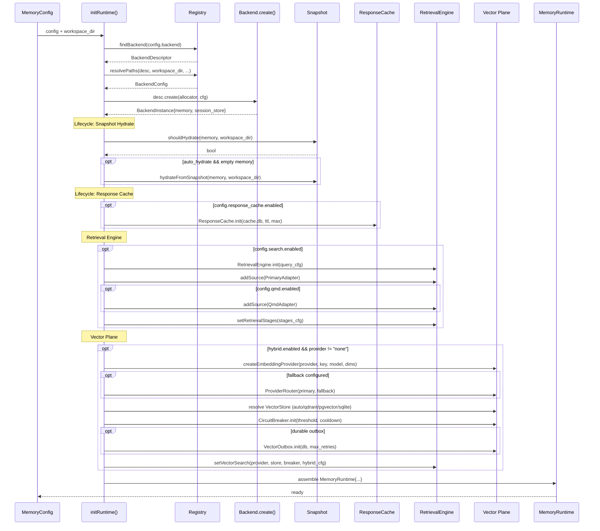

# 01 — 总体架构

## 四层分层架构

Nullclaw 的记忆系统采用严格的四层分层设计，每层职责清晰、接口解耦：

```mermaid
graph TB
    subgraph "Layer D: Runtime Orchestrator<br/>lifecycle/"
        RT[MemoryRuntime]
        RC[ResponseCache]
        SC[SemanticCache]
        HY[Hygiene]
        SN[Snapshot]
        SM[Summarizer]
        RO[Rollout]
        DG[Diagnostics]
    end

    subgraph "Layer B: Retrieval Engine<br/>retrieval/"
        RE[RetrievalEngine]
        QE[QueryExpansion]
        AD[Adaptive]
        RRF[RRF Merge]
        TD[TemporalDecay]
        MMR[MMR Rerank]
        LR[LLM Reranker]
    end

    subgraph "Layer C: Vector Plane<br/>vector/"
        EP[EmbeddingProvider]
        PR[ProviderRouter]
        VS[VectorStore]
        CB[CircuitBreaker]
        OB[VectorOutbox]
        CK[Chunker]
    end

    subgraph "Layer A: Primary Store<br/>engines/"
        REG[Registry]
        SQL[SQLite+FTS5]
        MD[Markdown]
        PG[Postgres]
        RD[Redis]
        API[HTTP API]
        LDB[LanceDB]
        LU[Lucid]
        MEM[InMemory LRU]
        NO[None]
    end

    RT --> RE
    RT --> RC
    RT --> SC
    RT --> HY
    RT --> SN
    RT --> SM
    RT --> RO
    RT --> DG

    RE --> QE
    RE --> AD
    RE --> RRF
    RE --> TD
    RE --> MMR
    RE --> LR

    RE --> EP
    RE --> VS
    RE --> CB

    RT --> EP
    RT --> VS
    RT --> CB
    RT --> OB

    REG --> SQL
    REG --> MD
    REG --> PG
    REG --> RD
    REG --> API
    REG --> LDB
    REG --> LU
    REG --> MEM
    REG --> NO

    RT --> REG

    style RT fill:#f9f,stroke:#333
    style RE fill:#bbf,stroke:#333
    style EP fill:#bfb,stroke:#333
    style REG fill:#fbb,stroke:#333
```



## 各层职责

### Layer A — Primary Store（主存储层）

**职责**：持久化记忆条目（MemoryEntry），提供 CRUD + 关键词搜索。

- 通过 `Memory` vtable 接口统一抽象所有后端
- 支持 10 种后端（SQLite/Markdown/Postgres/Redis/API/LanceDB/Lucid/Memory/None/Hybrid）
- `Registry` 提供编译期注册 + 运行时工厂查找
- SQLite 后端最完整：FTS5 全文搜索 + BM25 评分 + 事务 + Outbox

### Layer B — Retrieval Engine（检索引擎层）

**职责**：多源检索 + 多阶段后处理管线，输出排序后的候选列表。

- 9 阶段流水线：Query Expansion → Keyword → Vector → RRF → MinRelevance → TemporalDecay → MMR → LLM Rerank → Limit
- 支持多数据源（PrimaryAdapter + QmdAdapter 等）
- Reciprocal Rank Fusion 合并多源结果
- 自适应策略根据查询特征选择 keyword/vector/hybrid

### Layer C — Vector Plane（向量平面层）

**职责**：Embedding 生成 + 向量存储 + 可靠性保障。

- `EmbeddingProvider` vtable：支持 OpenAI / Gemini / Voyage / Ollama / Noop
- `ProviderRouter`：主备切换 + Fallback 链 + Hint 路由
- `VectorStore` vtable：SQLite Shared / SQLite Sidecar / Qdrant / pgvector
- `CircuitBreaker`：三态熔断器（closed → open → half_open）
- `VectorOutbox`：持久化 Outbox 保证向量同步不丢失

### Layer D — Runtime Orchestrator（运行时编排层）

**职责**：组装所有组件 + 生命周期管理。

- `MemoryRuntime`：唯一对外暴露的组合体，包含 Memory + SessionStore + Cache + Engine + Vector
- `ResponseCache`：精确哈希匹配的 LLM 响应去重
- `SemanticCache`：余弦相似度匹配的语义级响应缓存
- `Hygiene`：定期归档旧记忆、清除过期存档、裁剪对话
- `Snapshot`：JSON 导入/导出核心记忆
- `Summarizer`：滑动窗口摘要 + 语义事实提取
- `Rollout`：Shadow / Canary / On 三种混合检索渐进发布模式
- `Diagnostics`：运行时健康诊断报告

## MemoryRuntime 组装流程



## 核心设计原则

| 原则 | 体现 |
|------|------|
| **vtable 多态** | Memory / SessionStore / EmbeddingProvider / VectorStore / RetrievalSourceAdapter 均为 vtable 接口 |
| **编译期注册** | Registry 用 comptime 数组注册所有后端，build option 控制编译开关 |
| **优雅降级** | Vector 失败→降级为 keyword-only；所有 vector 操作 catch 不传播 |
| **持久化保障** | VectorOutbox 用 SQLite 表做 durable outbox，支持重试+死信 |
| **渐进发布** | Rollout 用 shadow/canary 模式平滑过渡 keyword → hybrid |
| **零外部依赖** | 纯 Zig 实现，SQLite 内嵌，HTTP 用 curl 子进程，无 C++ 依赖 |
| **best-effort 策略** | syncVectorAfterStore/deleteFromVectorStore 错误只 log 不抛出 |

## ResolvedConfig 快照

MemoryRuntime 初始化完成后保存一份 `ResolvedConfig` 快照，用于诊断和运行时检查：

```
ResolvedConfig {
    primary_backend: "sqlite"
    retrieval_mode: "hybrid"          // disabled | keyword | hybrid
    vector_mode: "sqlite_shared"      // none | sqlite_shared | sqlite_sidecar | qdrant | pgvector
    embedding_provider: "openai"      // none | openai | gemini | voyage | ollama | auto
    rollout_mode: "on"                // off | shadow | canary | on
    vector_sync_mode: "best_effort"   // best_effort | durable_outbox
    hygiene_enabled: true
    snapshot_enabled: true
    cache_enabled: true
    semantic_cache_enabled: false
    summarizer_enabled: true
    source_count: 2                   // primary + qmd
    fallback_policy: "degrade"        // degrade | fail_fast
}
```
