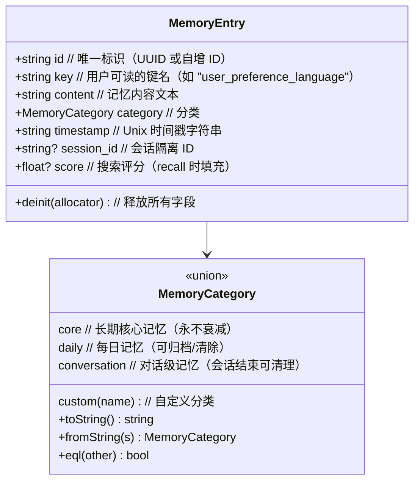
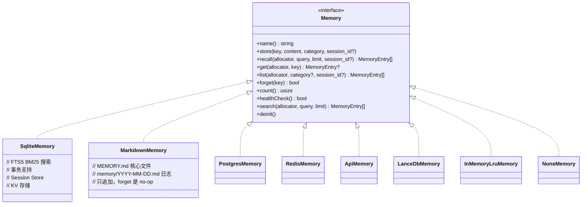
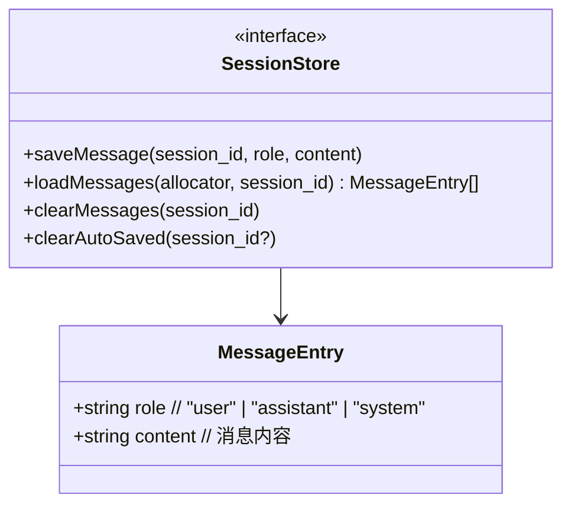
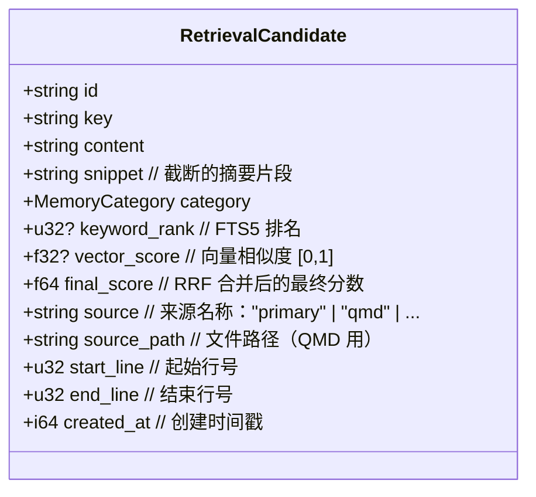
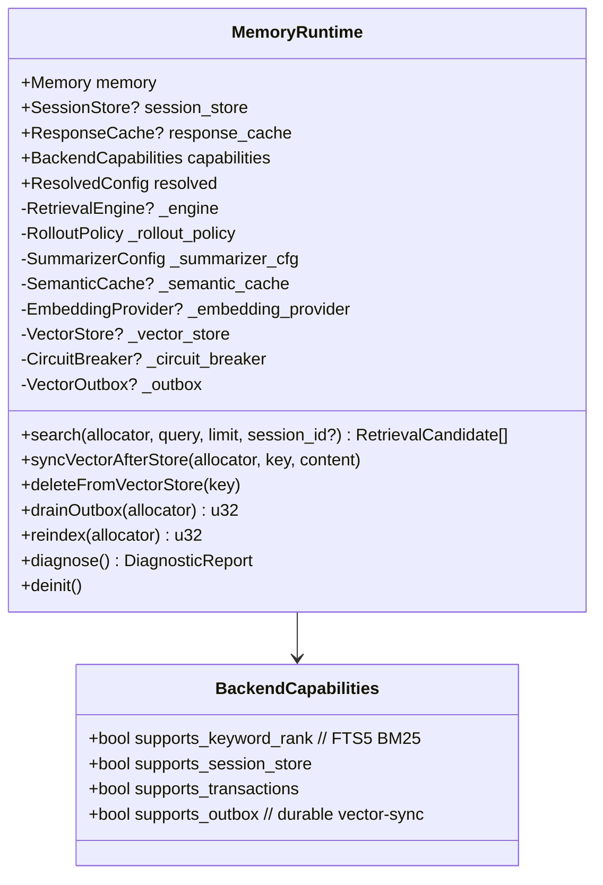
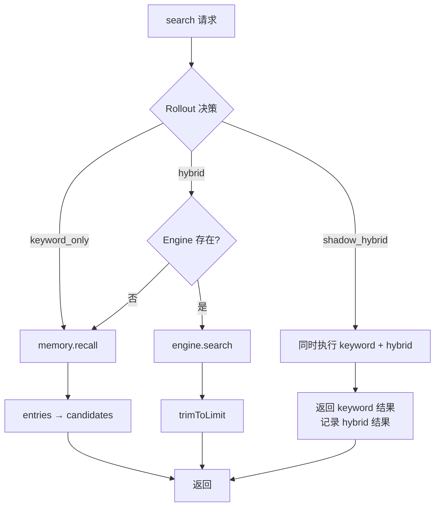

# 02 — 核心数据模型

## MemoryEntry（记忆条目）

系统的基本存储单元，所有后端都存储和返回此结构：



### 分类语义

| Category | 含义 | 生命周期 | 时间衰减 |
|----------|------|---------|---------|
| `core` | 长期知识、用户偏好、身份信息 | 永久 | 不衰减（evergreen） |
| `daily` | 每日工作记录、临时事实 | archive_after_days → purge_after_days | 正常衰减 |
| `conversation` | 对话上下文、临时提取的事实 | conversation_retention_days | 正常衰减 |
| `custom(name)` | 用户自定义分类 | 取决于应用逻辑 | 正常衰减 |

### 内部保留键

系统使用前缀约定标识内部记忆键，这些键在 UI 列表中被过滤：

```
autosave_user_*          # 自动保存的用户消息
autosave_assistant_*     # 自动保存的助手消息
last_hygiene_at          # 上次卫生清理时间戳
__bootstrap.prompt.*     # 引导文档（AGENTS.md, SOUL.md 等）
```

### Bootstrap 文档映射

```python
PROMPT_BOOTSTRAP_DOCS = {
    "AGENTS.md":    "__bootstrap.prompt.AGENTS.md",
    "SOUL.md":      "__bootstrap.prompt.SOUL.md",
    "TOOLS.md":     "__bootstrap.prompt.TOOLS.md",
    "IDENTITY.md":  "__bootstrap.prompt.IDENTITY.md",
    "USER.md":      "__bootstrap.prompt.USER.md",
    "HEARTBEAT.md": "__bootstrap.prompt.HEARTBEAT.md",
    "BOOTSTRAP.md": "__bootstrap.prompt.BOOTSTRAP.md",
    "MEMORY.md":    "__bootstrap.prompt.MEMORY.md",
}
```

## Memory 接口（vtable）

所有存储后端实现此统一接口：



### 方法语义

| 方法 | 语义 | 说明 |
|------|------|------|
| `store(key, content, category, session_id?)` | Upsert | 相同 key 覆盖更新，不同 key 插入 |
| `recall(query, limit, session_id?)` | 关键词搜索 | SQLite 用 FTS5 BM25，其他后端用简单匹配 |
| `get(key)` | 精确获取 | 按 key 精确查找单条 |
| `list(category?, session_id?)` | 列举 | 可按 category 和 session_id 过滤 |
| `forget(key)` | 删除 | Markdown 后端的 forget 是 no-op |
| `count()` | 计数 | 返回总条目数 |
| `search(query, limit)` | 混合搜索 | 目前委托给 recall()，未来升级为 hybrid |

## SessionStore 接口（vtable）

会话消息存储，部分后端支持：



支持 SessionStore 的后端：SQLite、Lucid、Postgres、API。

## RetrievalCandidate（检索候选）

检索引擎的输出单元，比 MemoryEntry 更丰富：



### MemoryEntry → RetrievalCandidate 转换

```python
def entry_to_candidate(entry: MemoryEntry, rank: int) -> RetrievalCandidate:
    return RetrievalCandidate(
        id=entry.id,
        key=entry.key,
        content=entry.content,
        snippet=entry.content,  # 直接复制
        category=entry.category,
        keyword_rank=rank,       # 1-based
        vector_score=None,
        final_score=0.0,         # RRF 阶段填充
        source="primary",
        source_path="",
        start_line=0,
        end_line=0,
        created_at=int(entry.timestamp) or 0,
    )
```

## MemoryRuntime（运行时聚合体）

最终暴露给上层的组合结构：



### search() 决策逻辑


