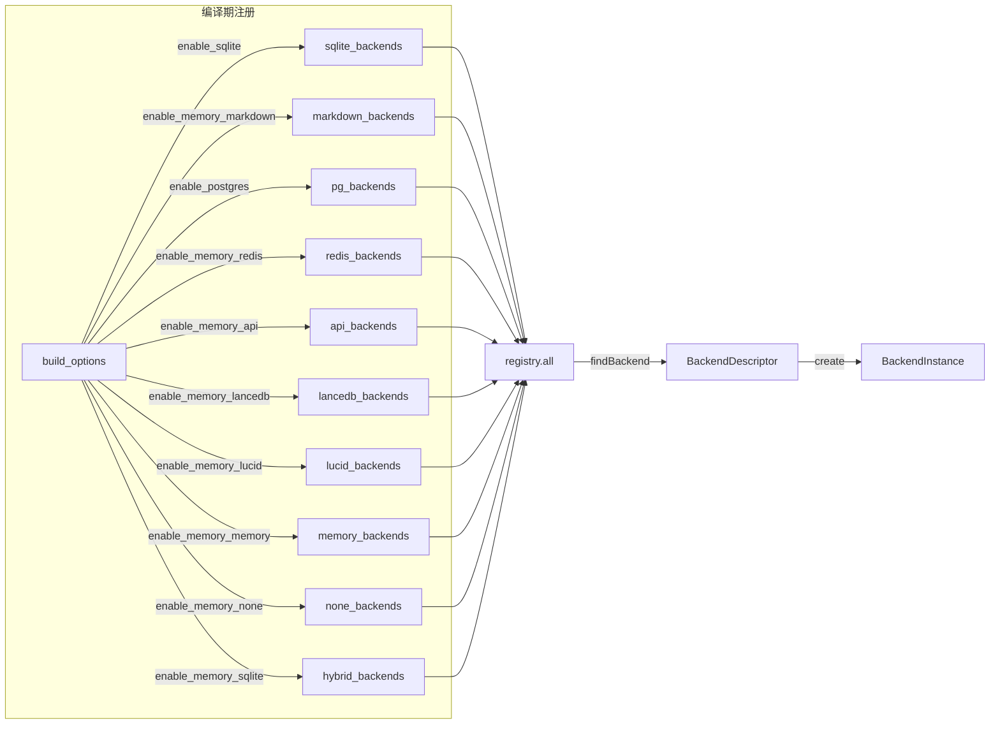
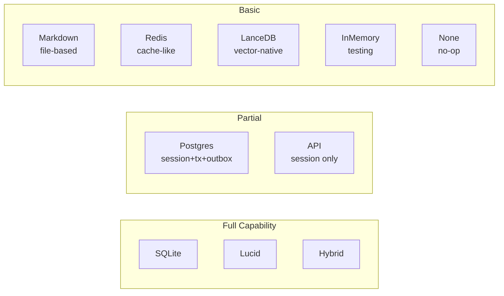

# 03 — 存储后端

## Backend Registry（后端注册表）

### 注册机制

使用编译期（comptime）数组注册所有后端，通过 build option 控制启用/禁用：



### BackendDescriptor 结构

每个后端声明自己的描述符：

```python
@dataclass
class BackendDescriptor:
    name: str                        # "sqlite", "markdown", "api", ...
    label: str                       # 人类可读的描述
    auto_save_default: bool          # 是否默认自动保存
    capabilities: BackendCapabilities
    needs_db_path: bool              # 需要 memory.db 路径
    needs_workspace: bool            # 需要工作区目录
    create: Callable                 # 工厂函数
```

### BackendConfig 和路径解析

```python
@dataclass
class BackendConfig:
    db_path: Optional[str]           # sqlite/lucid/lancedb: "{workspace}/memory.db"
    workspace_dir: str               # 工作区目录
    postgres_url: Optional[str]      # PostgreSQL 连接串
    postgres_schema: str = "public"
    postgres_table: str = "memories"
    postgres_connect_timeout_secs: int = 30
    redis_config: Optional[RedisConfig] = None
    api_config: Optional[ApiConfig] = None
    instance_id: str = ""
```

**路径解析规则**：
- `needs_db_path=True` → `db_path = join(workspace_dir, "memory.db")`
- `needs_workspace=True` → `workspace_dir` 直接传入
- Postgres → URL 自动添加 `connect_timeout` 参数

## 各后端详解

### 1. SQLite（推荐后端）

```
capabilities:
  supports_keyword_rank: true    # FTS5 BM25 评分
  supports_session_store: true   # 消息存储
  supports_transactions: true    # BEGIN/COMMIT
  supports_outbox: true          # 持久化向量同步
```

**SQLite Schema**：

```sql
-- 主记忆表
CREATE TABLE IF NOT EXISTS memories (
    id         INTEGER PRIMARY KEY AUTOINCREMENT,
    key        TEXT NOT NULL UNIQUE,
    content    TEXT NOT NULL,
    category   TEXT NOT NULL DEFAULT 'core',
    timestamp  TEXT NOT NULL,
    session_id TEXT
);
CREATE INDEX IF NOT EXISTS idx_mem_key ON memories(key);
CREATE INDEX IF NOT EXISTS idx_mem_cat ON memories(category);
CREATE INDEX IF NOT EXISTS idx_mem_ts  ON memories(timestamp);
CREATE INDEX IF NOT EXISTS idx_mem_sid ON memories(session_id);

-- FTS5 全文搜索索引
CREATE VIRTUAL TABLE IF NOT EXISTS memories_fts USING fts5(
    key, content, content=memories, content_rowid=id
);

-- 自动同步触发器
CREATE TRIGGER IF NOT EXISTS trig_mem_ai AFTER INSERT ON memories BEGIN
    INSERT INTO memories_fts(rowid, key, content) VALUES (new.id, new.key, new.content);
END;
CREATE TRIGGER IF NOT EXISTS trig_mem_au AFTER UPDATE ON memories BEGIN
    INSERT INTO memories_fts(memories_fts, rowid, key, content)
        VALUES('delete', old.id, old.key, old.content);
    INSERT INTO memories_fts(rowid, key, content) VALUES (new.id, new.key, new.content);
END;
CREATE TRIGGER IF NOT EXISTS trig_mem_ad AFTER DELETE ON memories BEGIN
    INSERT INTO memories_fts(memories_fts, rowid, key, content)
        VALUES('delete', old.id, old.key, old.content);
END;

-- 会话消息表
CREATE TABLE IF NOT EXISTS session_messages (
    id         INTEGER PRIMARY KEY AUTOINCREMENT,
    session_id TEXT NOT NULL,
    role       TEXT NOT NULL,
    content    TEXT NOT NULL,
    timestamp  TEXT NOT NULL
);

-- 向量嵌入表
CREATE TABLE IF NOT EXISTS memory_embeddings (
    memory_key TEXT PRIMARY KEY,
    embedding  BLOB NOT NULL
);

-- 向量同步 Outbox 表
CREATE TABLE IF NOT EXISTS vector_outbox (
    id         INTEGER PRIMARY KEY AUTOINCREMENT,
    memory_key TEXT NOT NULL,
    operation  TEXT NOT NULL,      -- "upsert" | "delete"
    created_at TEXT NOT NULL DEFAULT (datetime('now')),
    attempts   INTEGER DEFAULT 0,
    last_error TEXT
);
```

**Pragma 配置**：
```sql
PRAGMA journal_mode = WAL;       -- 写前日志（9p/NFS 降级为 DELETE）
PRAGMA synchronous = NORMAL;
PRAGMA temp_store = MEMORY;
PRAGMA busy_timeout = 5000;      -- 5 秒忙等
```

**FTS5 搜索（recall）**：
```sql
SELECT m.id, m.key, m.content, m.category, m.timestamp, m.session_id,
       bm25(memories_fts) AS score
FROM memories_fts fts
JOIN memories m ON fts.rowid = m.id
WHERE memories_fts MATCH ?1
  AND (?2 IS NULL OR m.session_id = ?2)
ORDER BY bm25(memories_fts)
LIMIT ?3
```

### 2. Markdown（文件后端）

```
capabilities: 全部 false
needs_workspace: true
```

**文件布局**：
```
workspace/
├── MEMORY.md              # 核心长期记忆（category=core）
└── memory/
    ├── 2024-01-15.md      # 每日记忆（category=daily）
    ├── 2024-01-16.md
    └── archive/           # 归档目录（hygiene 移入）
        └── 2024-01-01.md
```

**存储格式**：每条记忆追加为 `**key**: content` 格式行。

**recall 实现**：遍历文件内容做简单子串匹配（无 FTS5 排序）。

**forget 是 no-op**：保留审计追踪，不删除内容。

### 3. PostgreSQL

```
capabilities:
  supports_session_store: true
  supports_transactions: true
  supports_outbox: true
```

- 使用 `libpq` C 客户端库
- 支持自定义 schema 和 table 名
- 自动添加 `connect_timeout` 参数到 URL
- 适合多实例共享记忆场景

### 4. Redis

```
capabilities: 全部 false
```

- 基于 Redis Hash/Set 实现
- 支持 TTL 自动过期
- 支持 `key_prefix` 隔离不同实例
- 适合高速缓存场景

### 5. HTTP API

```
capabilities:
  supports_session_store: true
```

- 委托到外部 REST API 服务
- 使用 curl 子进程发起 HTTP 请求（保证超时控制）
- 安全约束：HTTP 仅允许 localhost，外部必须 HTTPS
- 支持 API Key 认证（Bearer token）

**API 端点映射**：

| Memory 方法 | HTTP | URL |
|------------|------|-----|
| store | POST | `{base}/memories` |
| recall | GET | `{base}/memories/search?q={query}&limit={n}` |
| get | GET | `{base}/memories/{key}` |
| list | GET | `{base}/memories?category={cat}` |
| forget | DELETE | `{base}/memories/{key}` |
| count | GET | `{base}/memories/count` |

### 6. LanceDB

- SQLite + 向量增强召回
- 需要 `memory.db` 路径
- 内建向量搜索能力

### 7. Lucid

- SQLite 核心 + 跨项目记忆同步
- 通过 `lucid` CLI 工具同步
- 同时需要 db_path 和 workspace_dir

### 8. InMemory LRU

- 内存中 LRU 缓存，容量 1000 条
- 无持久化，适合测试
- `auto_save_default = false`

### 9. Hybrid（SQLite + Markdown）

- 内部实际等同 SQLite 后端
- 组合了 SQLite 的搜索能力和 Markdown 的人类可读性
- `needs_db_path = true, needs_workspace = true`

### 10. None

- 空实现，所有操作为 no-op
- `store` 丢弃、`recall` 返回空、`count` 返回 0

## 后端能力矩阵



| 后端 | keyword_rank | session_store | transactions | outbox |
|------|:-----------:|:------------:|:-----------:|:------:|
| SQLite | ✅ | ✅ | ✅ | ✅ |
| Hybrid | ✅ | ✅ | ✅ | ✅ |
| Lucid | ✅ | ✅ | ✅ | ✅ |
| Postgres | ❌ | ✅ | ✅ | ✅ |
| API | ❌ | ✅ | ❌ | ❌ |
| Markdown | ❌ | ❌ | ❌ | ❌ |
| Redis | ❌ | ❌ | ❌ | ❌ |
| LanceDB | ❌ | ❌ | ❌ | ❌ |
| InMemory | ❌ | ❌ | ❌ | ❌ |
| None | ❌ | ❌ | ❌ | ❌ |
