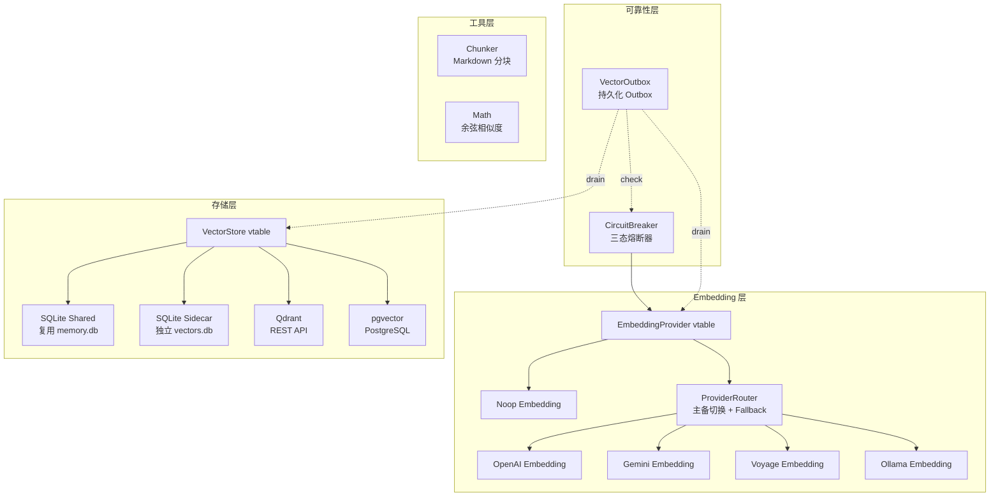
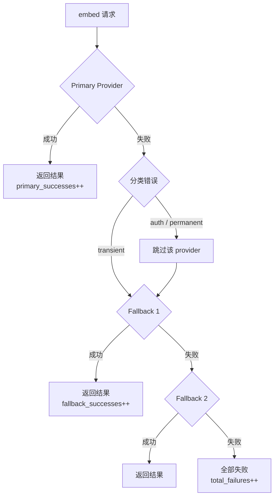
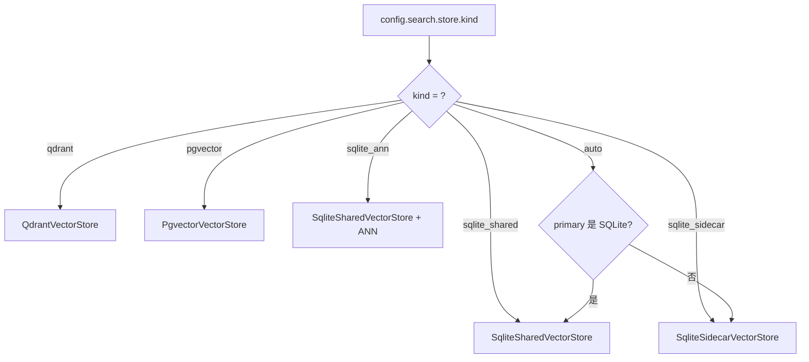
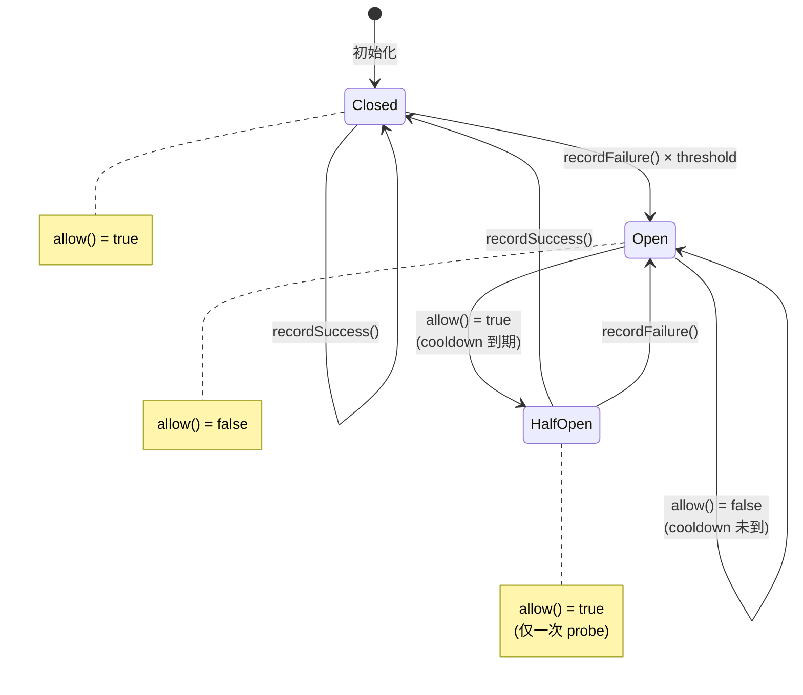
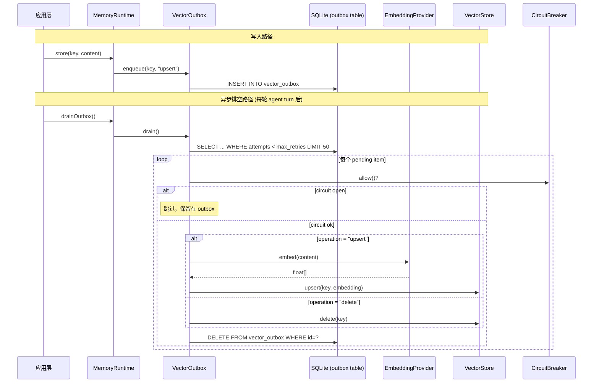
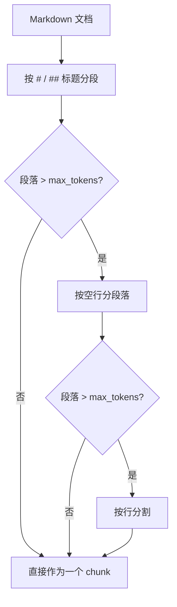

# 05 — 向量平面 (Vector Plane)

## 整体架构



## EmbeddingProvider 接口

```python
class EmbeddingProvider(Protocol):
    def name(self) -> str: ...
    def dimensions(self) -> int: ...
    def embed(self, text: str) -> list[float]: ...
    def deinit(self) -> None: ...
```

### OpenAI 兼容实现

- 支持自定义 `base_url`（兼容 Azure OpenAI、本地代理等）
- URL 自动补全逻辑：
  - 已以 `/embeddings` 结尾 → 直接使用
  - 有显式 API 路径 → 追加 `/embeddings`
  - 否则 → 追加 `/v1/embeddings`
- 请求体：`{"model": "...", "input": "..."}`
- 响应解析：提取 `data[0].embedding` 浮点数组
- 安全约束：base_url 必须为 HTTPS，或 HTTP 仅限 localhost

### Gemini / Voyage / Ollama

各自实现对应 API 格式，但都通过 EmbeddingProvider vtable 暴露统一接口。

### Noop Provider

- `embed()` 返回空数组，用于 keyword-only 回退
- `dimensions()` 返回 0

## ProviderRouter（提供者路由）



### 错误分类

| 错误类型 | 分类 | 处理 |
|---------|------|------|
| `EmbeddingApiError` | transient | 尝试 fallback |
| `ConnectionRefused/TimedOut/Reset` | transient | 尝试 fallback |
| `InvalidEmbeddingResponse` | permanent | 跳过 provider |
| `OutOfMemory` | permanent | 跳过 provider |
| 其他 | transient | 尝试 fallback |

### Hint 路由

模型名以 `hint:` 前缀可路由到指定 provider：

```
model = "hint:high-dim"  →  resolveRoute("high-dim")  →  EmbeddingRoute{provider, model, dims}
```

### Metrics

```python
@dataclass
class RouterMetrics:
    total_calls: int = 0
    primary_successes: int = 0
    fallback_successes: int = 0
    total_failures: int = 0
```

## VectorStore 接口

```python
class VectorStore(Protocol):
    def search(self, query_embedding: list[float], limit: int) -> list[VectorResult]: ...
    def upsert(self, key: str, embedding: list[float]) -> None: ...
    def delete(self, key: str) -> None: ...
    def count(self) -> int: ...
    def health(self) -> HealthStatus: ...
    def deinit(self) -> None: ...

@dataclass
class VectorResult:
    key: str       # 对应 MemoryEntry.key
    score: float   # 余弦相似度 [0, 1]

@dataclass
class HealthStatus:
    ok: bool
    latency_ns: int
    entry_count: Optional[int]
    error_msg: Optional[str]
```

### SQLite Shared VectorStore

- **复用 memory.db** 的 `memory_embeddings` 表
- Embedding 以 BLOB 存储（f32 小端序列化）
- 搜索：全表扫描 + 余弦相似度计算（无近似索引）
- 适合中小规模（< 10K 条目）

```sql
-- 搜索（精确暴力搜索）
SELECT memory_key, embedding FROM memory_embeddings
-- 在代码中逐行计算余弦相似度，维护 top-K 堆

-- Upsert
INSERT OR REPLACE INTO memory_embeddings (memory_key, embedding) VALUES (?1, ?2)

-- Delete
DELETE FROM memory_embeddings WHERE memory_key = ?1
```

### SQLite Sidecar VectorStore

- 独立 `vectors.db` 文件
- 与 SQLite Shared 相同的查询逻辑
- 文件级隔离，不影响主 memory.db

### SQLite ANN（实验性）

- 基于 LSH（Locality-Sensitive Hashing）的近似最近邻
- 64-bit 签名，分 4 个 16-bit band
- 预过滤候选集 → 精确余弦排序
- 候选集大小 = `limit * candidate_multiplier`（默认 12x）

### Qdrant VectorStore

- 通过 REST API 连接 Qdrant 服务
- 支持 API Key 认证
- 自动创建 Collection（设置 dimensions + cosine distance）
- 搜索 → `POST /collections/{name}/points/search`
- Upsert → `PUT /collections/{name}/points`（使用 UUID 作为 point ID）

### pgvector VectorStore

- PostgreSQL + pgvector 扩展
- 使用 libpq C 客户端
- 适合已有 Postgres 基础设施的场景

### 向量存储选择逻辑



## CircuitBreaker（熔断器）

### 三态状态机



### 参数

```python
@dataclass
class CircuitBreakerConfig:
    threshold: int = 5       # 连续失败次数触发熔断
    cooldown_ms: int = 30000 # 30秒冷却期
```

### Half-Open 单探针

半开状态只允许一次 probe 请求：
- 第一次 `allow()` → True，设置 `half_open_probe_sent = True`
- 后续 `allow()` → False，直到 `recordSuccess()` 或 `recordFailure()`

## VectorOutbox（持久化 Outbox）

### 设计目标

确保 `store()` 后的向量同步不因进程崩溃而丢失。



### Outbox Schema

```sql
CREATE TABLE IF NOT EXISTS vector_outbox (
    id         INTEGER PRIMARY KEY AUTOINCREMENT,
    memory_key TEXT NOT NULL,
    operation  TEXT NOT NULL,      -- "upsert" | "delete"
    created_at TEXT NOT NULL DEFAULT (datetime('now')),
    attempts   INTEGER DEFAULT 0,
    last_error TEXT
);
```

### 重试与死信

- `max_retries` 默认 2
- 每次失败 → `attempts += 1`，记录 `last_error`
- 超过 `max_retries` → 死信（不再处理）
- 每次 drain 最多处理 50 条

## Chunker（文档分块）

### 分块策略（三级递降）



### Token 估算

`tokens ≈ chars / 4`（粗略英文平均值）

### Chunk 结构

```python
@dataclass
class Chunk:
    index: int              # 在文档中的序号
    content: str            # 分块内容
    heading: Optional[str]  # 所属标题（保持上下文）
```

### 特殊处理

- **UTF-8 BOM**：自动剥离 `\xEF\xBB\xBF`
- **空白修剪**：chunk 内容去首尾空白
- **标题继承**：子 chunk 保留父标题上下文
- **空 chunk 过滤**：过滤掉空内容的 chunk
- **重新编号**：过滤后重新分配 index

## Vector Math（向量数学工具）

### 余弦相似度

$$\cos(\mathbf{a}, \mathbf{b}) = \frac{\mathbf{a} \cdot \mathbf{b}}{|\mathbf{a}| \cdot |\mathbf{b}|}$$

- 返回值 clamp 到 [0, 1]
- 空/不等长/退化向量 → 返回 0.0
- 非有限值（NaN/Inf） → 返回 0.0
- 使用 f64 中间精度计算

### 向量序列化

```python
def vec_to_bytes(v: list[float]) -> bytes:
    """f32 小端序列化"""
    return struct.pack(f'<{len(v)}f', *v)

def bytes_to_vec(b: bytes) -> list[float]:
    """f32 小端反序列化"""
    count = len(b) // 4
    return list(struct.unpack(f'<{count}f', b))
```

### Hybrid Merge（权重融合）

$$\text{final\_score} = w_v \times \text{vector\_score} + w_k \times \text{keyword\_score}$$

- keyword_score 归一化到 [0, 1]
- vector_score（余弦相似度）已在 [0, 1]
- 按 id 去重，final_score 取两路之和
