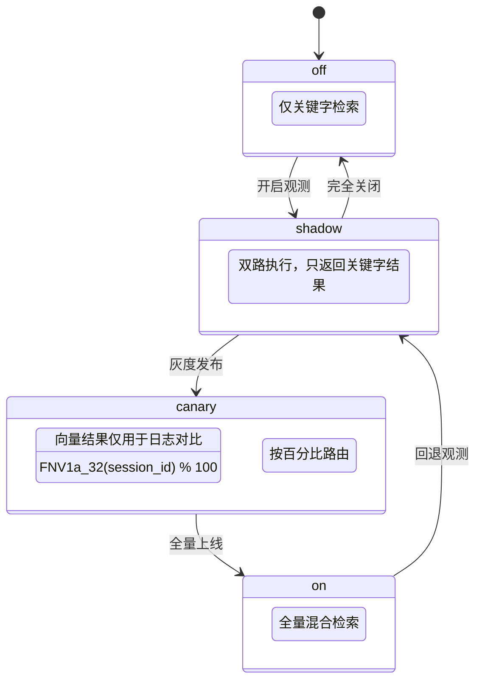
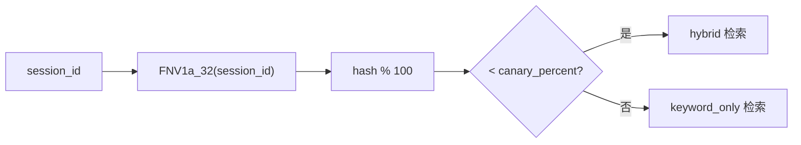
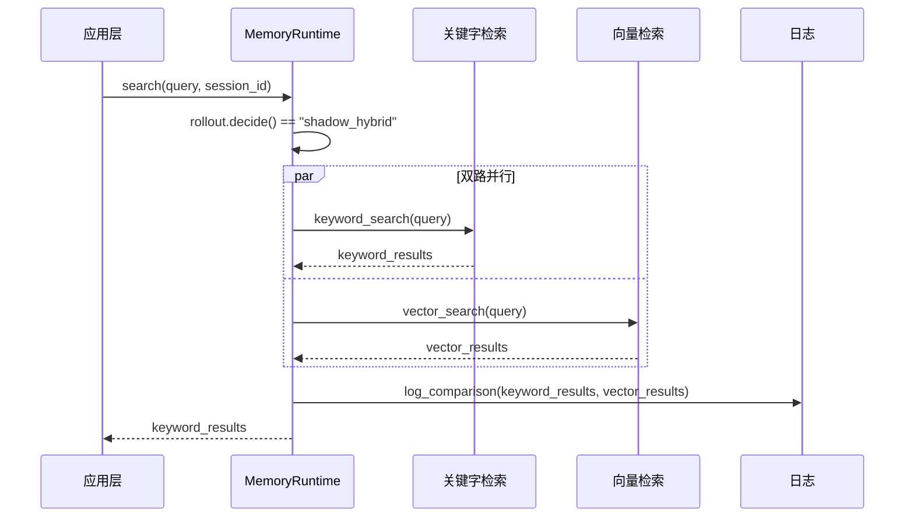
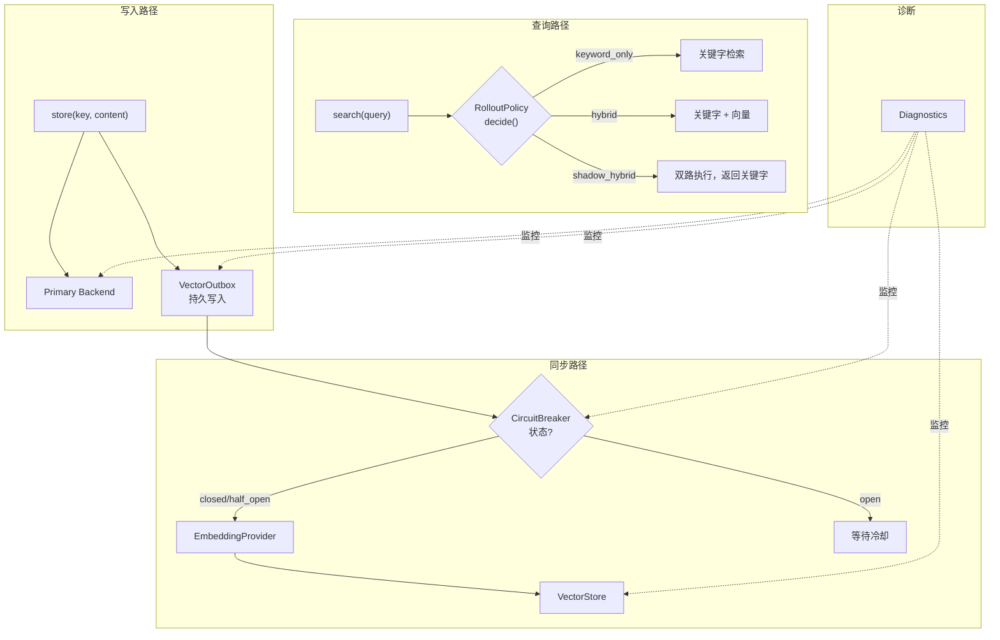
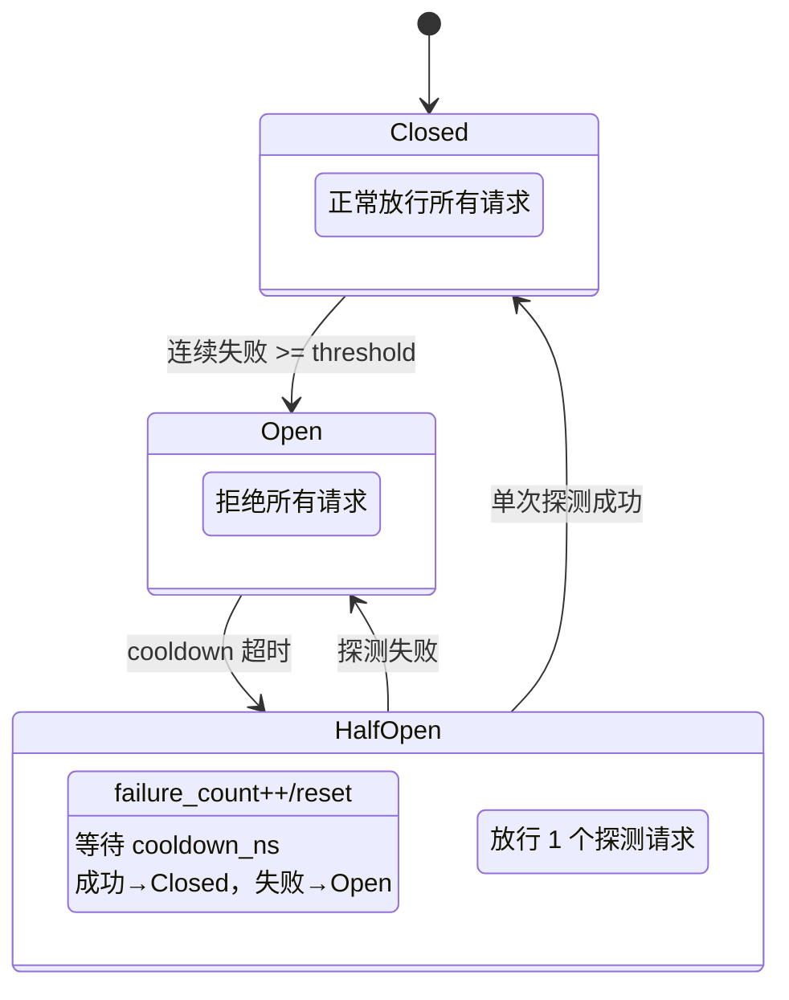
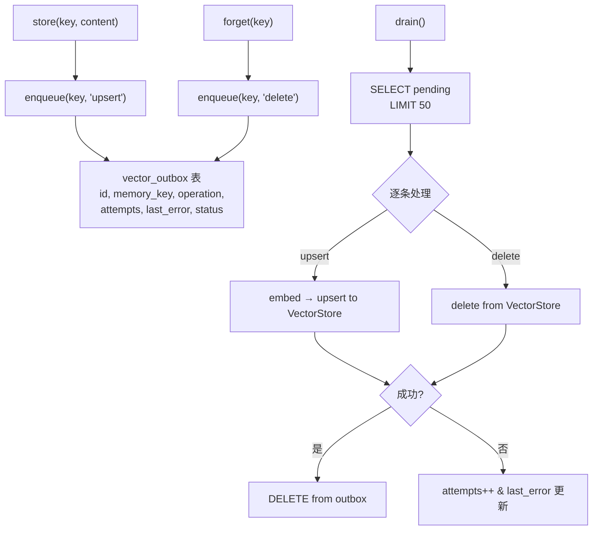
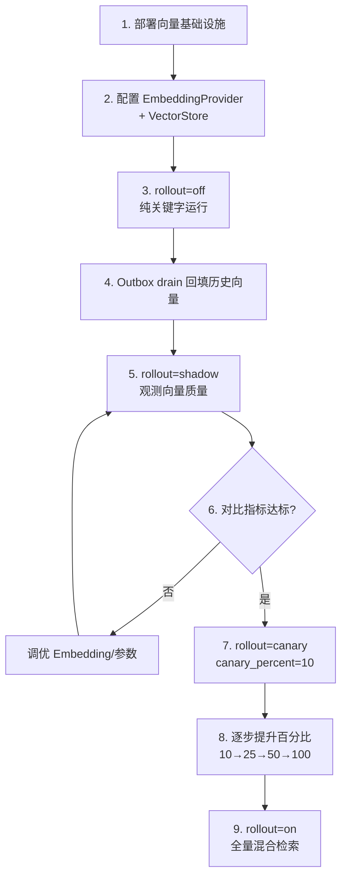
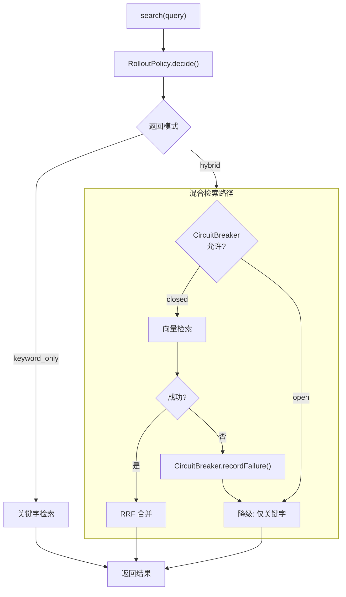

# 07 — 渐进式发布与可靠性 (Rollout & Reliability)

## 概览

Nullclaw 提供了一套完整的渐进式发布机制，允许在不停机的情况下从纯关键字检索平滑过渡到混合（关键字 + 向量）检索。同时，CircuitBreaker + Outbox + Diagnostics 三者协作确保发布过程中的可靠性。

## 1. RolloutPolicy（渐进式发布策略）

### 四种模式



### 模式详情

| 模式 | 关键字检索 | 向量检索 | 返回结果 | 用途 |
|------|-----------|---------|---------|------|
| `off` | ✅ 执行 | ❌ 不执行 | 关键字 | 默认/保守模式 |
| `shadow` | ✅ 执行 | ✅ 执行 | 关键字 | A/B 对比观测 |
| `canary` | ✅ 执行 | 按比例 | 混合或关键字 | 灰度验证 |
| `on` | ✅ 执行 | ✅ 执行 | 混合 | 全量上线 |

### decide() 决策逻辑

```python
class RolloutPolicy:
    mode: str       # "off" | "shadow" | "canary" | "on"
    canary_percent: int  # 0-100, canary 模式下的流量百分比

    def decide(self, session_id: Optional[str]) -> str:
        if self.mode == "off":
            return "keyword_only"
        elif self.mode == "on":
            return "hybrid"
        elif self.mode == "shadow":
            return "shadow_hybrid"
        elif self.mode == "canary":
            if session_id is None:
                return "keyword_only"
            hash_val = fnv1a_32(session_id.encode())
            if hash_val % 100 < self.canary_percent:
                return "hybrid"
            else:
                return "keyword_only"
```

### Canary 路由一致性

使用 FNV-1a 32-bit 哈希确保同一 `session_id` 始终被分到同一组：



**特性**：
- 哈希分布均匀，百分比精确
- 同一 session 多次查询结果一致
- `session_id = null` → 保守回退到 keyword_only

## 2. Shadow 模式详解

### 运行流程



### Shadow 对比指标

- 结果重叠率（overlap ratio）
- 向量独有的高分结果
- 关键字独有的结果
- 延迟差异

## 3. 可靠性保障三件套

### 协作关系



### CircuitBreaker 状态机



**配置**：
```python
@dataclass
class CircuitBreakerConfig:
    failure_threshold: int = 5       # 触发 Open 的连续失败次数
    cooldown_secs: int = 60          # Open → HalfOpen 等待秒数
    half_open_max_probes: int = 1    # HalfOpen 放行探测数
```

### VectorOutbox 持久化保障



**特性**：
- 最大批次 50 条
- 失败不删除，下次 drain 重试
- 与 CircuitBreaker 配合：breaker open 时 drain 跳过

## 4. 推荐发布流程

### 从零到全量的完整路径



### 各阶段检查清单

| 阶段 | 检查项 | Diagnostics 字段 |
|------|--------|-----------------|
| shadow | 向量结果不为空 | `vector_entry_count > 0` |
| shadow | Outbox 清空 | `outbox_pending == 0` |
| shadow | CircuitBreaker 健康 | `circuit_breaker.state == closed` |
| canary | 10% 流量无异常 | 日志无错误 |
| canary | 向量延迟可接受 | 自定义监控 |
| on | 全量无降级 | `backend_healthy == true` |

## 5. 故障降级策略



**核心原则**：向量平面的任何故障都不会导致整体检索失败，始终降级到关键字检索。
