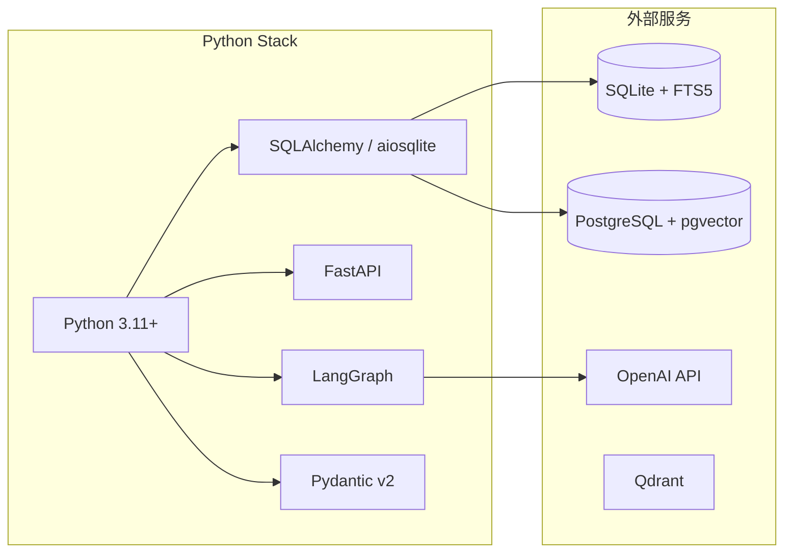
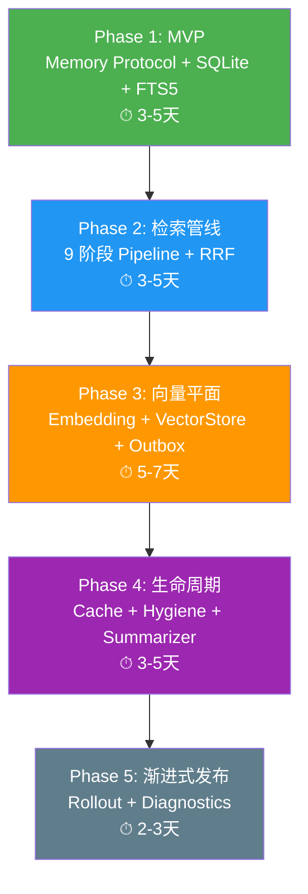
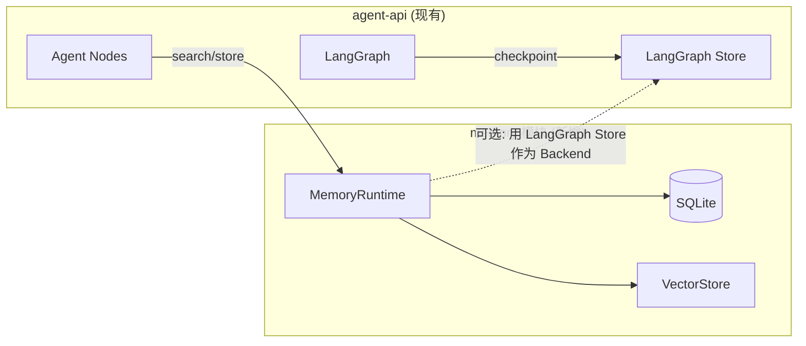

# 08 — Python / LangGraph 复刻指南 (Replication Guide)

## 复刻目标

将 Nullclaw 的 Zig 内存系统完整移植到 Python 3.11+ 技术栈，使用 LangGraph / FastAPI / SQLAlchemy 等主流框架，保留所有核心设计但采用 Pythonic 实现。

## 1. 概念映射表

### 核心抽象

| Nullclaw (Zig) | Python 复刻 | 说明 |
|----------------|------------|------|
| `Memory` vtable | `abc.ABC` / `Protocol` | Python 的鸭子类型 + Protocol |
| `SessionStore` vtable | `SessionStoreProtocol` | 同上 |
| `initRuntime()` | `MemoryRuntimeFactory.create()` | 工厂函数 |
| `MemoryRuntime` struct | `MemoryRuntime` dataclass | 不可变容器 |
| comptime `Registry` | `dict[str, BackendDescriptor]` + 装饰器注册 | 运行时注册 |
| `BackendCapabilities` packed struct | `@dataclass(frozen=True)` | 能力标记 |
| `RetrievalEngine` | `RetrievalPipeline` class | 9 阶段管线 |
| `EmbeddingProvider` vtable | `EmbeddingProvider` Protocol | 嵌入接口 |
| `VectorStore` vtable | `VectorStore` Protocol | 向量存储接口 |
| `CircuitBreaker` | `CircuitBreaker` class | 状态机 |
| `VectorOutbox` | `VectorOutbox` class | 持久化队列 |
| comptime type dispatch | `@singledispatch` / if-elif | 运行时分发 |

### 数据模型

| Nullclaw | Python |
|----------|--------|
| `MemoryEntry` struct | `MemoryEntry` dataclass |
| `MemoryCategory` enum | `MemoryCategory(str, Enum)` |
| `RetrievalCandidate` | `RetrievalCandidate` dataclass (extends MemoryEntry) |
| `ResolvedConfig` | `MemoryConfig` Pydantic model |

## 2. 推荐技术栈



| 层 | 推荐方案 |
|----|---------|
| 主存储 | SQLAlchemy + aiosqlite（开发）/ asyncpg（生产） |
| 全文搜索 | SQLite FTS5（开发）/ PostgreSQL tsvector（生产） |
| 向量存储 | sqlite-vec（轻量）/ Qdrant（生产）/ pgvector（PostgreSQL 统一） |
| Embedding | OpenAI text-embedding-3-small / Ollama（本地） |
| 缓存 | 内置 SQLite（同 Nullclaw）或 Redis |
| 工作流 | LangGraph（已在 agent-api 中使用） |

## 3. 分层实现路线图

### Phase 1：核心协议 + SQLite 后端（MVP）

```mermaid
gantt
    title Phase 1 - 核心协议 + SQLite 后端
    dateFormat  X
    axisFormat %s

    section 协议定义
    MemoryEntry & Category    :a1, 0, 2
    Memory Protocol           :a2, 0, 2
    SessionStore Protocol     :a3, 0, 2

    section SQLite 后端
    Schema (memories + FTS5)  :b1, 2, 3
    SQLiteBackend 实现        :b2, 3, 6
    SessionStore 实现         :b3, 5, 7

    section 集成
    MemoryRuntime 组装        :c1, 7, 8
    基础测试                   :c2, 8, 9
```



**产出文件**：
```
src/memory/
├── __init__.py
├── models.py          # MemoryEntry, MemoryCategory
├── protocols.py       # Memory, SessionStore Protocol
├── runtime.py         # MemoryRuntime, MemoryRuntimeFactory
├── config.py          # MemoryConfig (Pydantic)
└── backends/
    ├── __init__.py
    ├── registry.py    # BackendRegistry
    └── sqlite.py      # SQLiteBackend
```

### Phase 2：检索管线

```
src/memory/
└── retrieval/
    ├── __init__.py
    ├── pipeline.py         # RetrievalPipeline (9 阶段)
    ├── candidates.py       # RetrievalCandidate
    ├── rrf.py              # Reciprocal Rank Fusion
    ├── query_expansion.py  # 自然语言 → FTS5 查询
    ├── adaptive.py         # 查询自适应策略
    ├── temporal_decay.py   # 时间衰减
    ├── mmr.py              # Maximal Marginal Relevance
    └── llm_reranker.py     # LLM 重排序
```

### Phase 3：向量平面

```
src/memory/
└── vector/
    ├── __init__.py
    ├── embeddings.py       # EmbeddingProvider Protocol + OpenAI impl
    ├── provider_router.py  # 主备切换路由
    ├── store.py            # VectorStore Protocol + SQLite/Qdrant impl
    ├── circuit_breaker.py  # CircuitBreaker
    ├── outbox.py           # VectorOutbox (持久化队列)
    ├── chunker.py          # Markdown 分块
    └── math_utils.py       # 余弦相似度
```

### Phase 4：生命周期

```
src/memory/
└── lifecycle/
    ├── __init__.py
    ├── response_cache.py   # ResponseCache (FNV1a hash)
    ├── semantic_cache.py   # SemanticCache (cosine similarity)
    ├── hygiene.py          # Hygiene (定期清理)
    ├── snapshot.py         # Snapshot (JSON 导入/导出)
    ├── summarizer.py       # Summarizer (滑动窗口摘要)
    ├── rollout.py          # RolloutPolicy
    └── diagnostics.py      # DiagnosticReport
```

## 4. 核心协议定义（Python 伪代码）

### Memory Protocol

```python
from typing import Protocol, Optional, runtime_checkable

@runtime_checkable
class MemoryProtocol(Protocol):
    """主存储接口 — 对应 Nullclaw Memory vtable"""

    async def store(
        self,
        key: str,
        content: str,
        category: MemoryCategory,
        session_id: Optional[str] = None,
    ) -> None: ...

    async def recall(self, query: str, n: int = 10) -> list[MemoryEntry]:
        """关键字检索（FTS5 BM25）"""
        ...

    async def get(self, key: str) -> Optional[MemoryEntry]: ...

    async def list(
        self,
        category: Optional[MemoryCategory] = None,
        session_id: Optional[str] = None,
    ) -> list[MemoryEntry]: ...

    async def forget(self, key: str) -> bool: ...

    async def count(self) -> int: ...

    async def health_check(self) -> bool: ...
```

### SessionStore Protocol

```python
@runtime_checkable
class SessionStoreProtocol(Protocol):
    """会话消息存储 — 对应 Nullclaw SessionStore vtable"""

    async def save_message(
        self,
        session_id: str,
        role: str,
        content: str,
    ) -> None: ...

    async def load_messages(
        self,
        session_id: str,
        limit: Optional[int] = None,
    ) -> list[dict]: ...

    async def clear_messages(self, session_id: str) -> None: ...
```

### Backend Registry

```python
@dataclass(frozen=True)
class BackendCapabilities:
    supports_keyword_rank: bool = False
    session_store: bool = False
    transactions: bool = False
    outbox: bool = False

@dataclass
class BackendDescriptor:
    name: str
    label: str
    capabilities: BackendCapabilities
    create: Callable[[MemoryConfig], MemoryProtocol]

class BackendRegistry:
    _backends: dict[str, BackendDescriptor] = {}

    @classmethod
    def register(cls, descriptor: BackendDescriptor):
        cls._backends[descriptor.name] = descriptor

    @classmethod
    def get(cls, name: str) -> Optional[BackendDescriptor]:
        return cls._backends.get(name)

    @classmethod
    def list_all(cls) -> list[BackendDescriptor]:
        return list(cls._backends.values())
```

### MemoryRuntime

```python
@dataclass
class MemoryRuntime:
    """不可变运行时容器 — 对应 Nullclaw MemoryRuntime struct"""
    memory: MemoryProtocol
    session_store: Optional[SessionStoreProtocol]
    retrieval_pipeline: Optional[RetrievalPipeline]
    embedding_provider: Optional[EmbeddingProvider]
    vector_store: Optional[VectorStore]
    circuit_breaker: Optional[CircuitBreaker]
    outbox: Optional[VectorOutbox]
    response_cache: Optional[ResponseCache]
    semantic_cache: Optional[SemanticCache]
    rollout_policy: RolloutPolicy
    config: MemoryConfig

    async def search(self, query: str, session_id: Optional[str] = None, n: int = 10):
        """统一检索入口"""
        decision = self.rollout_policy.decide(session_id)
        if decision == "keyword_only":
            return await self.memory.recall(query, n)
        elif decision == "hybrid":
            return await self.retrieval_pipeline.search(query, n)
        elif decision == "shadow_hybrid":
            kw_results = await self.memory.recall(query, n)
            # 异步执行向量检索用于对比日志
            try:
                vec_results = await self.retrieval_pipeline.search(query, n)
                log_shadow_comparison(kw_results, vec_results)
            except Exception:
                pass
            return kw_results
```

## 5. 关键实现要点

### 5.1 FTS5 全文搜索

```python
# SQLite FTS5 Schema
SCHEMA_SQL = """
CREATE TABLE IF NOT EXISTS memories (
    id          INTEGER PRIMARY KEY AUTOINCREMENT,
    key         TEXT UNIQUE NOT NULL,
    content     TEXT NOT NULL,
    category    TEXT NOT NULL DEFAULT 'conversation',
    timestamp   INTEGER NOT NULL,
    session_id  TEXT,
    score       REAL NOT NULL DEFAULT 0.0
);

CREATE VIRTUAL TABLE IF NOT EXISTS memories_fts USING fts5(
    key, content,
    content=memories,
    content_rowid=id,
    tokenize='unicode61'
);

-- 触发器保持 FTS5 同步
CREATE TRIGGER IF NOT EXISTS memories_ai AFTER INSERT ON memories BEGIN
    INSERT INTO memories_fts(rowid, key, content)
    VALUES (new.id, new.key, new.content);
END;

CREATE TRIGGER IF NOT EXISTS memories_ad AFTER DELETE ON memories BEGIN
    INSERT INTO memories_fts(memories_fts, rowid, key, content)
    VALUES ('delete', old.id, old.key, old.content);
END;

CREATE TRIGGER IF NOT EXISTS memories_au AFTER UPDATE ON memories BEGIN
    INSERT INTO memories_fts(memories_fts, rowid, key, content)
    VALUES ('delete', old.id, old.key, old.content);
    INSERT INTO memories_fts(rowid, key, content)
    VALUES (new.id, new.key, new.content);
END;
"""
```

### 5.2 RRF 合并

```python
def reciprocal_rank_fusion(
    *result_lists: list[RetrievalCandidate],
    k: int = 60,
) -> list[RetrievalCandidate]:
    scores: dict[str, float] = {}
    candidates: dict[str, RetrievalCandidate] = {}

    for result_list in result_lists:
        for rank, candidate in enumerate(result_list):
            rrf_score = 1.0 / (rank + k)
            scores[candidate.key] = scores.get(candidate.key, 0.0) + rrf_score
            if candidate.key not in candidates:
                candidates[candidate.key] = candidate

    for key, score in scores.items():
        candidates[key].final_score = score

    return sorted(candidates.values(), key=lambda c: c.final_score, reverse=True)
```

### 5.3 CircuitBreaker

```python
import time
from enum import Enum

class BreakerState(Enum):
    CLOSED = "closed"
    OPEN = "open"
    HALF_OPEN = "half_open"

class CircuitBreaker:
    def __init__(self, failure_threshold: int = 5, cooldown_secs: float = 60):
        self.state = BreakerState.CLOSED
        self.failure_count = 0
        self.failure_threshold = failure_threshold
        self.cooldown_secs = cooldown_secs
        self.last_failure_time = 0.0
        self.half_open_probe_active = False

    def allow_request(self) -> bool:
        if self.state == BreakerState.CLOSED:
            return True
        elif self.state == BreakerState.OPEN:
            if time.monotonic() - self.last_failure_time > self.cooldown_secs:
                self.state = BreakerState.HALF_OPEN
                return True
            return False
        else:  # HALF_OPEN
            if not self.half_open_probe_active:
                self.half_open_probe_active = True
                return True
            return False

    def record_success(self):
        self.failure_count = 0
        self.half_open_probe_active = False
        self.state = BreakerState.CLOSED

    def record_failure(self):
        self.failure_count += 1
        self.last_failure_time = time.monotonic()
        self.half_open_probe_active = False
        if self.failure_count >= self.failure_threshold:
            self.state = BreakerState.OPEN
```

### 5.4 VectorOutbox

```python
class VectorOutbox:
    BATCH_SIZE = 50

    async def enqueue(self, key: str, operation: str):
        """operation: 'upsert' | 'delete'"""
        await self.db.execute(
            "INSERT INTO vector_outbox (memory_key, operation, status) "
            "VALUES (?, ?, 'pending')",
            (key, operation),
        )

    async def drain(self, embedding_provider, vector_store, circuit_breaker):
        if not circuit_breaker.allow_request():
            return DrainResult(skipped_circuit_open=True)

        pending = await self.db.fetch_all(
            "SELECT * FROM vector_outbox WHERE status='pending' "
            f"ORDER BY id LIMIT {self.BATCH_SIZE}"
        )

        processed = 0
        for item in pending:
            try:
                if item.operation == "upsert":
                    content = await self._get_memory_content(item.memory_key)
                    embedding = await embedding_provider.embed(content)
                    await vector_store.upsert(item.memory_key, embedding, content)
                elif item.operation == "delete":
                    await vector_store.delete(item.memory_key)

                await self.db.execute(
                    "DELETE FROM vector_outbox WHERE id = ?", (item.id,)
                )
                circuit_breaker.record_success()
                processed += 1
            except Exception as e:
                circuit_breaker.record_failure()
                await self.db.execute(
                    "UPDATE vector_outbox SET attempts = attempts + 1, "
                    "last_error = ? WHERE id = ?",
                    (str(e), item.id),
                )

        return DrainResult(processed=processed, remaining=len(pending) - processed)
```

## 6. 优先级排序



### MVP 验收标准

- [ ] `MemoryProtocol` 定义 + SQLite 实现通过单元测试
- [ ] FTS5 全文检索返回 BM25 排序结果
- [ ] `SessionStore` 支持消息增删查
- [ ] `MemoryRuntime` 正确组装所有组件
- [ ] `Snapshot` 导入/导出正确往返

## 7. 与现有 agent-api 集成点



**集成策略**：
1. **独立模块**：`src/memory/` 作为独立 Python 包
2. **LangGraph Node**：包装为 LangGraph tool node
3. **双存储**：LangGraph Store 继续管 checkpoint，Memory 模块管长期记忆
4. **渐进迁移**：先 `rollout=off` 跑关键字，再逐步开启向量

## 8. 测试策略

| 层 | 测试类型 | 工具 |
|----|---------|------|
| Protocol | 合约测试 (每个 backend 跑同一套) | pytest + parametrize |
| SQLite | 单元测试 (内存数据库) | aiosqlite `:memory:` |
| 检索管线 | 组件测试 (mock Memory) | pytest-mock |
| 向量 | 集成测试 (Qdrant testcontainer) | testcontainers-python |
| E2E | 端到端 (MemoryRuntime) | pytest-asyncio |
| Rollout | 属性测试 (hash 分布) | hypothesis |

## 9. 总结

Nullclaw 的内存系统设计精妙，核心创新点：

1. **vtable 多态** → Python Protocol 天然适配
2. **Comptime 注册** → 运行时 dict + 装饰器 (更灵活)
3. **9 阶段检索管线** → 每阶段独立可测试
4. **Outbox + CircuitBreaker** → 向量同步永不丢失 + 故障自动隔离
5. **渐进式 Rollout** → 从关键字到混合检索的平滑过渡
6. **优雅降级** → 向量故障 → 自动回退关键字，用户无感

Python 复刻的关键优势：
- 异步原生（`async/await`），比 Zig 手动线程池更简洁
- 丰富的 ML 生态（langchain, sentence-transformers, openai SDK）
- Pydantic 配置验证比手写 JSON 解析更安全
- pytest 生态比 Zig 测试更成熟

建议从 Phase 1 MVP 开始，每个 Phase 完成后做一轮 code review + 集成测试，确保增量可控。
