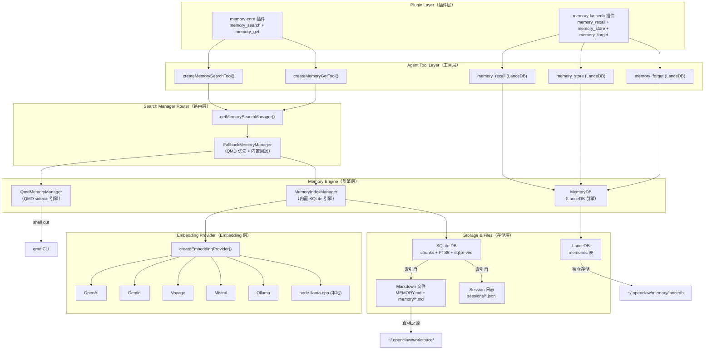
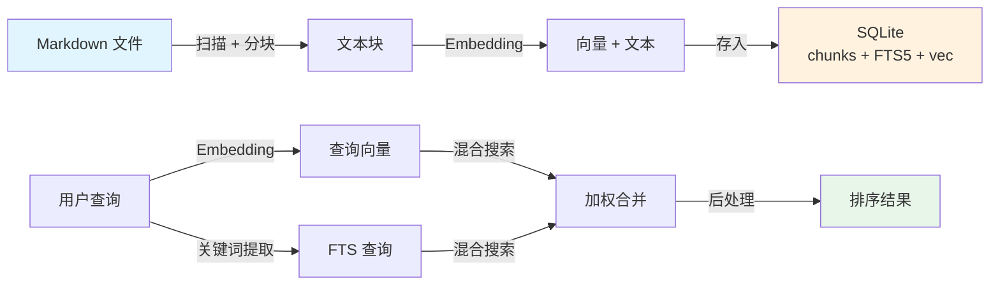
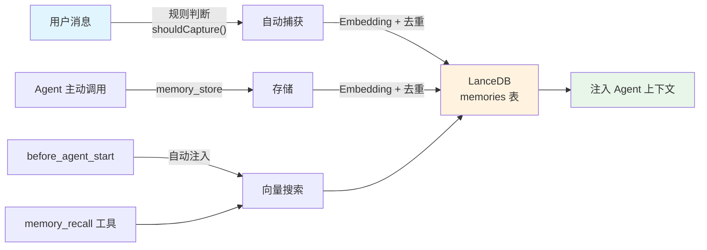
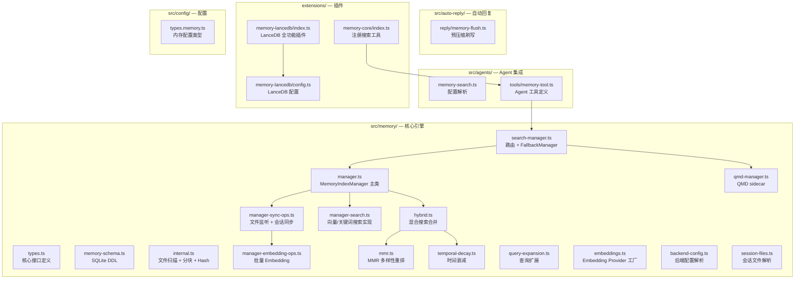
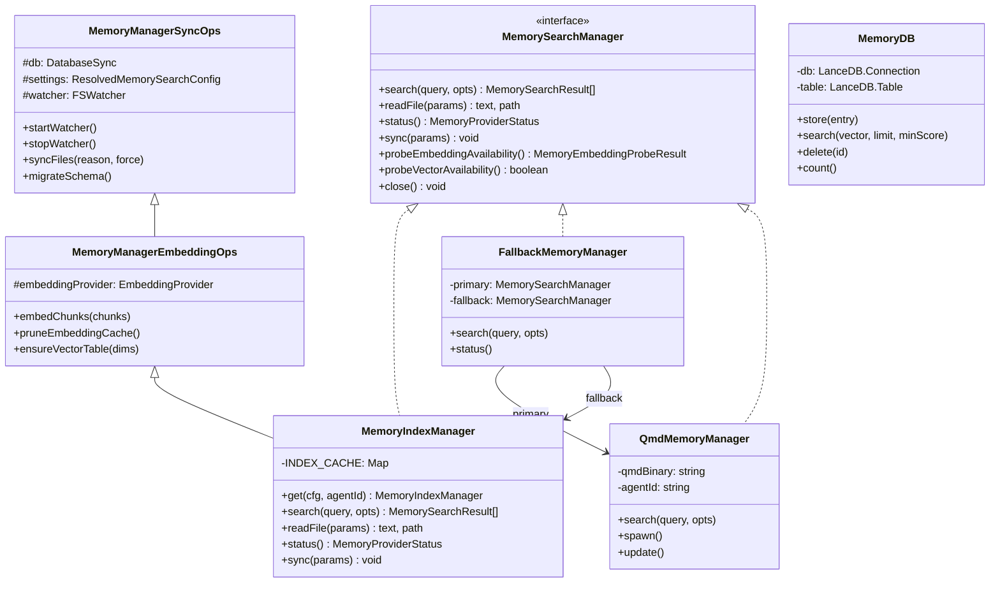

# 01 - 整体架构总览

## 分层架构

OpenClaw 的记忆系统采用 **六层分层架构**，从上到下依次为：插件层 → Agent 工具层 → 搜索管理器路由层 → 记忆引擎层 → Embedding 提供商层 → 存储与文件层。

## 两条独立的记忆管线

OpenClaw 有 **两个完全独立的记忆子系统**，它们互不依赖：

### 管线 A：内置 SQLite 记忆（`memory-core`）

**特点**：
- Markdown 文件是源，SQLite 只是索引
- 支持混合搜索（向量 + BM25）
- 支持 MMR 多样性重排
- 支持时间衰减
- 通过 `memory_search` 和 `memory_get` 工具暴露

### 管线 B：LanceDB 长期记忆（`memory-lancedb`）

**特点**：
- 独立的向量数据库（LanceDB），不依赖 Markdown 文件
- 自动捕获 + 自动召回（生命周期 Hook）
- 支持 GDPR 遗忘（`memory_forget`）
- 分类存储（preference / fact / decision / entity / other）

## 模块文件映射

## 类继承关系

## 关键设计决策

| 决策 | 选择 | 理由 |
|------|------|------|
| 真相之源 | Markdown 文件 | 可读、可用 Git 版控、Agent 可直接读写 |
| 内置搜索 | SQLite + FTS5 + sqlite-vec | 零依赖、嵌入式、性能好 |
| 向量搜索 | sqlite-vec 扩展（可选） | 避免加载全部 Embedding 到内存 |
| 混合权重 | 向量 0.7 + BM25 0.3（默认） | 语义匹配为主，精确匹配补充 |
| 多 Embedding | 6 种 provider + auto 选择 | 最大兼容性 |
| 增量更新 | chokidar 文件监听 + 内容 Hash | 只重建变化的块 |
| 单例缓存 | `INDEX_CACHE` Map | 多次 get() 同一 agent 共享实例 |
| 降级策略 | Embedding → FTS-only；QMD → 内置 | 任何组件失败不影响基本功能 |
