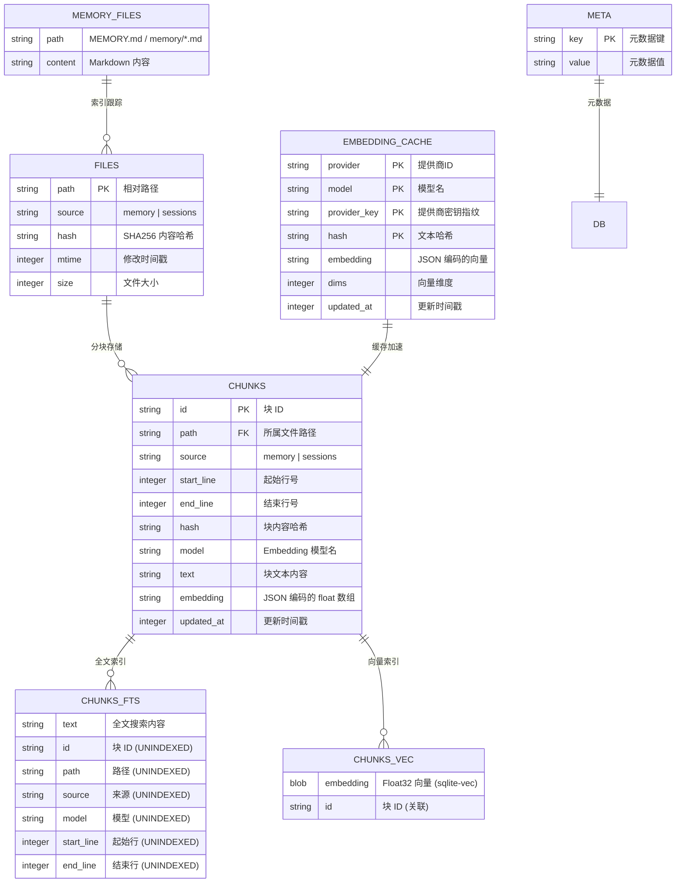
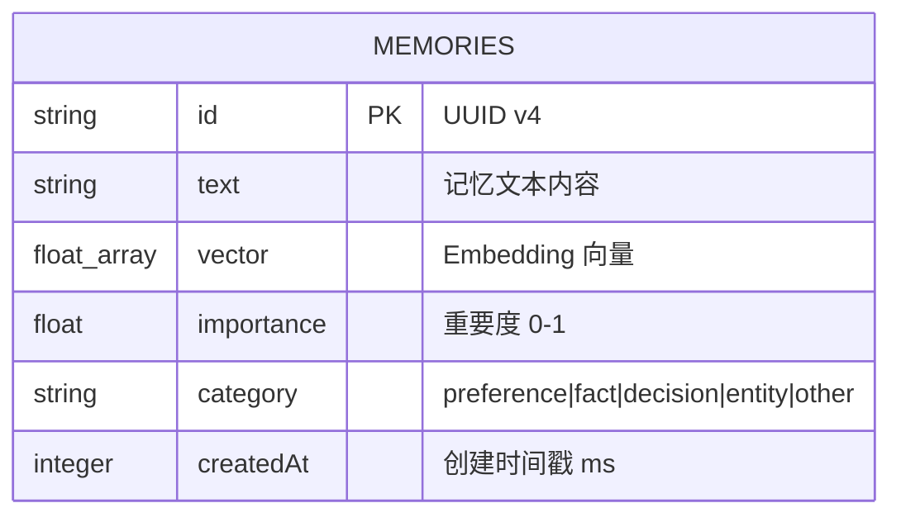
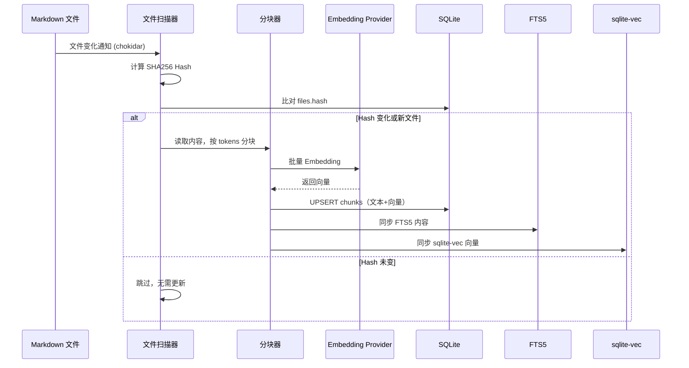

# 02 - 数据模型

## 概览

OpenClaw 的记忆系统涉及三种数据存储：

1. **SQLite 数据库（内置引擎）** — 文本块索引 + 向量 + FTS
2. **LanceDB（插件引擎）** — 向量数据库，独立长期记忆
3. **文件系统** — Markdown 记忆文件 + JSONL 会话日志



## SQLite Schema 详解

### `meta` 表 — 数据库元数据

存储数据库版本、Embedding 配置指纹等。当配置变化时用于检测是否需要全量重建。

```sql
CREATE TABLE IF NOT EXISTS meta (
    key   TEXT PRIMARY KEY,
    value TEXT NOT NULL
);
```

### `files` 表 — 文件索引追踪

追踪已索引的源文件，通过 hash 对比检测文件变化。

```sql
CREATE TABLE IF NOT EXISTS files (
    path   TEXT PRIMARY KEY,         -- 工作区相对路径
    source TEXT NOT NULL DEFAULT 'memory',  -- 'memory' | 'sessions'
    hash   TEXT NOT NULL,            -- SHA256(文件内容)
    mtime  INTEGER NOT NULL,         -- 修改时间 ms
    size   INTEGER NOT NULL          -- 文件字节数
);
```

### `chunks` 表 — 文本块与向量

核心表，存储分块后的文本及其 Embedding 向量。

```sql
CREATE TABLE IF NOT EXISTS chunks (
    id         TEXT PRIMARY KEY,     -- 块唯一 ID
    path       TEXT NOT NULL,        -- 所属文件路径
    source     TEXT NOT NULL DEFAULT 'memory',
    start_line INTEGER NOT NULL,     -- 块起始行号 (1-based)
    end_line   INTEGER NOT NULL,     -- 块结束行号 (1-based)
    hash       TEXT NOT NULL,        -- SHA256(块文本)
    model      TEXT NOT NULL,        -- Embedding 模型标识
    text       TEXT NOT NULL,        -- 块文本内容
    embedding  TEXT NOT NULL,        -- JSON 编码的 float[] 向量
    updated_at INTEGER NOT NULL      -- 更新时间戳 ms
);

CREATE INDEX IF NOT EXISTS idx_chunks_path   ON chunks(path);
CREATE INDEX IF NOT EXISTS idx_chunks_source ON chunks(source);
```

### `embedding_cache` 表 — Embedding 缓存

避免对未变化的文本重复请求 Embedding API。联合主键确保同一文本在同一提供商+模型下只缓存一次。

```sql
CREATE TABLE IF NOT EXISTS embedding_cache (
    provider     TEXT NOT NULL,      -- 提供商 ID (openai/gemini/...)
    model        TEXT NOT NULL,      -- 模型名
    provider_key TEXT NOT NULL,      -- API Key 指纹（区分不同密钥）
    hash         TEXT NOT NULL,      -- SHA256(文本内容)
    embedding    TEXT NOT NULL,      -- JSON 编码的向量
    dims         INTEGER,            -- 向量维度
    updated_at   INTEGER NOT NULL,
    PRIMARY KEY (provider, model, provider_key, hash)
);

CREATE INDEX IF NOT EXISTS idx_embedding_cache_updated_at 
    ON embedding_cache(updated_at);
```

### `chunks_fts` — FTS5 全文搜索虚拟表

SQLite FTS5 虚拟表，用于 BM25 关键词搜索。只有 `text` 列参与搜索，其他列为 `UNINDEXED`（存储但不索引）。

```sql
CREATE VIRTUAL TABLE IF NOT EXISTS chunks_fts USING fts5(
    text,
    id         UNINDEXED,
    path       UNINDEXED,
    source     UNINDEXED,
    model      UNINDEXED,
    start_line UNINDEXED,
    end_line   UNINDEXED
);
```

### `chunks_vec` — sqlite-vec 向量虚拟表

使用 sqlite-vec 扩展创建的向量搜索表。存储 Float32 blob 格式的向量，支持 `vec_distance_cosine()` 查询。

```sql
-- 动态创建，维度在运行时确定
CREATE VIRTUAL TABLE chunks_vec USING vec0(
    id    TEXT PRIMARY KEY,
    embedding FLOAT[{dims}]
);
```

## LanceDB Schema

LanceDB 插件使用独立的向量数据库，Schema 简单直接：



**字段说明**：

| 字段 | 类型 | 说明 |
|------|------|------|
| `id` | UUID | 随机生成，用于精确删除 |
| `text` | string | 记忆内容原文 |
| `vector` | float[] | OpenAI Embedding 向量（默认 1536 维） |
| `importance` | float | 重要度评分（默认 0.7） |
| `category` | enum | 自动分类或手动指定 |
| `createdAt` | timestamp | 毫秒级时间戳 |

**分类规则（`detectCategory()`）**：

```
prefer/like/hate/love/want → "preference"
decided/will use          → "decision"
电话号码/邮箱/名字         → "entity"
is/are/has                → "fact"
其他                       → "other"
```

## 文件系统布局

```
~/.openclaw/
├── workspace/                      # Agent 工作区（真相之源）
│   ├── MEMORY.md                   # 精选长期记忆
│   └── memory/                     # 记忆目录
│       ├── 2026-03-07.md          # 日期日志（追加写入）
│       ├── 2026-03-06.md
│       ├── projects.md            # 主题记忆（常青）
│       └── network.md
├── memory/                         # 索引数据库
│   └── main.sqlite                # per-agent SQLite
├── agents/
│   └── main/
│       ├── sessions/
│       │   └── transcripts/
│       │       └── *.jsonl        # 会话日志
│       └── qmd/                   # QMD sidecar 数据
│           ├── xdg-config/
│           └── xdg-cache/
└── memory/
    └── lancedb/                   # LanceDB 数据目录
```

## 核心类型定义

### `MemorySearchResult`

搜索结果的统一返回格式：

```typescript
type MemorySearchResult = {
    path: string;       // 文件相对路径 "memory/2026-03-07.md"
    startLine: number;  // 块起始行号
    endLine: number;    // 块结束行号
    score: number;      // 综合评分 0-1
    snippet: string;    // 文本片段（最大 700 字符）
    source: "memory" | "sessions";  // 来源
    citation?: string;  // 引用格式 "path#L1-L5"
};
```

### `MemoryProviderStatus`

状态信息，用于 `openclaw doctor` 和调试：

```typescript
type MemoryProviderStatus = {
    backend: "builtin" | "qmd";
    provider: string;         // Embedding 提供商
    model?: string;           // 模型名
    files?: number;           // 已索引文件数
    chunks?: number;          // 已索引块数
    fts?: { enabled, available, error? };
    vector?: { enabled, available?, dims? };
    cache?: { enabled, entries?, maxEntries? };
    batch?: { enabled, failures, limit, ... };
};
```

### `MemoryFileEntry` — 文件条目

```typescript
type MemoryFileEntry = {
    path: string;       // 工作区相对路径
    absPath: string;    // 绝对路径
    mtimeMs: number;    // 修改时间
    size: number;       // 大小
    hash: string;       // SHA256
};
```

### `MemoryChunk` — 文本块

```typescript
type MemoryChunk = {
    startLine: number;  // 起始行（1-based）
    endLine: number;    // 结束行（1-based）
    text: string;       // 块文本
    hash: string;       // SHA256(文本)
};
```

## 数据流动总结


