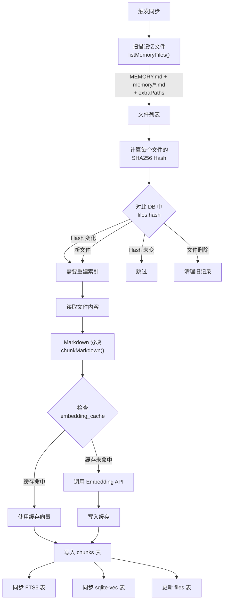
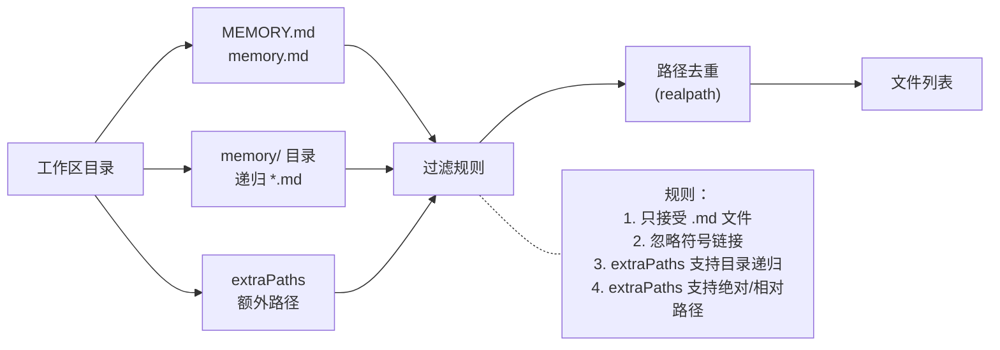
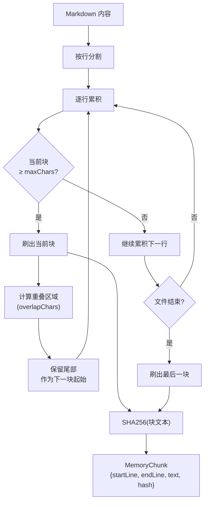
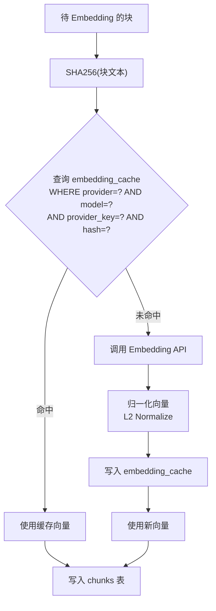
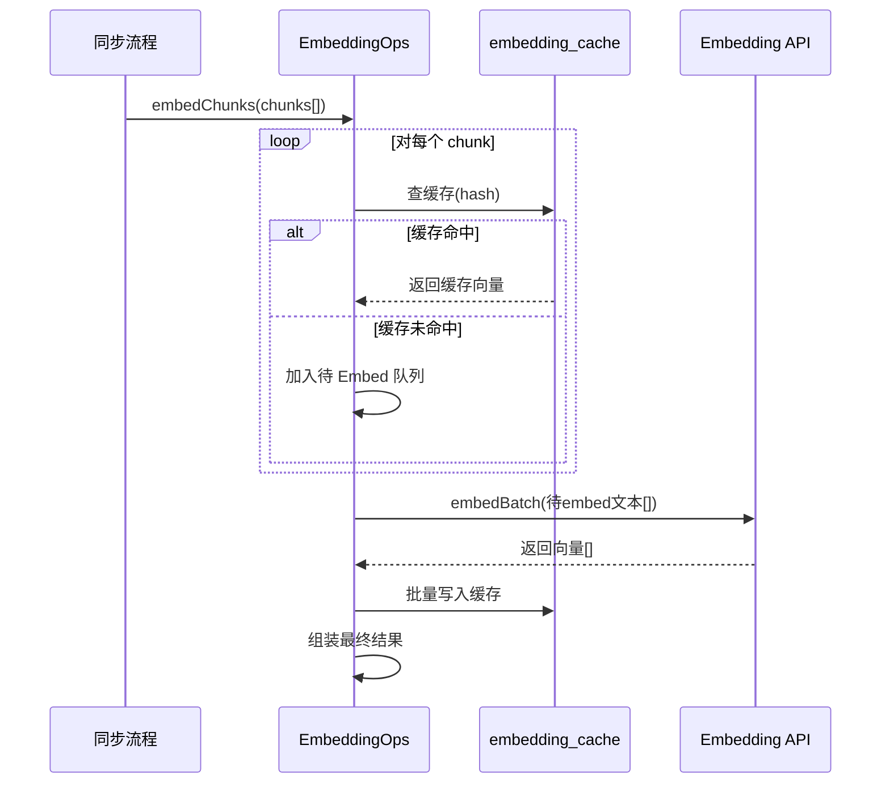
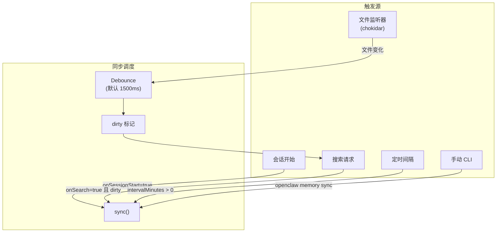
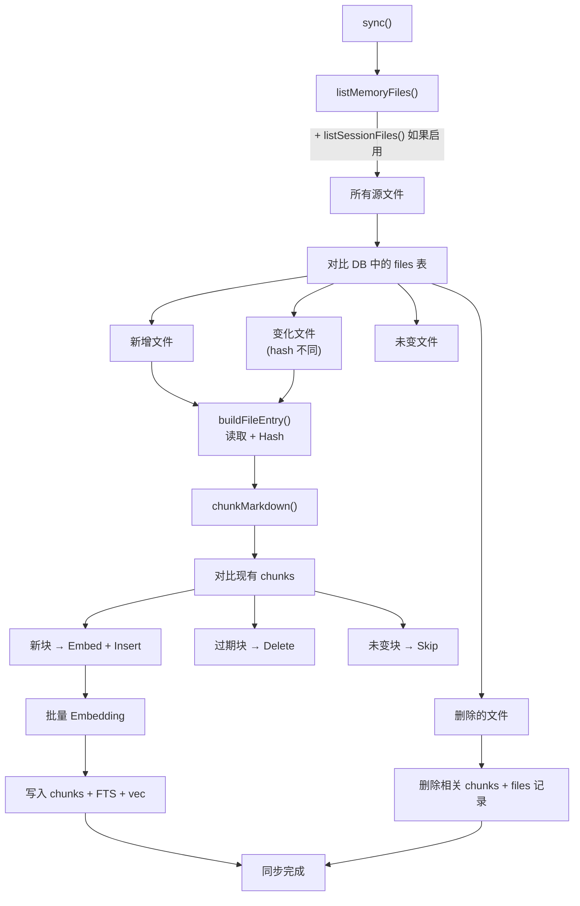
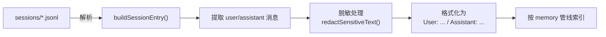
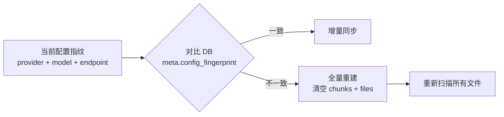

# 03 - 索引构建

## 索引构建全流程



## 文件扫描

### 扫描规则（`listMemoryFiles()`）



**扫描入口**：
- `MEMORY.md` 或 `memory.md`（二选一或共存）
- `memory/` 目录下所有 `.md` 文件（递归）
- `extraPaths` 配置的额外路径

**过滤规则**：
1. 只接受 `.md` 后缀
2. 忽略符号链接（文件和目录都跳过）
3. 路径去重（通过 `fs.realpath` 解析后比较）

### 路径判断（`isMemoryPath()`）

判断一个相对路径是否属于"记忆文件"：

```typescript
function isMemoryPath(relPath: string): boolean {
    const normalized = normalizeRelPath(relPath);  // 去掉前导 ./ 并统一 /
    if (normalized === "MEMORY.md" || normalized === "memory.md") return true;
    return normalized.startsWith("memory/");
}
```

## Markdown 分块

### 分块算法（`chunkMarkdown()`）

将 Markdown 内容按 token 数量分块，支持重叠以保持上下文连贯性：



**参数**：

| 参数 | 默认值 | 说明 |
|------|--------|------|
| `tokens` | 400 | 每块目标 token 数 |
| `overlap` | 80 | 块之间重叠 token 数 |

**token 估算**：`maxChars = tokens × 4`（简单按 4 字符/token 估算）

**重叠策略**：
- 从当前块尾部取 `overlapChars` 字符的行作为下一块起始
- 确保跨块边界的信息不丢失
- 每个块记录 `startLine` 和 `endLine`（1-based）

### 分块示例

假设 `tokens=400, overlap=80`（即 maxChars=1600, overlapChars=320）：

```
原始文件 (50 行):
  行 1-20  → 块 1 (约 1500 字符)
  行 17-38 → 块 2 (重叠 3 行 ≈ 320 字符)
  行 35-50 → 块 3 (剩余内容)
```

## Embedding 处理

### Embedding 缓存机制



**缓存键**：`(provider, model, provider_key, hash)`
- `provider_key`：API Key 的指纹/前缀，区分不同密钥
- `hash`：文本内容的 SHA256
- 同一文本、同一提供商+模型，只需 Embed 一次

### 批量 Embedding（`MemoryManagerEmbeddingOps`）

支持三种批量模式：

1. **同步批量** — 逐批调用 `embedBatch()`
2. **OpenAI Batch API** — 异步提交大批量任务
3. **Gemini Batch API** — 类似 OpenAI 的异步批量



### 向量归一化

所有 Embedding 向量在存储前统一做 **L2 归一化**：

```typescript
function sanitizeAndNormalizeEmbedding(vec: number[]): number[] {
    // 1. 替换 NaN/Infinity 为 0
    const sanitized = vec.map(v => Number.isFinite(v) ? v : 0);
    // 2. 计算 L2 范数
    const magnitude = Math.sqrt(sanitized.reduce((s, v) => s + v * v, 0));
    if (magnitude < 1e-10) return sanitized;
    // 3. 归一化
    return sanitized.map(v => v / magnitude);
}
```

## 同步触发机制



### 文件监听器（chokidar）

```typescript
// 监听路径
const watchPaths = [
    path.join(workspaceDir, "MEMORY.md"),
    path.join(workspaceDir, "memory"),
    ...normalizedExtraPaths
];

// 配置
chokidar.watch(watchPaths, {
    ignoreInitial: true,
    awaitWriteFinish: { stabilityThreshold: 300 }
});

// 事件处理（debounced）
watcher.on("change/add/unlink", debounce(() => {
    this.markDirty();
}, watchDebounceMs));  // 默认 1500ms
```

### 增量同步逻辑



### 会话文件索引

当 `sources` 包含 `"sessions"` 时，还会索引会话日志：



**JSONL 格式**：
```json
{"type":"message","message":{"role":"user","content":"设置 VLAN 10"}}
{"type":"message","message":{"role":"assistant","content":"好的，我来配置..."}}
```

**解析规则**：
1. 只提取 `type: "message"` 的行
2. 只保留 `role: "user"` 和 `role: "assistant"` 的消息
3. 内容脱敏（隐藏 API Key 等敏感信息）
4. 格式化为 `User: {text}` / `Assistant: {text}`
5. 计算 lineMap 用于引用定位

### 配置变化检测

当 Embedding 配置（provider/model/endpoint）变化时，自动全量重建：


