# 04 - 搜索管线

## 搜索全流程

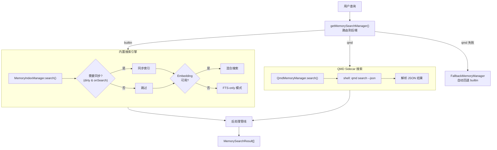

## 搜索路由（`getMemorySearchManager()`）

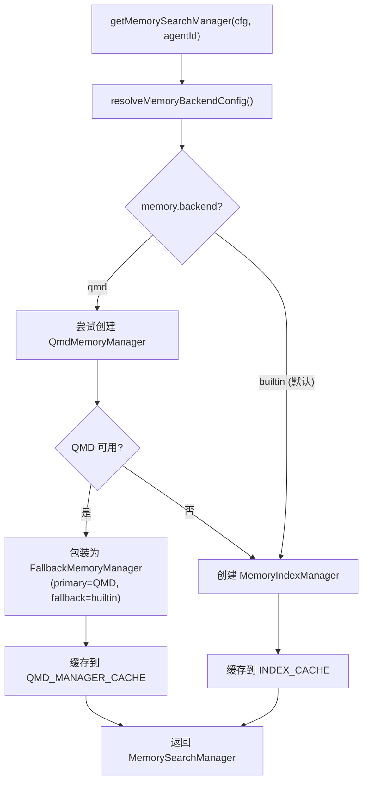

**FallbackMemoryManager 行为**：
- 搜索时先调用 QMD（primary）
- QMD 失败时自动降级到内置 SQLite（fallback）
- 失败后驱逐缓存，下次请求重试 QMD

## 混合搜索详解

### 搜索管线架构

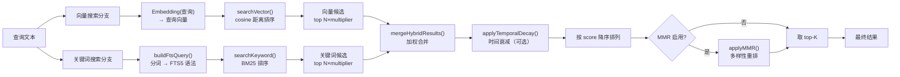

### 向量搜索（`searchVector()`）

两种实现路径：

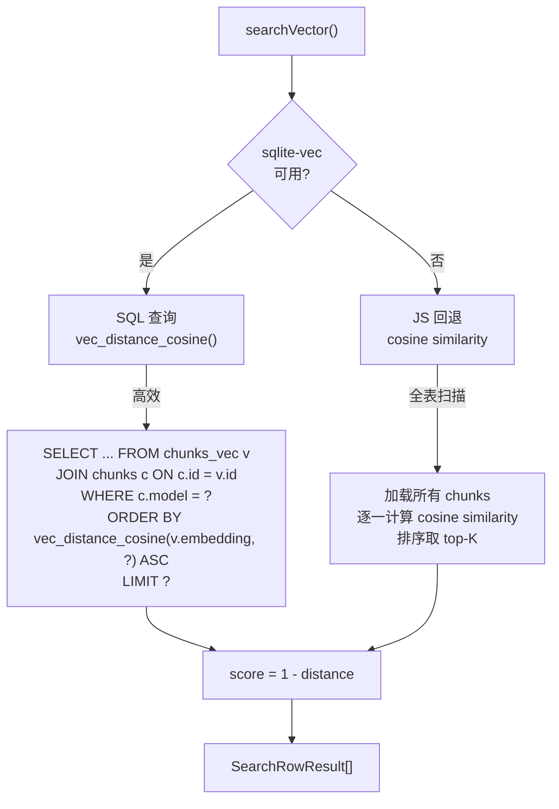

**sqlite-vec 路径**（推荐）：
```sql
SELECT c.id, c.path, c.start_line, c.end_line, c.text, c.source,
       vec_distance_cosine(v.embedding, ?) AS dist
  FROM chunks_vec v
  JOIN chunks c ON c.id = v.id
 WHERE c.model = ?
 ORDER BY dist ASC
 LIMIT ?
```

**JS 回退路径**：
```typescript
// 加载所有 chunks 的 embedding
const candidates = listChunks(db, providerModel);
// 逐条计算余弦相似度
const scored = candidates.map(c => ({
    chunk: c,
    score: cosineSimilarity(queryVec, c.embedding)
}));
// 排序取 top-K
return scored.sort((a, b) => b.score - a.score).slice(0, limit);
```

### 关键词搜索（`searchKeyword()`）

```mermaid
flowchart LR
    QUERY["原始查询"] --> BUILD["buildFtsQuery()"]
    BUILD --> |"分词 + 引号包裹"| FTS_QUERY["'\"term1\" AND \"term2\"'"]
    FTS_QUERY --> SQL["SELECT ... FROM chunks_fts<br/>WHERE chunks_fts MATCH ?<br/>ORDER BY bm25(chunks_fts) ASC"]
    SQL --> CONVERT["textScore = 1 / (1 + max(0, rank))"]
    CONVERT --> RESULT["SearchRowResult[]"]
```

**BM25 分数转换**：
- SQLite FTS5 的 `bm25()` 返回的是"排名"（越小越好）
- 转换公式：`score = 1 / (1 + max(0, rank))`
- 结果范围约 0-1，越大越相关

### FTS 查询构建（`buildFtsQuery()`）

将原始查询转为 FTS5 语法：
```
输入: "API design for memory"
输出: "\"api\" AND \"design\" AND \"memory\""
```

过滤规则：
- 去除停用词（支持英语、中文、日语、韩语、西班牙语等）
- 去除短词（英文 < 3 字符）
- 去除纯数字和纯标点
- 中文按字符 + 双字（bigram）分词
- 韩语去除尾缀助词

### FTS-only 模式

当 Embedding 不可用时的降级路径：

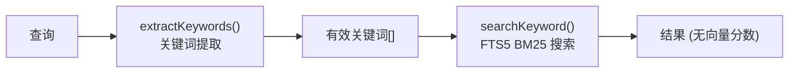

`extractKeywords()` 处理流程：
1. 分词（按空格/标点分割）
2. 中文字符 → 单字 + 双字 bigram
3. 日文 → 提取汉字/片假名/ASCII 片段
4. 韩文 → 去除尾缀助词
5. 过滤停用词（7 种语言）
6. 过滤无效词（短词、纯数字等）
7. 去重

## 混合搜索合并（`mergeHybridResults()`）

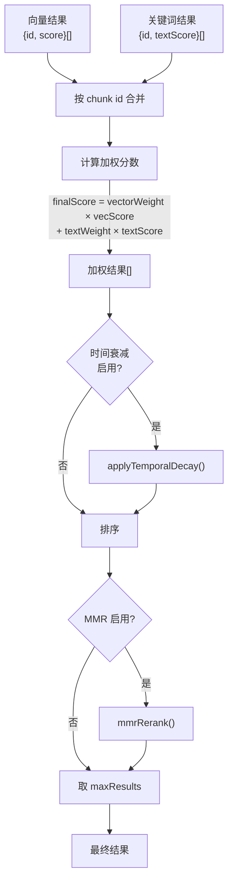

**默认权重**：
- `vectorWeight = 0.7`（语义匹配为主）
- `textWeight = 0.3`（精确匹配补充）
- 权重自动归一化到总和 1.0

**候选数量**：
- `candidateMultiplier = 4`
- 向量搜索：取 `maxResults × 4` 条
- 关键词搜索：取 `maxResults × 4` 条
- 合并后取 top `maxResults`

### 合并算法

```typescript
// 两个分支可能返回相同 chunk
// 按 chunk id 建立映射
const map = new Map<string, MergedEntry>();

for (const vec of vectorResults) {
    map.set(vec.id, { ...vec, vecScore: vec.score, textScore: 0 });
}

for (const kw of keywordResults) {
    const existing = map.get(kw.id);
    if (existing) {
        existing.textScore = kw.textScore;       // 补充关键词分数
    } else {
        map.set(kw.id, { ...kw, vecScore: 0, textScore: kw.textScore });
    }
}

// 计算最终分数
for (const entry of map.values()) {
    entry.score = vectorWeight * entry.vecScore + textWeight * entry.textScore;
}
```

## 时间衰减（`applyTemporalDecayToHybridResults()`）

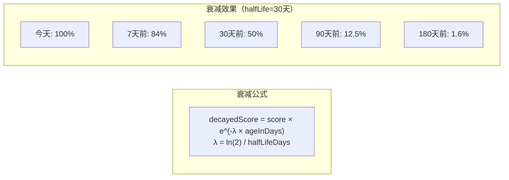

**时间来源优先级**：

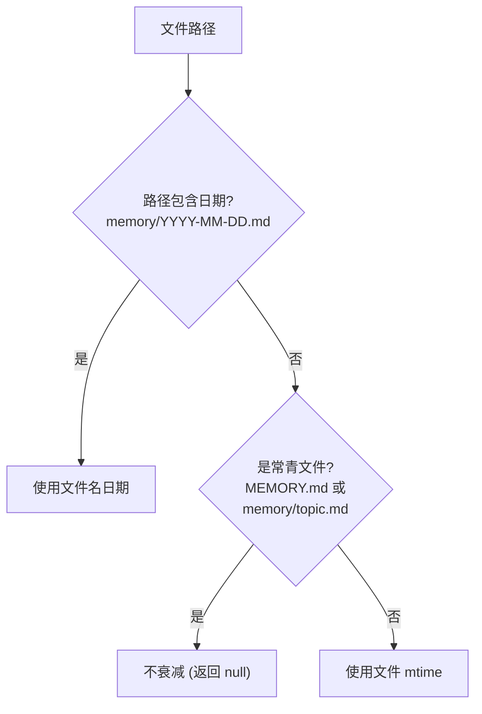

**常青文件规则**（不衰减）：
- `MEMORY.md` / `memory.md`（根记忆文件）
- `memory/` 下非日期命名的文件（如 `memory/projects.md`）

**日期文件**：
- 匹配 `memory/YYYY-MM-DD.md` 格式
- 从文件名提取日期，按天计算年龄

## MMR 多样性重排（`applyMMRToHybridResults()`）

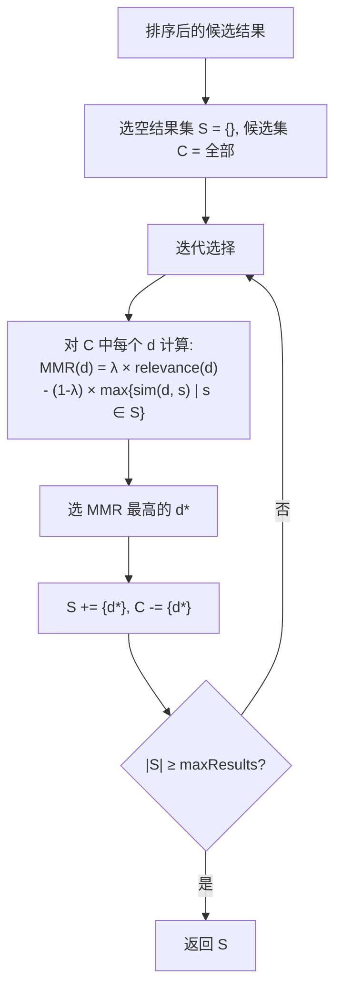

**参数**：
- `lambda = 0.7`（默认）
  - `1.0` = 纯相关性（无多样性）
  - `0.0` = 纯多样性（忽略相关性）
  - `0.7` = 偏向相关性的平衡

**相似度计算**：
- 基于 Jaccard 相似度（token 集合交集/并集）
- 分词后比较，不需要 Embedding

**效果示例**：
```
无 MMR:                            有 MMR (λ=0.7):
1. 路由器配置 (0.92)              1. 路由器配置 (0.92)
2. 路由器配置-重复 (0.89) ←重复    2. 网络拓扑文档 (0.85) ←多样
3. 网络拓扑文档 (0.85)            3. DNS 配置 (0.78) ←多样
```

## 搜索配置汇总

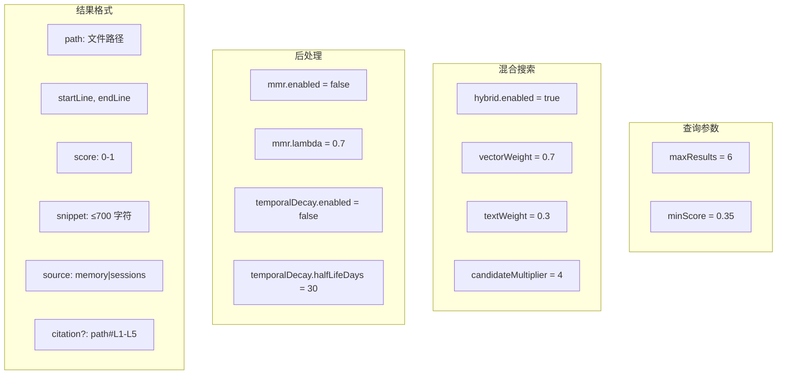

## 引用模式（Citations）

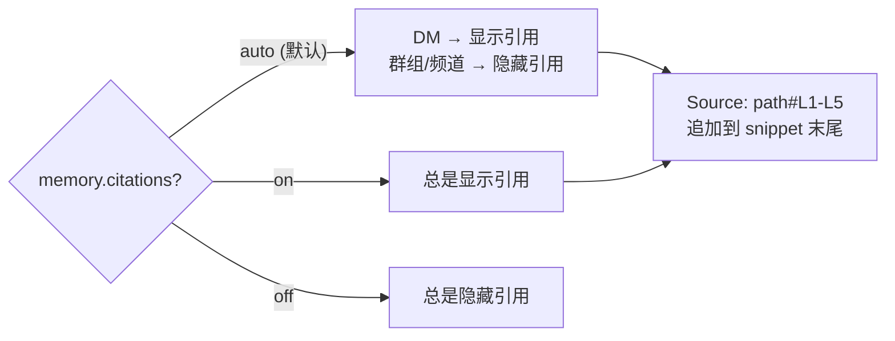
