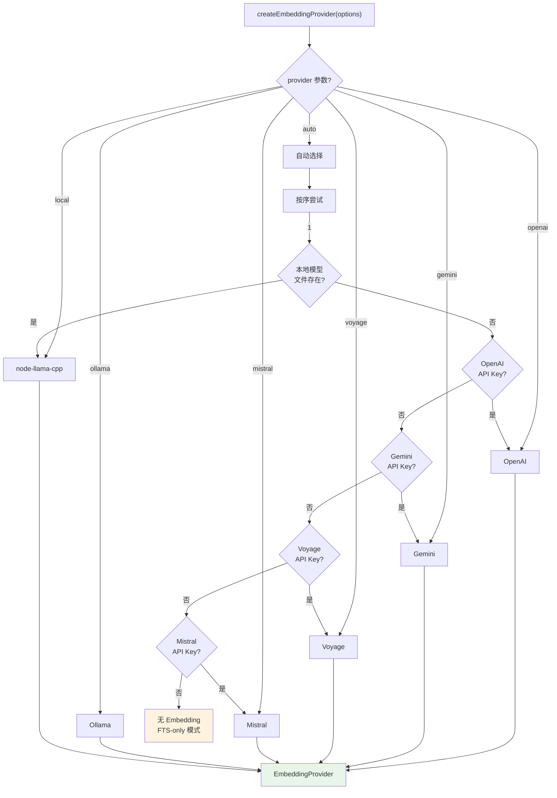
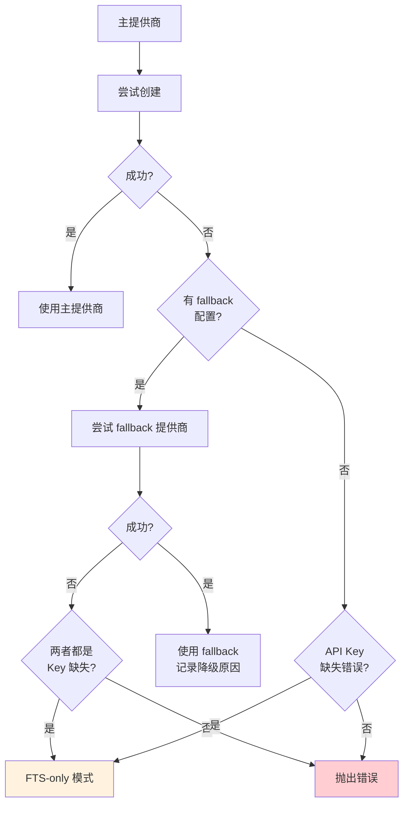
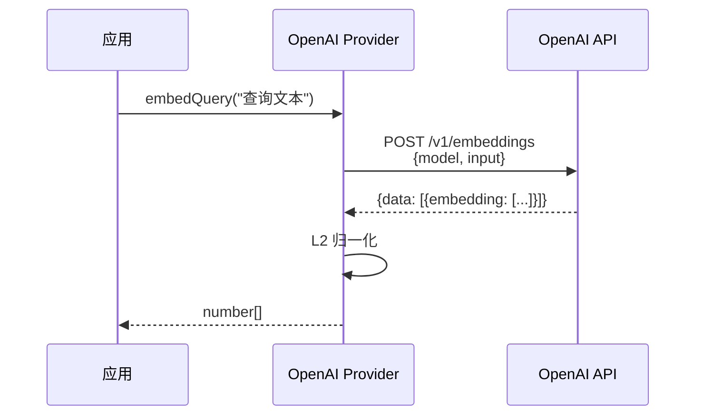
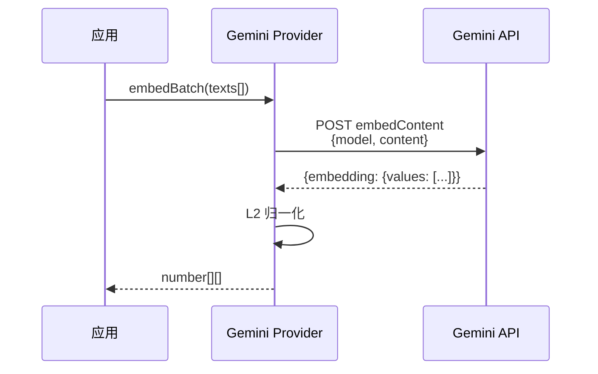
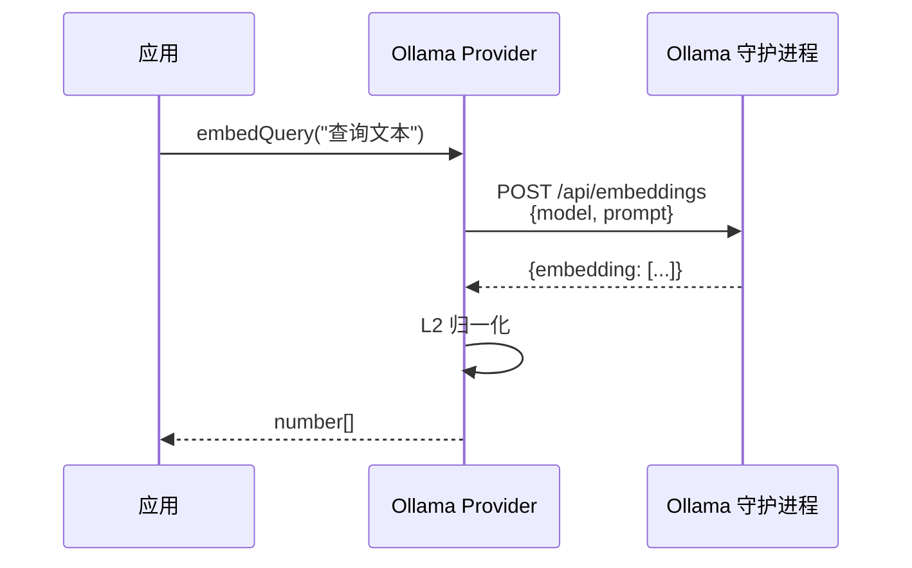
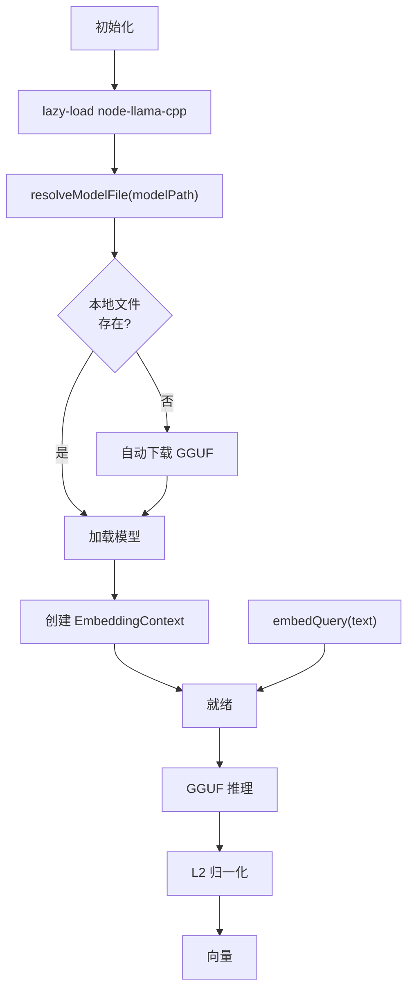
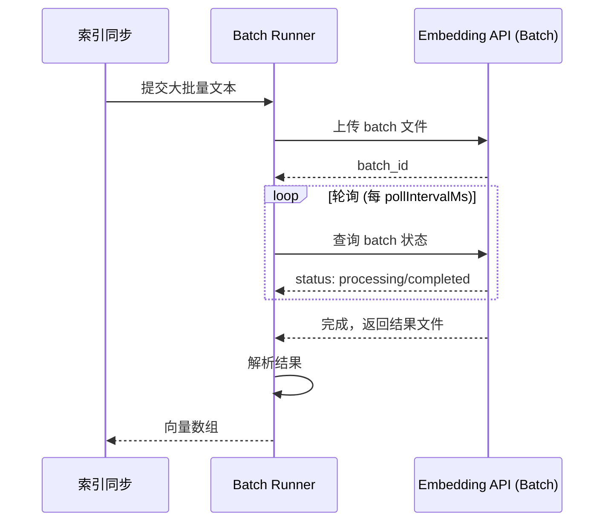

# 05 - Embedding 提供商

## 多提供商架构



## 提供商对比

| 提供商 | 默认模型 | 维度 | 类型 | 自动选择 | 备注 |
|--------|---------|------|------|---------|------|
| `openai` | text-embedding-3-small | 1536 | 远程 | ✅ 第2优先 | 推荐，支持 Batch API |
| `gemini` | gemini-embedding-001 | — | 远程 | ✅ 第3优先 | 支持 Batch API |
| `voyage` | voyage-4-large | — | 远程 | ✅ 第4优先 | 高质量 |
| `mistral` | mistral-embed | — | 远程 | ✅ 第5优先 | |
| `ollama` | nomic-embed-text | — | 本地/自托管 | ❌ 不自动 | 需要 Ollama 守护进程 |
| `local` | embeddinggemma-300m | — | 本地 | ✅ 第1优先* | 需 node-llama-cpp |

> *Local 仅在指定的模型文件存在时自动选择，不会自动下载

## `EmbeddingProvider` 接口

```typescript
type EmbeddingProvider = {
    id: string;              // "openai" | "local" | "gemini" | ...
    model: string;           // 模型名称
    maxInputTokens?: number; // 最大输入 token 数
    embedQuery(text: string): Promise<number[]>;      // 单条 Embedding
    embedBatch(texts: string[]): Promise<number[][]>;  // 批量 Embedding
};
```

## 降级策略（Fallback）



**降级结果报告**：

```typescript
type EmbeddingProviderResult = {
    provider: EmbeddingProvider | null;  // null = FTS-only
    requestedProvider: "auto" | "openai" | ...;
    fallbackFrom?: string;        // 从哪个提供商降级来的
    fallbackReason?: string;      // 降级原因
    providerUnavailableReason?: string;  // 不可用原因
};
```

## 各提供商实现细节

### OpenAI



**配置**：
- 支持自定义 `baseUrl`（兼容 OpenRouter、vLLM 等）
- 支持自定义 `headers`
- 支持 Batch API（大规模索引优化）

### Gemini



**API Key 来源**：`GEMINI_API_KEY` 或 `models.providers.google.apiKey`

### Ollama（本地/自托管）



**特点**：
- 不在自动选择列表中（需显式指定 `provider: "ollama"`）
- 通常不需要真实 API Key（占位符即可）
- 默认模型：`nomic-embed-text`

### Local（node-llama-cpp）



**默认模型**：`hf:ggml-org/embeddinggemma-300m-qat-q8_0-GGUF` (~0.6GB)
**前提**：需要安装 `node-llama-cpp`（`pnpm approve-builds` 后构建原生模块）

## Batch API 支持

对于大规模索引，支持 OpenAI / Gemini / Voyage 的 Batch API：



**配置**：
```json5
{
    remote: {
        batch: {
            enabled: true,       // 默认 false
            wait: true,          // 等待完成
            concurrency: 2,      // 并行 batch 数
            pollIntervalMs: 2000,
            timeoutMinutes: 60
        }
    }
}
```

## 向量归一化

所有提供商返回的向量统一做 L2 归一化：

```
向量 v = [v1, v2, ..., vn]
范数 ||v|| = sqrt(v1² + v2² + ... + vn²)
归一化 v' = v / ||v||
```

这确保：
1. 余弦相似度计算正确性
2. 不同提供商的向量可比
3. NaN/Infinity 替换为 0
