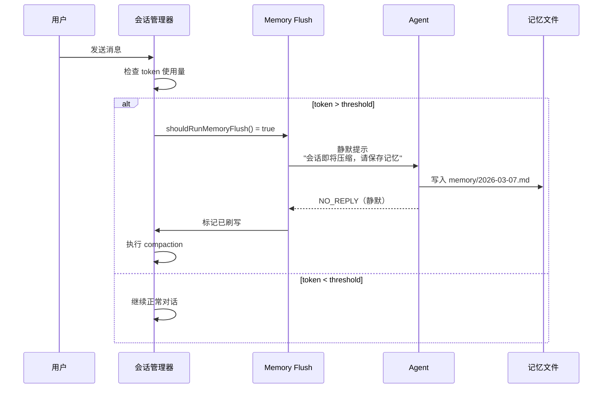
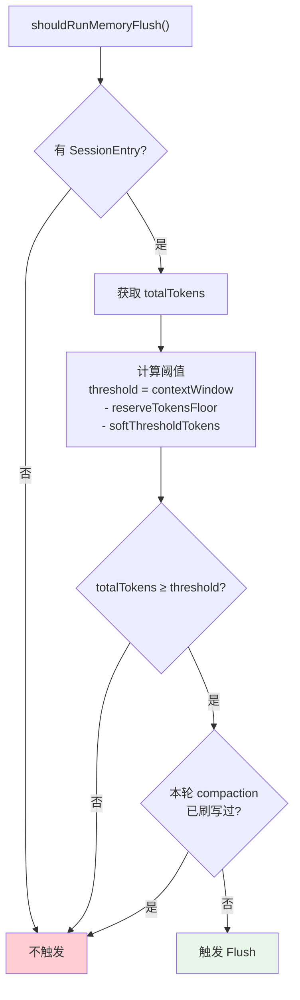
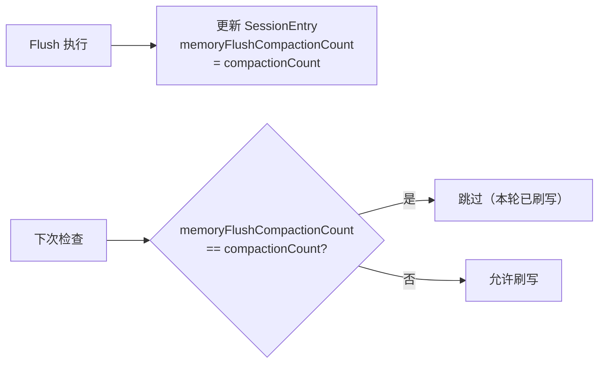
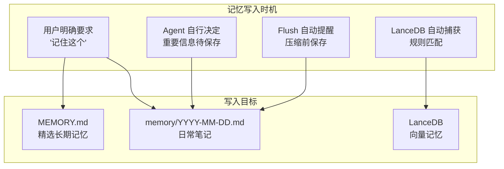

# 06 - 预压缩记忆刷写（Memory Flush）

## 核心问题

AI Agent 的上下文窗口有限。当对话接近 token 上限时，系统会执行 **上下文压缩（compaction）**，丢弃旧的对话内容。如果 Agent 在对话中获得了有价值的信息但没有写入磁盘，这些信息会在压缩时永久丢失。

## 解决方案

在压缩发生 **之前**，自动触发一个 **静默的 Agent 回合**，提醒 Agent 将有价值的记忆写入 Markdown 文件。



## 触发条件



### 阈值计算

```
threshold = contextWindow - reserveTokensFloor - softThresholdTokens
```

| 参数 | 默认值 | 说明 |
|------|--------|------|
| `contextWindow` | 模型决定 | 模型的上下文窗口大小 |
| `reserveTokensFloor` | 20,000 | 为压缩预留的 token 数 |
| `softThresholdTokens` | 4,000 | 提前触发的缓冲区 |

**示例**（GPT-4 128K 窗口）：
```
threshold = 128,000 - 20,000 - 4,000 = 104,000
当 totalTokens ≥ 104,000 时触发 Memory Flush
```

### 额外触发：转录文件大小

```typescript
forceFlushTranscriptBytes = 2 * 1024 * 1024  // 2MB
```

当会话转录文件达到 2MB 时也会强制触发，不依赖 token 计数。

## 刷写提示词

### 用户提示（User Prompt）

```
Pre-compaction memory flush.
Store durable memories now (use memory/YYYY-MM-DD.md; create memory/ if needed).
IMPORTANT: If the file already exists, APPEND new content only and do not overwrite existing entries.
If nothing to store, reply with NO_REPLY.
```

**动态替换**：`YYYY-MM-DD` 会替换为当前日期（按用户时区）

### 系统提示（System Prompt）

```
Pre-compaction memory flush turn.
The session is near auto-compaction; capture durable memories to disk.
You may reply, but usually NO_REPLY is correct.
```

## 单次保护



每个 compaction 周期只执行一次 Flush，通过 `memoryFlushCompactionCount` 追踪。

## 配置

```json5
{
    agents: {
        defaults: {
            compaction: {
                reserveTokensFloor: 20000,
                memoryFlush: {
                    enabled: true,                    // 默认开启
                    softThresholdTokens: 4000,        // 提前 4K token 触发
                    forceFlushTranscriptBytes: "2MB", // 文件大小强制触发
                    prompt: "...",                     // 自定义用户提示
                    systemPrompt: "...",               // 自定义系统提示
                }
            }
        }
    }
}
```

## 与记忆写入的关系



## 设计原则

1. **静默执行** — 用户不会看到 Flush 回合（`NO_REPLY` token）
2. **只追加** — 提示词明确要求 APPEND，不覆盖已有内容
3. **幂等** — 同一 compaction 周期只执行一次
4. **可降级** — 如果工作区只读，跳过 Flush
5. **可定制** — 提示词和阈值均可配置
