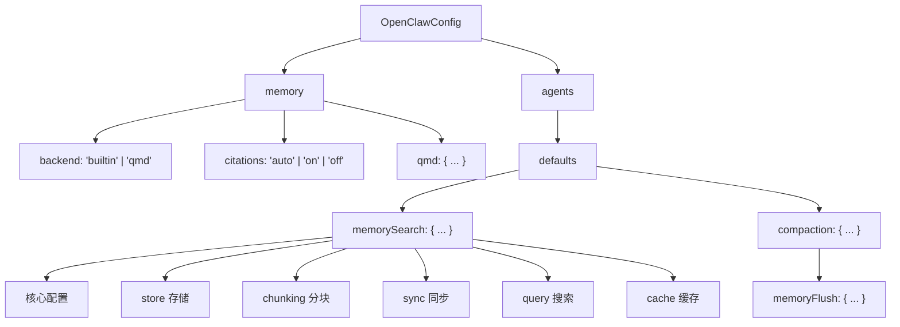

# 08 - 完整配置参考

## 配置结构总览



## `ResolvedMemorySearchConfig` 完整字段

```typescript
type ResolvedMemorySearchConfig = {
    // === 基本 ===
    enabled: boolean;                          // 默认: true
    sources: ("memory" | "sessions")[];        // 默认: ["memory"]
    extraPaths: string[];                      // 额外索引路径

    // === Embedding 提供商 ===
    provider: "openai" | "local" | "gemini" | "voyage" | "mistral" | "ollama" | "auto";
    fallback: "openai" | "gemini" | "local" | "voyage" | "mistral" | "ollama" | "none";
    model: string;                             // 默认按 provider 决定
    
    // === 远程配置 ===
    remote?: {
        baseUrl?: string;
        apiKey?: string;
        headers?: Record<string, string>;
        batch?: {
            enabled: boolean;                  // 默认: false
            wait: boolean;                     // 默认: true
            concurrency: number;               // 默认: 2
            pollIntervalMs: number;            // 默认: 2000
            timeoutMinutes: number;            // 默认: 60
        };
    };

    // === 本地模型 ===
    local: {
        modelPath?: string;                    // GGUF 文件路径或 hf: URI
        modelCacheDir?: string;                // 模型缓存目录
    };

    // === 存储 ===
    store: {
        driver: "sqlite";
        path: string;                          // 默认: ~/.openclaw/memory/{agentId}.sqlite
        vector: {
            enabled: boolean;                  // 默认: true (sqlite-vec)
            extensionPath?: string;            // sqlite-vec 扩展路径
        };
    };

    // === 分块 ===
    chunking: {
        tokens: number;                        // 默认: 400
        overlap: number;                       // 默认: 80
    };

    // === 同步 ===
    sync: {
        onSessionStart: boolean;               // 默认: true
        onSearch: boolean;                     // 默认: true
        watch: boolean;                        // 默认: true
        watchDebounceMs: number;               // 默认: 1500
        intervalMinutes: number;               // 默认: 0 (禁用)
        sessions: {
            deltaBytes: number;                // 默认: 100,000
            deltaMessages: number;             // 默认: 50
        };
    };

    // === 搜索查询 ===
    query: {
        maxResults: number;                    // 默认: 6
        minScore: number;                      // 默认: 0.35
        hybrid: {
            enabled: boolean;                  // 默认: true
            vectorWeight: number;              // 默认: 0.7
            textWeight: number;                // 默认: 0.3
            candidateMultiplier: number;       // 默认: 4
            mmr: {
                enabled: boolean;              // 默认: false
                lambda: number;                // 默认: 0.7
            };
            temporalDecay: {
                enabled: boolean;              // 默认: false
                halfLifeDays: number;          // 默认: 30
            };
        };
    };

    // === 缓存 ===
    cache: {
        enabled: boolean;                      // 默认: true
        maxEntries?: number;                   // 默认: 无上限
    };

    // === 实验性 ===
    experimental: {
        sessionMemory: boolean;                // 默认: false
    };
};
```

## Memory Flush 配置

```typescript
type MemoryFlushSettings = {
    enabled: boolean;                          // 默认: true
    softThresholdTokens: number;               // 默认: 4000
    forceFlushTranscriptBytes: number;         // 默认: 2MB
    prompt: string;                            // 用户提示
    systemPrompt: string;                      // 系统提示
    reserveTokensFloor: number;                // 默认: 20000
};
```

## Memory Backend 配置（QMD）

```typescript
type ResolvedQmdConfig = {
    command: string;                           // 默认: "qmd"
    searchMode: "search" | "vsearch" | "query"; // 默认: "search"
    includeDefaultMemory: boolean;             // 默认: true
    paths: QmdCollection[];                    // 额外索引路径
    sessions: {
        enabled: boolean;
        retentionDays: number;
        exportDir: string;
    };
    update: {
        interval: string;                      // 默认: "5m"
        debounceMs: number;
        onBoot: boolean;
        waitForBootSync: boolean;
        embedInterval: string;
        commandTimeoutMs: number;
        updateTimeoutMs: number;
        embedTimeoutMs: number;
    };
    limits: {
        maxResults: number;
        maxSnippetChars: number;
        maxInjectedChars: number;
        timeoutMs: number;
    };
    scope: ScopeConfig;                        // 作用域（DM/群组/频道）
};
```

## LanceDB 插件配置

```typescript
type MemoryConfig = {
    embedding: {
        provider: "openai";
        model: string;                         // 默认: "text-embedding-3-small"
        apiKey: string;                        // 必填，支持 ${ENV_VAR}
        baseUrl?: string;
        dimensions?: number;
    };
    dbPath?: string;                           // 默认: ~/.openclaw/memory/lancedb
    autoCapture?: boolean;                     // 默认: false
    autoRecall?: boolean;                      // 默认: true
    captureMaxChars?: number;                  // 默认: 500，范围 100-10000
};
```

## 配置示例

### 最小配置（使用 OpenAI）

```json5
{
    agents: {
        defaults: {
            memorySearch: {
                provider: "openai"
                // API Key 从环境变量 OPENAI_API_KEY 自动读取
            }
        }
    }
}
```

### 完整推荐配置

```json5
{
    memory: {
        backend: "builtin",
        citations: "auto"
    },
    agents: {
        defaults: {
            memorySearch: {
                enabled: true,
                sources: ["memory"],
                provider: "openai",
                model: "text-embedding-3-small",
                fallback: "gemini",
                store: {
                    vector: { enabled: true }
                },
                chunking: { tokens: 400, overlap: 80 },
                sync: {
                    onSessionStart: true,
                    onSearch: true,
                    watch: true,
                    watchDebounceMs: 1500
                },
                query: {
                    maxResults: 6,
                    minScore: 0.35,
                    hybrid: {
                        enabled: true,
                        vectorWeight: 0.7,
                        textWeight: 0.3,
                        candidateMultiplier: 4,
                        mmr: { enabled: true, lambda: 0.7 },
                        temporalDecay: { enabled: true, halfLifeDays: 30 }
                    }
                },
                cache: { enabled: true }
            },
            compaction: {
                reserveTokensFloor: 20000,
                memoryFlush: {
                    enabled: true,
                    softThresholdTokens: 4000
                }
            }
        }
    }
}
```

### 本地离线配置

```json5
{
    agents: {
        defaults: {
            memorySearch: {
                provider: "local",
                fallback: "none",
                local: {
                    modelPath: "hf:ggml-org/embeddinggemma-300m-qat-q8_0-GGUF/embeddinggemma-300m-qat-Q8_0.gguf"
                }
            }
        }
    }
}
```

### Ollama 自托管配置

```json5
{
    agents: {
        defaults: {
            memorySearch: {
                provider: "ollama",
                model: "nomic-embed-text",
                remote: {
                    apiKey: "ollama-local",
                    baseUrl: "http://localhost:11434"
                }
            }
        }
    }
}
```

## 默认值汇总

| 配置项 | 默认值 |
|--------|--------|
| `provider` | `"auto"` |
| `fallback` | `"none"` |
| `model` (openai) | `"text-embedding-3-small"` |
| `model` (gemini) | `"gemini-embedding-001"` |
| `model` (voyage) | `"voyage-4-large"` |
| `model` (mistral) | `"mistral-embed"` |
| `model` (ollama) | `"nomic-embed-text"` |
| `model` (local) | `"hf:ggml-org/embeddinggemma-300m..."` |
| `store.path` | `~/.openclaw/memory/{agentId}.sqlite` |
| `chunking.tokens` | 400 |
| `chunking.overlap` | 80 |
| `sync.watchDebounceMs` | 1500 |
| `query.maxResults` | 6 |
| `query.minScore` | 0.35 |
| `hybrid.vectorWeight` | 0.7 |
| `hybrid.textWeight` | 0.3 |
| `hybrid.candidateMultiplier` | 4 |
| `mmr.lambda` | 0.7 |
| `temporalDecay.halfLifeDays` | 30 |
| `cache.enabled` | true |
| `memoryFlush.softThresholdTokens` | 4000 |
| `memoryFlush.forceFlushTranscriptBytes` | 2MB |
| `reserveTokensFloor` | 20000 |
