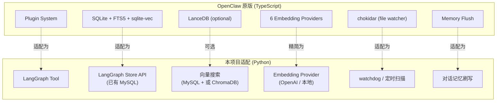
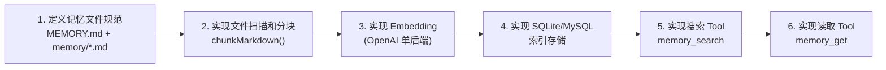
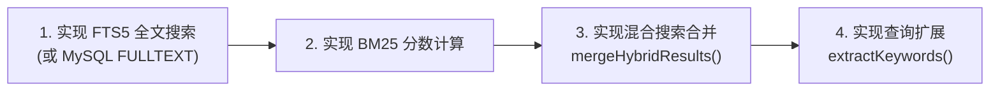
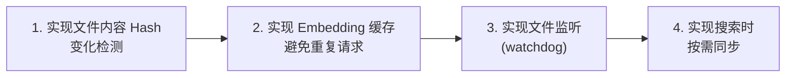
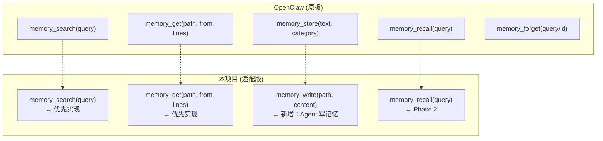
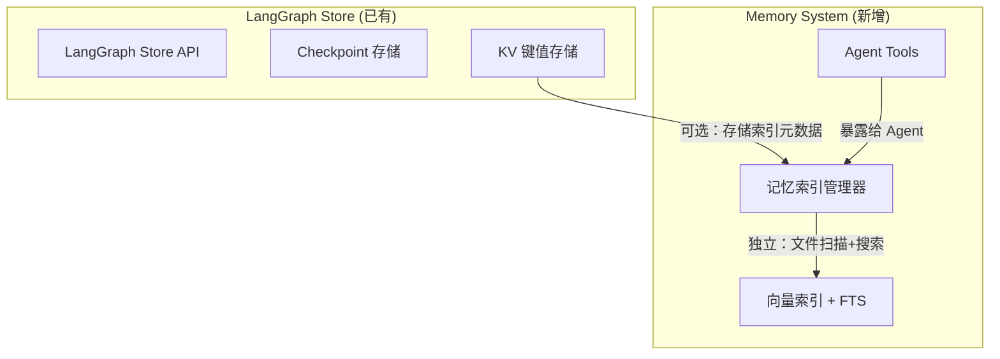

# 09 - 复刻实施方案

## 目标

将 OpenClaw 的记忆能力移植到本项目（CRC AI Insight Pilot Assistant），适配 Python + LangGraph 技术栈。

## 架构适配总览



## 分阶段实施计划

### Phase 1：基础记忆存储与搜索

**目标**：Agent 能通过 Tool 搜索和读取记忆文件



**交付物**：
- `memory_search` Tool：语义搜索记忆文件
- `memory_get` Tool：精确读取文件片段
- 索引管理器：文件扫描 → 分块 → Embedding → 存储

### Phase 2：混合搜索

**目标**：向量搜索 + 关键词搜索，提高召回率



### Phase 3：增量同步

**目标**：文件变化自动触发索引更新



### Phase 4：高级特性

**目标**：MMR、时间衰减、预压缩刷写


## 技术选型建议

### 存储层

| 选项 | 优势 | 劣势 | 推荐 |
|------|------|------|------|
| **方案 A: LangGraph Store** | 已集成、零额外依赖 | 搜索能力有限 | Phase 1 快速启动 |
| **方案 B: SQLite + FTS5** | 完全对齐 OpenClaw、高性能 | 需额外管理文件 | Phase 2 升级 |
| **方案 C: MySQL FULLTEXT** | 复用已有 DB | 中文分词需 ngram | 备选 |
| **方案 D: ChromaDB** | 专业向量数据库、易用 | 额外依赖 | 向量搜索部分 |

**推荐路线**：Phase 1 用 LangGraph Store + ChromaDB，Phase 2 可考虑迁移到 SQLite+FTS5

### Embedding 层

| 选项 | 模型 | 维度 | 成本 |
|------|------|------|------|
| OpenAI | text-embedding-3-small | 1536 | 商用 |
| 本地 | bge-small-zh-v1.5 | 512 | 免费 |
| Ollama | nomic-embed-text | 768 | 免费（需部署） |

**推荐**：OpenAI 为主，环境变量控制，支持降级到本地

### 文件监听

| 选项 | 说明 |
|------|------|
| `watchdog` | Python 文件监听库，对标 chokidar |
| 定时扫描 | 简单可靠，每 N 分钟扫描一次 |
| LangGraph callback | 对话结束时触发同步 |

## Python 核心代码结构

```
agent-api/src/project_insight_agent/memory/
├── __init__.py
├── types.py                  # 核心类型定义
├── schema.py                 # 数据库 Schema
├── internal.py               # 文件扫描 + 分块 + Hash
├── manager.py                # MemoryIndexManager 主类
├── search.py                 # 搜索实现（向量 + FTS）
├── hybrid.py                 # 混合搜索合并
├── mmr.py                    # MMR 多样性重排
├── temporal_decay.py         # 时间衰减
├── query_expansion.py        # 查询扩展（中文支持）
├── embeddings/
│   ├── __init__.py           # 工厂函数
│   ├── openai_provider.py
│   └── local_provider.py
├── sync/
│   ├── __init__.py
│   ├── file_watcher.py       # 文件监听
│   └── session_indexer.py    # 会话索引
├── tools/
│   ├── memory_search.py      # memory_search Tool
│   └── memory_get.py         # memory_get Tool
└── flush/
    └── memory_flush.py       # 预压缩刷写
```

## 核心接口设计（Python 版）

```python
# types.py
from dataclasses import dataclass
from typing import Literal, Optional

@dataclass
class MemorySearchResult:
    path: str
    start_line: int
    end_line: int
    score: float
    snippet: str
    source: Literal["memory", "sessions"]
    citation: Optional[str] = None

@dataclass
class MemoryChunk:
    start_line: int
    end_line: int
    text: str
    hash: str

class MemorySearchManager(Protocol):
    async def search(
        self, query: str, *,
        max_results: int = 6,
        min_score: float = 0.35,
    ) -> list[MemorySearchResult]: ...
    
    async def read_file(
        self, rel_path: str, *,
        from_line: int | None = None,
        lines: int | None = None,
    ) -> dict[str, str]: ...
    
    def status(self) -> dict: ...
    
    async def sync(self, *, force: bool = False) -> None: ...
```

## 关键算法复刻清单

### 必须复刻

| 算法 | 源文件 | 说明 |
|------|--------|------|
| Markdown 分块 | `internal.ts:chunkMarkdown()` | 按 token 分块 + 重叠 |
| 混合搜索合并 | `hybrid.ts:mergeHybridResults()` | 加权合并向量+BM25 |
| BM25 分数转换 | `hybrid.ts:bm25RankToScore()` | `1/(1+rank)` |
| FTS 查询构建 | `hybrid.ts:buildFtsQuery()` | 分词→FTS5语法 |
| 关键词提取 | `query-expansion.ts:extractKeywords()` | 多语言停用词过滤 |
| 文件变化检测 | `internal.ts:hashText()` | SHA256 对比 |

### 推荐复刻

| 算法 | 源文件 | 说明 |
|------|--------|------|
| MMR 重排 | `mmr.ts:mmrRerank()` | Jaccard 相似度 + MMR 选择 |
| 时间衰减 | `temporal-decay.ts` | 指数衰减 + 常青文件豁免 |
| Embedding 缓存 | `embedding_cache` 表 | 避免重复 API 调用 |
| 预压缩刷写 | `memory-flush.ts` | token 阈值触发保存 |

### 可选复刻

| 特性 | 说明 |
|------|------|
| QMD sidecar 后端 | 复杂度高，优先级低 |
| LanceDB 插件 | 可用 ChromaDB 替代 |
| Batch API | 大规模索引优化 |
| sqlite-vec | Python 可用 chromadb 替代 |

## 记忆文件规范

建议沿用 OpenClaw 的文件布局：

```
workspace/
├── MEMORY.md                     # 精选长期记忆（手动维护）
└── memory/
    ├── 2026-03-07.md            # 日期日志（追加写入）
    ├── 2026-03-06.md
    ├── projects.md              # 主题记忆（常青）
    └── decisions.md             # 决策记录（常青）
```

**写入约定**：
- 日期文件：`memory/YYYY-MM-DD.md`，只追加不覆盖
- 主题文件：按领域组织持久知识
- `MEMORY.md`：最重要的、经过提炼的长期信息

## Tool 工具调用链对标



## 与 LangGraph Store 的关系

本项目已有 LangGraph Store (MySQL-backed)。两者关系：



**整合策略**：
1. 记忆文件仍以 Markdown 为源（不依赖 LangGraph Store）
2. 索引可以存在独立 SQLite 或 MySQL 表中
3. LangGraph Store 的 KV 可用于存储配置/缓存
4. 两个系统并行运行，互不干扰
