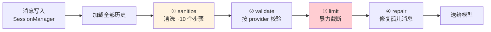
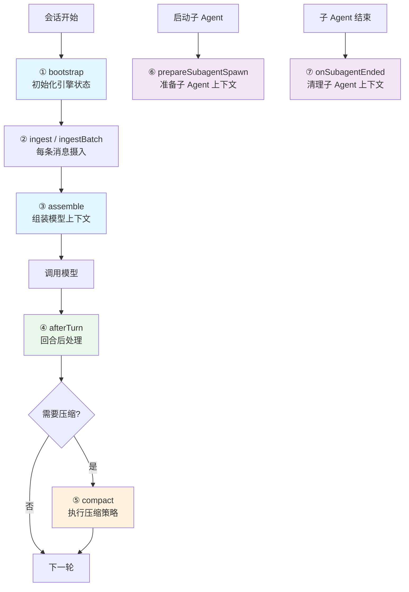
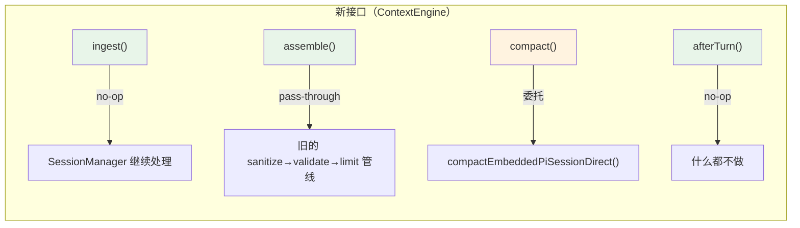
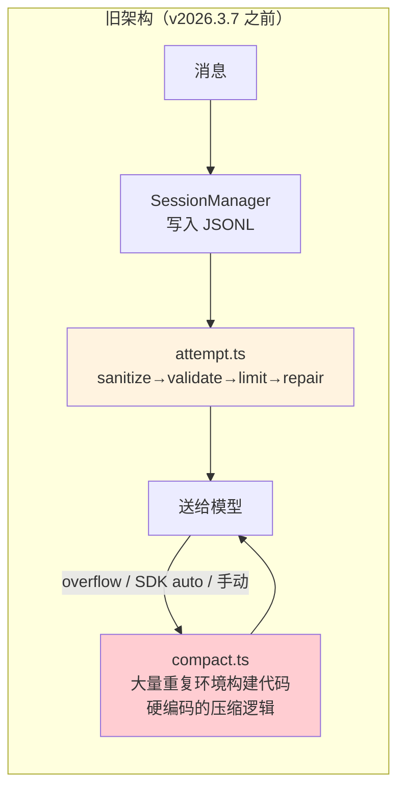
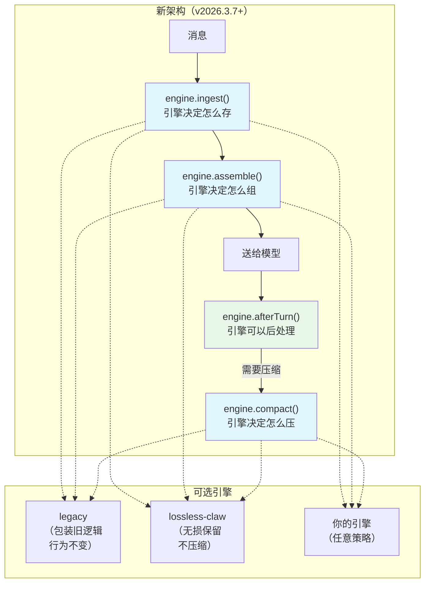
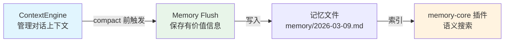

# 10 - ContextEngine 插件接口：从硬编码到可插拔的演变

> 源码路径：`references/openclaw/src/context-engine/`
> 版本：v2026.3.7 (#22201) + v2026.3.8 (#40232, #40115) 增量修复
> 贡献者：@jalehman

> 📎 **深入代码层**：本文讲设计演变和接口原理。想看 PR #22201 的 25 个 commit、44 个文件逐一拆解？→ [11 - PR #22201 完整代码解剖（超详细版）](11-pr-22201-context-engine.md)

---

## Part 1：先讲清楚背景 —— AI Agent 为什么需要"上下文管理"？

你跟 AI 对话时，每一轮的历史消息都会作为"上下文"送给模型。模型需要看到之前聊了什么，才知道你现在在问什么。

但问题是：**模型的上下文窗口有大小限制**。比如 128K token 的窗口，你聊了 200 轮，加上工具调用的返回值，token 早就超了。

这时候系统需要做决策：
- **哪些消息留下？** 最近的肯定要留，但多远算"最近"？
- **哪些消息可以扔？** 旧的对话是直接删掉，还是压缩成摘要？
- **送给模型时怎么排列？** 系统提示 + 历史消息 + 工具 schema，顺序和内容怎么组装？

这件事就叫 **上下文管理**（Context Management）。每个实用的 AI Agent 框架都必须面对它。

---

## Part 2：旧架构 —— ContextEngine 之前是怎么做的？

### 一条写死的管线

在 v2026.3.7 之前，OpenClaw 的上下文管理是一条 **完全硬编码** 的流水线，散布在 5+ 个文件里，没有任何抽象层。

每次 Agent 执行一轮对话时，走的是这条路：

```
用户消息进来 → SessionManager 写入 JSONL 文件
           → 构建 prompt 时加载全部历史消息
           → sanitize（清洗）
           → validate（校验）
           → limit（截断）
           → repair（修复）
           → 送给模型
```



### 每一步具体干什么？

**① sanitize（清洗）**：这个函数叫 `sanitizeSessionHistory()`，名字虽然平平无奇，但里面有 **约 10 个处理步骤**（部分按 provider/policy 条件执行）：

1. 标注跨会话用户消息（`annotateInterSessionUserMessages`）
2. 清理/缩放图片（`sanitizeSessionMessagesImages`，不同模型有不同图片限制）
3. 删除 `<thinking>` 块（`dropThinkingBlocks`，按 policy 条件执行）
4. 规范化工具调用的名称和 ID（`sanitizeToolCallInputs`）
5. 修复孤立的 tool_use → tool_result 配对（`sanitizeToolUseResultPairing`，按 policy 条件执行）
6. 删除工具返回值中的冗余 `details` 字段（`stripToolResultDetails`）
7. 清理过期的 assistant usage 快照（`stripStaleAssistantUsageBeforeLatestCompaction`）
8. 记录/检查模型快照（model snapshot 元数据维护，按需写入）
9. 降级 OpenAI 推理格式（`downgradeOpenAIReasoningBlocks` + `downgradeOpenAIFunctionCallReasoningPairs`，仅 OpenAI Responses API）
10. 修复 Google/vLLM 的轮次顺序约束（`applyGoogleTurnOrderingFix`，仅 Google provider）

**② validate（校验）**：不同模型对消息格式有不同要求。Anthropic 要求严格的 user/assistant 交替；Gemini 不允许以 assistant 消息开头。这些校验逻辑直接 inline 写在代码里：

```typescript
// 直接在代码里 if-else 判断
const validatedGemini = transcriptPolicy.validateGeminiTurns
  ? validateGeminiTurns(prior) : prior;
const validated = transcriptPolicy.validateAnthropicTurns
  ? validateAnthropicTurns(validatedGemini) : validatedGemini;
```

**③ limit（截断）**：最粗暴的一步——从后往前数 N 轮 user 消息，前面的全砍掉：

```typescript
function limitHistoryTurns(messages, limit) {
  // 从末尾倒数 N 个 user turn，前面的一刀切
}
```

**④ repair（修复）**：截断之后可能出现"孤儿消息"——比如 tool_result 在，但对应的 tool_use 被砍了。修复步骤把这些不完整的配对补回来。

### 压缩（Compaction）：另一套独立的重复代码

当 token 量快要超限时，系统还有一个"压缩"机制：把旧的对话总结成一段摘要，然后删掉原始消息。

这个逻辑在 `compact.ts`（约 763 行），是**最大的痛点**。为什么？因为压缩需要调模型来生成摘要，而调模型需要完整的上下文环境，于是 `compact.ts` **把 `attempt.ts` 里大量环境构建代码重复了一遍**：

```
compact.ts 独立重复的逻辑（通过 git show v2026.3.2 核实）：
├── resolveModel()                   — 模型解析（attempt.ts 也有一份）
├── resolveModelAuthMode()           — 认证模式（attempt.ts 也有一份）
├── resolveSandboxContext()          — 沙箱配置（attempt.ts 也有一份）
├── resolveChannelCapabilities()     — 频道能力（attempt.ts 也有一份）
├── resolveChannelMessageToolHints() — 工具提示（attempt.ts 也有一份）
├── sanitizeToolsForGoogle()         — 工具清洗（attempt.ts 也有一份）
└── sanitize→validate→limit→repair   — 完整管线（attempt.ts 也有一份）
```

大量的重复环境构建代码。改一处忘了改另一处？上线出 bug。

### 压缩策略虽然多样，但全都硬编码

> ⚠️ 勘误：此前版本文档错误地描述为"压缩只能被动触发"。通过 `git show v2026.3.2` 核实，旧版实际有三种触发方式。

旧架构的压缩触发方式其实有**三种**：

**① SDK 自动压缩（主动触发）**：pi-coding-agent SDK 在 Agent 运行期间检测到上下文接近限制时，会主动触发压缩。`compaction-safeguard.ts` 扩展通过监听 `session_before_compact` 事件来处理：

```typescript
// pi-extensions/compaction-safeguard.ts (v2026.3.2)
onEvent("session_before_compact", async (event) => {
  // SDK 检测到即将超限，主动触发压缩
});
```

**② 用户手动 `/compact` 命令**：用户可以在对话中输入 `/compact` 主动触发压缩，对应 `trigger: "manual"`。

**③ Overflow 重试**：模型返回 context overflow 错误时，`run.ts` 自动重试并触发压缩，对应 `trigger: "overflow"`，最多重试 3 次：

```
overflow 重试流程：
  模型调用 → 报错 "token 超限"
    → 第1次重试：自动压缩 + 重跑
    → 第2次重试：再压缩一次
    → 第3次重试：暴力截断工具返回值
    → 还不行？直接报错给用户
```

那问题在哪？**这三种触发方式全是硬编码的**——你无法通过插件替换压缩策略，无法自定义"什么时候该压缩"的判断逻辑。SDK 自动压缩是 SDK 内部行为，不是可配置的插件能力；overflow 重试逻辑写死在 `run.ts` 里；想加一种新的触发策略？只能改核心代码。

### 子 Agent 之间完全隔离

旧架构下，父 Agent 和子 Agent 的 session 是完全独立的，没有上下文传递机制。子 Agent 结束后，它的上下文直接丢弃，父 Agent 无法感知子 Agent 的上下文状态。

### 痛点总结

| 痛点 | 具体表现 |
|------|---------|
| **逻辑散落** | 上下文处理散布在 sanitize（google.ts）、validate（inline）、limit（history.ts）、repair（inline）、compact（compact.ts）5+ 个文件 |
| **大量重复** | compact.ts 复制了 attempt.ts 的模型解析、沙箱配置、sanitize 管线等大量环境构建代码，两处手动保持同步 |
| **无法替换** | 想换个压缩算法？必须改核心代码，改一处崩全程 |
| **策略硬编码** | 三种压缩触发方式（SDK 自动 / `/compact` 手动 / overflow 重试）全硬编码在核心代码，无法通过插件自定义触发策略 |
| **无后处理** | Agent 一轮结束后没有任何钩子做后续优化 |
| **子 Agent 隔离** | 父子 Agent 之间没有上下文共享/清理机制 |
| **不可测试** | 上下文逻辑与运行逻辑深度耦合，无法独立插拔和测试 |

---

## Part 3：ContextEngine 怎么解决这些问题的？

### 核心思路：把"做什么"和"怎么做"分开

ContextEngine 的思路很简单——**定义一组接口，让核心运行时只关心"要做什么"，具体"怎么做"交给可替换的引擎**。

打个比方：旧架构像一个全手动挡汽车，发动机、变速箱、刹车全焊死在一起。ContextEngine 把变速箱拆出来定义为一个标准接口——换自动挡？换电动变速箱？随便换，只要符合接口规范就行。

### 七个生命周期钩子

ContextEngine 定义了 **7 个钩子**，覆盖了上下文的完整生命周期：



用人话说：

| 从前（硬编码） | 现在（ContextEngine 钩子） | 变化 |
|---|---|---|
| 消息直接写入 JSONL 文件 | **`ingest()`** — 引擎决定怎么存 | 可以存到向量库、可以做预处理 |
| sanitize→validate→limit→repair 一条路 | **`assemble()`** — 引擎决定怎么组装 | 可以用 RAG、用检索、用任何算法 |
| 三种硬编码的压缩触发方式 | **`compact()`** — 引擎决定怎么压 | 可以不压（lossless）、可以用自定义摘要 |
| 回合结束后什么都不做 | **`afterTurn()`** — 引擎可以后处理 | 可以插件级决定是否需要压缩 |
| 子 Agent 完全独立 | **`prepareSubagentSpawn()` + `onSubagentEnded()`** | 父子 Agent 可以共享上下文 |

### 接口定义（精简版）

> 源码：`src/context-engine/types.ts`

```typescript
interface ContextEngine {
  readonly info: ContextEngineInfo;

  // ─── 3 个必选方法（最核心的三件事） ───
  ingest(params: { sessionId, message, isHeartbeat? }): Promise<IngestResult>;
  assemble(params: { sessionId, messages, tokenBudget? }): Promise<AssembleResult>;
  compact(params: { sessionId, sessionFile, tokenBudget?, force?, ... }): Promise<CompactResult>;

  // ─── 4 个可选方法（增强能力） ───
  bootstrap?(params: { sessionId, sessionFile }): Promise<BootstrapResult>;
  afterTurn?(params: { sessionId, messages, prePromptMessageCount, ... }): Promise<void>;
  prepareSubagentSpawn?(params: { parentSessionKey, childSessionKey, ttlMs? }): Promise<SubagentSpawnPreparation | undefined>;
  onSubagentEnded?(params: { childSessionKey, reason }): Promise<void>;
  dispose?(): Promise<void>;
}
```

**3 个必选 = 上下文管理的三件核心事**：消息进来怎么存（ingest）、送给模型时怎么组（assemble）、太多了怎么压（compact）。

**4 个可选 = 增强能力**：初始化（bootstrap）、回合后优化（afterTurn）、子 Agent 生命周期（spawn/ended）、资源释放（dispose）。

### 关键返回值

```typescript
// assemble 返回：组装好的消息 + token 预估 + 可选系统提示注入
type AssembleResult = {
  messages: AgentMessage[];         // 组装后的上下文消息
  estimatedTokens: number;          // 预估 token 数
  systemPromptAddition?: string;    // 引擎可以往系统提示里加东西
};

// compact 返回：压缩是否成功 + 压缩前后的 token 对比
type CompactResult = {
  ok: boolean;
  compacted: boolean;
  reason?: string;
  result?: {
    summary?: string;
    tokensBefore: number;
    tokensAfter?: number;
  };
};
```

---

## Part 4：向后兼容 —— LegacyContextEngine 怎么做到"不改变任何现有行为"？

这是最聪明的设计之一。引入 ContextEngine 不意味着旧逻辑要重写——OpenClaw 用了一个经典的架构模式叫 **Strangler Fig（绞杀者模式）**：在旧系统外面包一层新接口，旧逻辑原封不动跑在新接口里。

`LegacyContextEngine` 就是这个包装器：



| 方法 | LegacyContextEngine 做了什么 | 实际效果 |
|------|---|---|
| `ingest()` | 返回 `{ ingested: false }`，什么都不做 | SessionManager 照旧处理消息持久化 |
| `assemble()` | 原样返回 messages，不做任何改动 | 旧的 sanitize→validate→limit 管线照旧跑 |
| `compact()` | 调用原来的 `compactEmbeddedPiSessionDirect()` | 压缩逻辑完全不变 |
| `afterTurn()` | 空操作 | 没有任何副作用 |

**结果**：不配置任何 context engine 插件时，系统行为和 v2026.3.7 之前 **100% 一致**。零风险升级。

---

## Part 5：新旧对比 —— 一张图看懂

### 旧架构：一条管线打天下



### 新架构：通过 ContextEngine 接口解耦



---

## Part 6：注册与解析 —— 怎么选择用哪个引擎？

### 注册表：进程全局单例

> 源码：`src/context-engine/registry.ts`

```typescript
// 通过 Symbol.for() 挂在 globalThis 上
// 为什么要这么做？因为 monorepo 构建可能把模块打包成多份拷贝
// 用 Symbol.for() 确保不管有几份 js 文件，注册表只有一个
const CONTEXT_ENGINE_REGISTRY_STATE = Symbol.for("openclaw.contextEngineRegistryState");

registerContextEngine(id, factory)   // 注册一个引擎
getContextEngineFactory(id)          // 按 id 获取
listContextEngineIds()               // 列出所有已注册的引擎
```

### 配置驱动解析

```typescript
async function resolveContextEngine(config?): Promise<ContextEngine> {
  // 1. 看你配了什么：config.plugins.slots.contextEngine
  // 2. 没配？用默认的 "legacy"
  // 3. 从注册表找工厂函数，创建引擎实例
  // 4. 找不到？报错，告诉你有哪些可选的
}
```

### Slot 机制（一个坑位只能站一个人）

```typescript
// src/plugins/slots.ts
const DEFAULT_SLOT_BY_KEY = {
  memory: "memory-core",         // 记忆插件默认用 memory-core
  contextEngine: "legacy",       // 上下文引擎默认用 legacy
};
```

同一个 slot 只允许一个活跃插件。如果两个插件都声明 `kind: "context-engine"`，只有被配置选中的那个加载，另一个禁用并打日志。

### 选择引擎的配置方式

```json5
// ~/.openclaw/config.json
{
  plugins: {
    slots: {
      contextEngine: "lossless-claw"  // 换成无损引擎
    }
  }
}
```

不配这一行 → 默认 `"legacy"` → 行为和以前完全一样。

---

## Part 7：运行时怎么集成？

ContextEngine 接口插入到了三个关键位置：

### ① Agent 运行入口（run.ts → attempt.ts）

```
用户消息进来
  → ensureRuntimePluginsLoaded()     // 加载工作区里的插件
  → ensureContextEnginesInitialized() // 确保 legacy 兜底引擎注册了
  → resolveContextEngine(config)      // 按配置选引擎

  → engine.ingest(message)            // 新：消息摄入
  → [旧的 sanitize/validate/limit 仍然跑]
  → engine.assemble(messages, budget)  // 新：上下文组装
  → [调用模型，处理工具调用...]
  → engine.afterTurn(...)              // 新：回合后处理
```

### ② 压缩流程（compact.ts）

```
压缩被触发（overflow / 手动 /compact / 主动策略）
  → ensureRuntimePluginsLoaded()
  → resolveContextEngine(config)
  → engine.compact(sessionId, sessionFile, tokenBudget, ...)
```

### ③ 子 Agent 生命周期（subagent-registry.ts）

```
子 Agent 结束（完成 / 删除 / 超时 / 释放）
  → notifyContextEngineSubagentEnded()
  → 加载插件 + 解析引擎
  → engine.onSubagentEnded({ childSessionKey, reason })
```

子 Agent 结束的 4 种场景都会回调，使用 best-effort 策略——回调失败只记日志，不阻断主流程。

### v2026.3.8 的补丁

**#40232** — 统一了 plugin bootstrap 时机：在 embedded-run、compaction、subagent 三个边界处都调用 `ensureRuntimePluginsLoaded()`。之前有的路径忘了加载，导致插件提供的引擎在某些调用链中解析不到。

**#40115** — 修复 bundled 构建下注册表分裂：多份打包产物各自创建了自己的 Map，导致"注册了但查不到"。用 `globalThis` 单例修复。

---

## Part 8：想写一个自己的 Context Engine？

### 第一步：声明插件 manifest

```json
{
  "id": "my-smart-context",
  "kind": "context-engine",
  "name": "Smart Context Engine",
  "configSchema": { "type": "object", "additionalProperties": false }
}
```

### 第二步：注册引擎工厂

```typescript
export default function register(api) {
  api.registerContextEngine("my-smart-context", () => ({
    info: { id: "my-smart-context", name: "Smart Context", ownsCompaction: true },

    async ingest({ sessionId, message }) {
      // 比如：每条消息摄入向量数据库，方便后续 RAG 检索
      await vectorDb.insert(sessionId, message);
      return { ingested: true };
    },

    async assemble({ sessionId, messages, tokenBudget }) {
      // 比如：不是简单截断，而是用 RAG 检索最相关的历史消息
      const relevant = await vectorDb.search(sessionId, latestQuery, tokenBudget);
      return { messages: relevant, estimatedTokens: countTokens(relevant) };
    },

    async compact({ sessionId }) {
      // 比如：不生成摘要，而是把完整历史存到外部存储
      // 因为 assemble 会用 RAG 检索，所以不需要压缩
      return { ok: true, compacted: false };
    },
  }));
}
```

### 第三步：配置启用

```json5
{
  plugins: {
    slots: {
      contextEngine: "my-smart-context"
    }
  }
}
```

### 已知引擎一览

| 引擎 | 策略 | 适用场景 |
|------|------|---------|
| `legacy` | 包装旧逻辑，行为不变 | 默认，不想折腾就用这个 |
| `lossless-claw` | 无损，保留全部历史不压缩 | 需要完整对话记录的场景 |
| 自定义 | 任意策略 | RAG 检索、外部存储、混合压缩等 |

---

## Part 9：与记忆系统的关系

这是容易搞混的地方——ContextEngine 和记忆插件是**两套完全独立的系统**，解决不同层面的问题：

| | ContextEngine（上下文管理） | Memory 插件（记忆系统） |
|---|---|---|
| **管什么** | 当前 session 内的消息流 | 跨 session 的持久化知识库 |
| **核心问题** | 哪些消息送给模型、何时压缩 | 怎么索引、搜索、存取记忆 |
| **生命周期** | 一个 session 内 | 跨越所有 session |
| **存储** | session JSONL 文件 | Markdown 文件 + SQLite/LanceDB 索引 |
| **插件 kind** | `"context-engine"` | `"memory"` |

它们之间的桥梁是 **Memory Flush**（详见 [06-memory-flush.md](06-memory-flush.md)）——在 ContextEngine 执行 compact 之前，先触发一个静默的 Agent 回合，提醒 Agent 把值得保留的对话内容写入记忆文件。



---

## Part 10：对本项目的启示

### 可借鉴的设计模式

1. **Strangler Fig 模式**：新接口包装旧逻辑，渐进式替换。LegacyContextEngine 不改变任何行为，新引擎可以逐步替代各个环节
2. **接口 + 注册表 + 配置驱动**：定义接口 → 工厂函数注册 → 配置选择 → 运行时解析，整套可插拔体系很干净
3. **best-effort 回调**：子 Agent 生命周期回调失败只记日志不阻断，提高系统韧性
4. **globalThis 单例**：`Symbol.for()` 解决 JS monorepo 构建下的模块重复问题（虽然我们是 Python 后端，但 Python 的模块级全局变量也有类似分裂风险）

### 如果在本项目（LangGraph）中做类似的事

- **LangGraph checkpoint** 相当于 OpenClaw 的 session 持久化 → 可以在 checkpoint 层面设计可插拔的上下文管理
- **State 压缩策略** 可以参考 `compact()` 的接口设计 → 让不同的 graph 用不同的压缩策略
- **子 graph 上下文传递** 可以参考 `prepareSubagentSpawn()` / `onSubagentEnded()` → 在 subgraph 调用时传递精简上下文

---

## 附：版本历史

| 版本 | PR | 变更 |
|------|-----|------|
| v2026.3.7 | #22201 | **首次引入** ContextEngine 插件接口，7 个生命周期钩子，slot 注册机制，LegacyContextEngine 兼容包装 |
| v2026.3.8 | #40232 | 在 embedded-run / compaction / subagent 边界统一 bootstrap 运行时插件 |
| v2026.3.8 | #40115 | 修复 bundled 构建下注册表分裂问题（`globalThis` 单例） |

## 附：接口完整签名（速查）

<details>
<summary>点击展开完整 TypeScript 接口</summary>

```typescript
interface ContextEngine {
  readonly info: ContextEngineInfo;
  bootstrap?(params: { sessionId: string; sessionFile: string }): Promise<BootstrapResult>;
  ingest(params: { sessionId: string; message: AgentMessage; isHeartbeat?: boolean }): Promise<IngestResult>;
  ingestBatch?(params: { sessionId: string; messages: AgentMessage[]; isHeartbeat?: boolean }): Promise<IngestBatchResult>;
  assemble(params: { sessionId: string; messages: AgentMessage[]; tokenBudget?: number }): Promise<AssembleResult>;
  compact(params: {
    sessionId: string; sessionFile: string; tokenBudget?: number;
    force?: boolean; currentTokenCount?: number;
    compactionTarget?: "budget" | "threshold";
    customInstructions?: string; runtimeContext?: ContextEngineRuntimeContext;
  }): Promise<CompactResult>;
  afterTurn?(params: {
    sessionId: string; sessionFile: string; messages: AgentMessage[];
    prePromptMessageCount: number; autoCompactionSummary?: string;
    isHeartbeat?: boolean; tokenBudget?: number;
    runtimeContext?: ContextEngineRuntimeContext;
  }): Promise<void>;
  prepareSubagentSpawn?(params: {
    parentSessionKey: string; childSessionKey: string; ttlMs?: number;
  }): Promise<SubagentSpawnPreparation | undefined>;
  onSubagentEnded?(params: { childSessionKey: string; reason: SubagentEndReason }): Promise<void>;
  dispose?(): Promise<void>;
}

type ContextEngineInfo = { id: string; name: string; version?: string; ownsCompaction?: boolean };
type AssembleResult = { messages: AgentMessage[]; estimatedTokens: number; systemPromptAddition?: string };
type CompactResult = { ok: boolean; compacted: boolean; reason?: string; result?: { summary?: string; firstKeptEntryId?: string; tokensBefore: number; tokensAfter?: number; details?: unknown } };
type IngestResult = { ingested: boolean };
type IngestBatchResult = { ingestedCount: number };
type BootstrapResult = { bootstrapped: boolean; importedMessages?: number; reason?: string };
type SubagentSpawnPreparation = { rollback: () => void | Promise<void> };
type SubagentEndReason = "deleted" | "completed" | "swept" | "released";
type ContextEngineRuntimeContext = Record<string, unknown>;
type ContextEngineFactory = () => ContextEngine | Promise<ContextEngine>;
```

</details>
