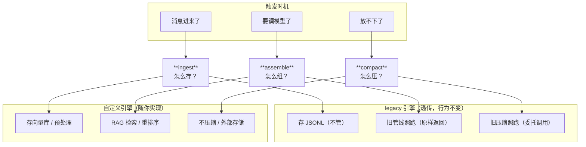
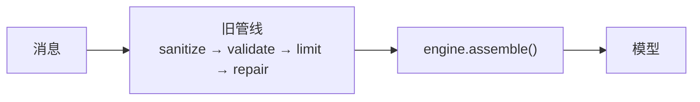
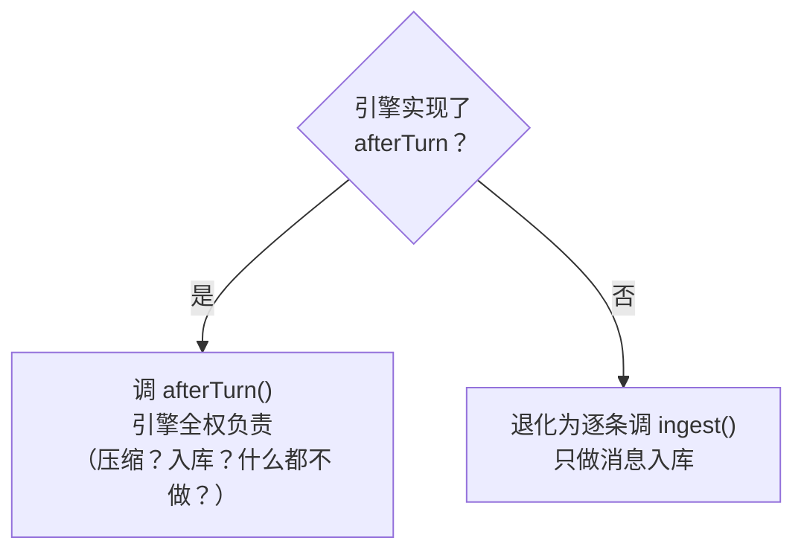
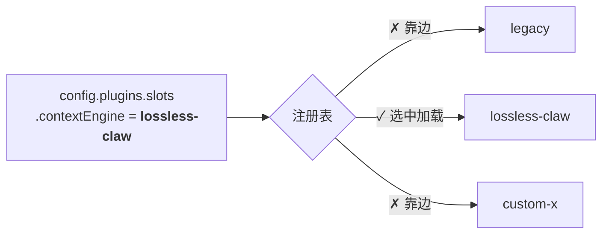
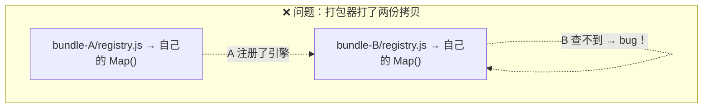
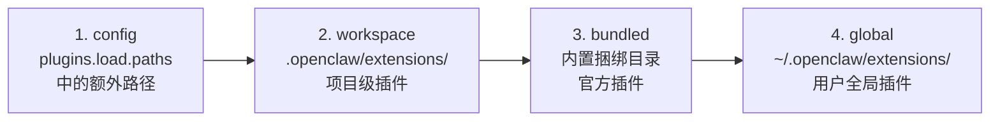

# 12 - ContextEngine 设计思想：一次教科书级的可插拔改造

> 关联 PR：#22201 · 44 files · +2,308 / -103 · 零行为变更
> 详细代码解读见 [11-pr-22201-context-engine.md](11-pr-22201-context-engine.md)

---

## 一句话总结

**在不改一行旧逻辑的前提下，让整个上下文管理变成可替换的。**

---

## 1. 问题是什么？

OpenClaw 的上下文管理——消息怎么存、怎么组装给模型、怎么压缩——全写死在核心运行时里。

这在很长时间内不是问题，因为只有一种策略够用了。直到 Lossless Context Management 论文出现，证明了一种全新的上下文管理方式效果极好。作者在外部仓库 `lossless-claw` 里实现了这个方案，但发现**没法以插件方式装进 OpenClaw**——想用新方案就得改核心代码。

这就是 PR #22201 要解决的：**让上下文管理从"只有一种方式"变成"可以有任意多种方式"**。

---

## 2. 设计原则

整个改造遵循三条核心原则：

### 原则一：零影响升级

> 不配置任何东西 → 行为与升级前 100% 一致。

这是最重要的约束。一个 +2,308 行的改动，对现有用户的影响是零。通过 `LegacyContextEngine`（一个什么都不做的包装器）实现——它把所有调用原样传给旧代码。

### 原则二：只加不改

> 旧代码不删不改，新代码只是在旁边加一层接口。

PR 的 -103 行几乎全是"把一个内联对象提取为变量"和"import 路径调整"，核心压缩逻辑一行没动。这是经典的 **Strangler Fig 模式**——新系统像绞杀榕一样慢慢包裹旧系统，但旧系统还在里面正常运行。

### 原则三：最小接口

> 写一个引擎只需要实现 3 个方法。

整个接口只有 3 个必选方法 + 5 个可选方法。必选的是最核心的三件事——消息怎么存（ingest）、怎么组（assemble）、怎么压（compact）。其余都标了 `?`，不实现也行。

---

## 3. 三个核心抽象

把上下文管理抽象成三件事：



**legacy 引擎**：三个方法全部"透传"，行为不变。
**自定义引擎**：三个方法随便你实现——存向量库、用 RAG 检索、不压缩都行。

这就是"把*做什么*和*怎么做*分开"的经典思路。

---

## 4. 五个关键设计决策

### 决策一：接口在旧管线之后执行



assemble 看到的是**已经清洗过的消息**。这意味着：
- legacy 引擎可以直接原样返回（旧管线已经做完了所有事）
- 自定义引擎可以在旧管线的基础上做额外处理（而不是完全绕开旧管线）

这降低了新引擎出 bug 的风险——你总有一个"最差也跟旧版一样"的底线。

### 决策二：引擎可以声明"我自己管压缩"

```typescript
info: { id: "lossless-claw", ownsCompaction: true }
```

当引擎声明 `ownsCompaction: true` 时，运行时自动禁用 SDK 内置的自动压缩。为什么需要这个？

因为 SDK 有自己的自动压缩机制（检测到上下文接近限制就主动触发）。如果自定义引擎也有自己的压缩策略（比如 lossless-claw 压根不压缩），两个压缩机制会打架。这个标志让引擎**声明式地表达意图**，运行时据此决策，不需要引擎去破解 SDK 内部行为。

### 决策三：legacy 参数走"不透明包"

旧的压缩函数需要 20+ 个参数（session key、provider、agent dir……）。新接口不想把这些全塞进签名里，所以用 `legacyParams: Record<string, unknown>` 打包。

这是一个**刻意的"丑陋"设计**——它不优雅，但它解耦了新接口和旧实现的参数依赖。等旧代码逐步被新引擎替换时，这个字段自然就没人用了，到时候删掉就行。

### 决策四：afterTurn 优先于 ingest

回合结束后的处理有两条路：



为什么不强制所有引擎都实现 afterTurn？因为很多简单引擎只需要"每条消息存一下"的能力，不需要回合级的完整控制权。分层设计，简单的场景简单用。

### 决策五：回调失败不阻断

子 Agent 生命周期的 4 个回调（completed / deleted / swept / released）全部是 best-effort——失败只记日志，不影响主流程。bootstrap 和 assemble 也是 try/catch 包裹。

理由：上下文引擎是"增强层"，不是"关键路径"。引擎挂了，Agent 仍然能用旧管线继续工作。**宁可降级也不要崩溃。**

---

## 5. Slot 机制：一个坑位一个人



同一个 slot 只允许一个活跃插件。不配 → 默认 `"legacy"`。配了一个不存在的 id？报错并列出所有可选项。

这个模式和记忆插件（`memory` slot）完全一致——ContextEngine 只是第二个 slot。意味着以后再加第三种可插拔能力（比如 tool-routing），直接复用这套 slot 机制就行。

---

## 6. 注册表：为什么用 Symbol.for？



解决：用 `Symbol.for("openclaw.contextEngineRegistryState")` 把 Map 挂在 `globalThis` 上。`Symbol.for` 对相同字符串总是返回同一个 Symbol，不管在哪份拷贝里调用。

**这是 JS monorepo 中"全局单例"的标准做法。** Python 项目中的等价问题是多进程 / `importlib.reload()` 导致的模块变量分裂——解法不同但思路一样：把状态放在一个所有拷贝都能访问的共享位置。

---

## 7. 子 Agent 调度：为什么要加这个？

PR 标题是"上下文管理"，但有 ~500 行用于子 Agent 调度（`runtime.subagent`）。为什么？

因为 Lossless Context Management 的一个核心特性是**深度上下文遍历**——让子 Agent 去浏览历史消息、提取关键信息。这需要 context-engine 插件能创建和管理子 Agent 会话。

不加这个 API，插件就只能做"被动处理消息"的事；加了之后，插件可以主动发起 Agent 调用——这才是 lossless-claw 真正的能力来源。

---

## 8. 这次改造的模式清单

| 模式 | 用在哪里 | 一句话解释 |
|------|---------|----------|
| **Strangler Fig** | LegacyContextEngine | 新接口包旧逻辑，渐进替换 |
| **Slot 注册** | plugins/slots.ts | 同类只一个活跃实例，配置驱动 |
| **不透明参数包** | legacyParams | 新接口不绑定旧参数，解耦演进 |
| **声明式标志** | ownsCompaction | 引擎声明意图，运行时据此决策 |
| **分层退化** | afterTurn / ingest | 高级能力可选，最简实现也能跑 |
| **best-effort 回调** | 子 Agent 生命周期 | 增强层失败不阻断关键路径 |
| **Symbol.for 单例** | 注册表 | JS 多拷贝安全的全局状态 |
| **AsyncLocalStorage 作用域** | gateway-request-scope | 异步调用链隐式传递请求上下文 |

---

## 9. 对我们项目的三个可借鉴点

**① Strangler Fig 改造存量代码**

我们的 LangGraph Agent 中也有"写死在核心路径"的逻辑。如果要做可插拔改造，不需要重写——在外面包一层接口，旧逻辑作为默认实现，新逻辑注册为替代方案。关键是**默认行为不变**。

**② 最小接口 + 可选增强**

定义接口时只把"不可绕过的核心能力"设为必选。OpenClaw 只有 3 个必选方法，其余 5 个全可选。这大幅降低了第三方实现门槛。

**③ 增强层的容错哲学**

任何"增强性"的回调/钩子都应该 try/catch + 降级。不要让一个可选功能的失败拖垮核心流程。OpenClaw 在 bootstrap、assemble、afterTurn、子 Agent 回调上全部遵循这个原则。

---

## 10. 如何实现一个 Context Engine 插件

想替换默认的上下文管理策略？只需要三步。

### 第一步：创建插件目录和清单文件

```
my-context-engine/
├── openclaw.plugin.json    ← 插件清单
├── package.json            ← npm 包描述
└── index.ts                ← 入口文件
```

**`openclaw.plugin.json`**（必需）：

```json
{
  "id": "my-context-engine",
  "name": "My Context Engine",
  "description": "A custom context engine for ...",
  "kind": "context-engine",
  "configSchema": {
    "type": "object",
    "properties": {
      "maxTokens": { "type": "number", "default": 80000 }
    }
  }
}
```

关键字段：
- `id`：唯一标识，后面配置 slot 时用这个名字
- `kind`：必须是 `"context-engine"`（另一个可选值是 `"memory"`）
- `configSchema`：JSON Schema，用户可通过配置文件或控制面板调参

**`package.json`**（发布到 npm 时需要）：

```json
{
  "name": "@yourscope/my-context-engine",
  "version": "0.1.0",
  "openclaw": {
    "extensions": ["index.ts"]
  }
}
```

`openclaw.extensions` 数组指向入口文件，运行时通过 jiti 加载。

### 第二步：实现三个必选方法

```typescript
// index.ts
export default function register(api) {
  api.registerContextEngine("my-context-engine", (config) => ({
    // 引擎元信息
    info: {
      id: "my-context-engine",
      name: "My Context Engine",
      ownsCompaction: false,    // true = 禁用 SDK 内置自动压缩
    },

    // 必选：消息怎么存？
    async ingest({ messages, conversationId }) {
      // 每条新消息进来后调用。可以存向量库、写外部存储、什么都不做……
      return { ingested: true };
    },

    // 必选：上下文怎么组装给模型？
    async assemble({ messages, tokenBudget }) {
      // 收到的 messages 已经过旧管线清洗（sanitize → validate → limit → repair）
      // 你可以原样返回，也可以做 RAG 检索、重排序、截断……
      return { messages, estimatedTokens: 0 };
    },

    // 必选：放不下了怎么压缩？
    async compact({ conversationId }) {
      // 上下文超限时调用。可以摘要压缩、移入外部存储、或声明不需要压缩
      return { ok: true, compacted: false };
    },

    // --- 以下全部可选 ---

    // 回合结束后的整体处理（实现了就不会逐条调 ingest）
    // async afterTurn({ messages }) { ... },

    // 引擎初始化
    // async bootstrap({ conversationId }) { ... },

    // 子 Agent 生命周期回调（best-effort，失败不阻断）
    // async onSubAgentCompleted({ agentId }) { ... },
    // async onSubAgentDeleted({ agentId }) { ... },
    // async onSubAgentSwept({ agentId }) { ... },
    // async onSubAgentReleased({ agentId }) { ... },
  }));
}
```

### 第三步：在配置中启用

```json5
// config.json 或 .openclaw/config.json
{
  plugins: {
    slots: {
      contextEngine: "my-context-engine"   // 与 openclaw.plugin.json 中的 id 一致
    }
  }
}
```

> **小贴士**：`ownsCompaction: true` 是一个声明式标志。如果你的引擎有自己的压缩策略（或压根不需要压缩），设为 `true` 就能让 SDK 内置的自动压缩自动退让，避免两套压缩机制打架。

---

## 11. 如何安装 Context Engine 插件

安装有三种方式，取决于插件来源：

### 从 npm 安装（最常见）

```bash
# 安装发布到 npm registry 的插件
openclaw plugins install @scope/my-context-engine

# 指定精确版本
openclaw plugins install @scope/my-context-engine@1.2.3
```

> npm spec 只支持包名 + 精确版本或 dist-tag，**不支持**  git URL、文件路径或 semver 范围。

### 从本地路径链接（开发调试用）

```bash
# -l / --link 模式：将本地目录加入 plugins.load.paths
openclaw plugins install -l ./my-context-engine
```

这不会拷贝文件，而是在配置中添加路径引用——本地修改即时生效，适合开发迭代。

### 从归档文件安装

```bash
# 支持 .zip / .tgz / .tar.gz / .tar
openclaw plugins install ./my-context-engine-1.0.0.tgz
```

### 安装后

```bash
# 验证安装是否成功
openclaw plugins list

# 查看插件详情
openclaw plugins info my-context-engine

# 诊断插件问题
openclaw plugins doctor

# 重启 Gateway 使插件生效，然后在配置中启用：
# plugins.slots.contextEngine = "my-context-engine"
```

### 更新与管理

```bash
# 更新单个插件（仅 npm 安装的支持更新）
openclaw plugins update @scope/my-context-engine

# 更新所有插件
openclaw plugins update --all

# 启用 / 禁用（不卸载，保留配置）
openclaw plugins enable my-context-engine
openclaw plugins disable my-context-engine
```

---

## 12. 如何找到社区 Context Engine 插件

### 官方渠道

1. **内置插件**：`openclaw plugins list` 会列出已安装的和已捆绑的插件。OpenClaw 自带 Memory Core 和 Memory LanceDB 两个记忆插件，以及 legacy 上下文引擎。

2. **官方插件列表**：[Plugin 文档](https://docs.openclaw.dev/tools/plugin) 列出所有官方维护的插件（Voice Call、Zalo、Matrix、Nostr、MS Teams 等）。

3. **社区插件页面**：[Community plugins](https://docs.openclaw.dev/plugins/community) 收录通过质量审核的第三方插件。提交 PR 即可申请收录。

### 社区贡献

想让自己的插件被收录？需要满足：

- 发布到 npmjs（可通过 `openclaw plugins install <npm-spec>` 安装）
- 源码托管在 GitHub（公开仓库）
- 仓库内含使用文档和 issue tracker
- 有明确的维护信号（活跃维护者、近期更新、能响应 issue）

向 OpenClaw 文档仓库提 PR，在 Community plugins 页面添加你的插件信息即可。

### 插件发现机制

运行时会从 4 个位置自动发现插件（按优先级排序）：



不需要手动注册——只要插件目录里有合法的 `openclaw.plugin.json`，就会被自动发现和加载。

---

## 13. 与 10 号、11 号文档的关系

| 文档 | 看什么 |
|------|-------|
| **10** — [context-engine.md](10-context-engine.md) | 从旧到新的演变故事，适合了解全貌 |
| **11** — [pr-22201-context-engine.md](11-pr-22201-context-engine.md) | 44 个文件逐个分析，适合要看代码的人 |
| **12** — **本文** | 设计原则和架构模式，适合想借鉴思路的人 |
