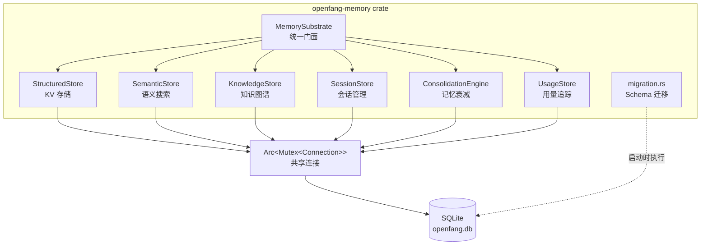
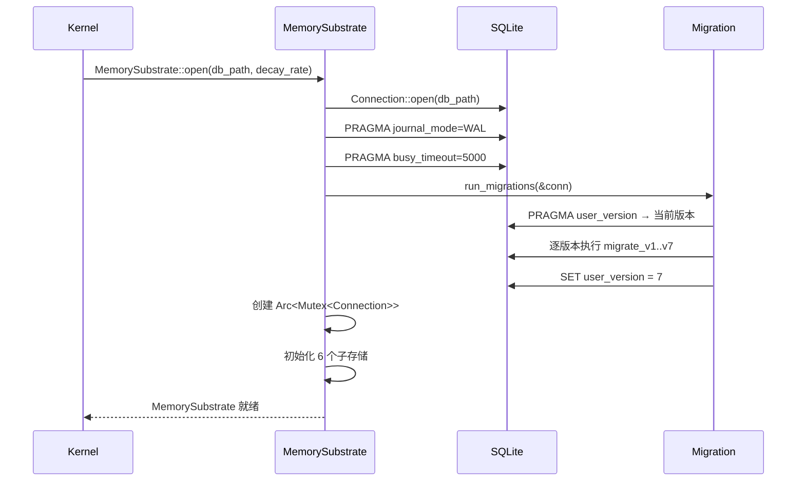

# 01 - 架构概览

## 系统定位

openfang-memory 是 OpenFang Agent OS 的**记忆基底**（Memory Substrate），在 Cargo workspace 的依赖层级中位于倒数第二层（仅依赖 `openfang-types`），被上层所有 crate 直接或间接依赖。

```
openfang-cli / openfang-api / openfang-desktop
        │
   openfang-kernel（组装所有子系统）
        │
   openfang-runtime（Agent 循环、工具、LLM 驱动）
        │
   openfang-memory ← 本文档主角
        │
   openfang-types（共享类型定义）
```

## 整体架构



## 模块职责

| 模块 | 源文件 | 职责 |
|------|--------|------|
| `MemorySubstrate` | `substrate.rs` | 统一门面，实现 `Memory` trait，组合所有子存储 |
| `StructuredStore` | `structured.rs` | 按 Agent 隔离的 KV 存储 + Agent 注册持久化 |
| `SemanticStore` | `semantic.rs` | 语义记忆片段存储与向量相似度检索 |
| `KnowledgeStore` | `knowledge.rs` | 实体-关系知识图谱 |
| `SessionStore` | `session.rs` | 对话历史 + 跨通道 CanonicalSession |
| `ConsolidationEngine` | `consolidation.rs` | 记忆置信度衰减 |
| `UsageStore` | `usage.rs` | LLM 调用的 token/cost 统计 |
| `migration` | `migration.rs` | Schema 版本管理（v1-v7） |

## 依赖关系

```toml
[dependencies]
openfang-types = { path = "../openfang-types" }  # 核心类型
tokio          # async 运行时（spawn_blocking）
rusqlite       # SQLite 绑定
serde / serde_json / rmp-serde  # 序列化（JSON + MessagePack）
chrono         # 时间处理
uuid           # ID 生成
async-trait    # 异步 trait 支持
tracing        # 结构化日志
```

## 关键设计决策

### 1. 单连接 + Mutex 模式

```rust
conn: Arc<Mutex<Connection>>
```

所有子存储共享同一个 SQLite 连接，通过 `Arc<Mutex<>>` 保证线程安全。异步桥接方式：

```rust
// 同步 SQLite 操作通过 spawn_blocking 桥接到 async
tokio::task::spawn_blocking(move || {
    store.get(agent_id, &key)
}).await
```

**理由**：rusqlite 是同步库，SQLite 本身不支持真正的并发写入，单连接 + WAL 模式是最简单高效的方案。

### 2. SQLite PRAGMA 配置

```rust
conn.execute_batch("PRAGMA journal_mode=WAL; PRAGMA busy_timeout=5000;");
```

- **WAL 模式**：允许读写并发，提升性能
- **busy_timeout**：5 秒等待锁释放，避免 `SQLITE_BUSY` 错误

### 3. 序列化策略

| 数据类型 | 序列化格式 | 存储方式 |
|---------|-----------|---------|
| KV Store 的 value | JSON | BLOB |
| Agent manifest | MessagePack (named) | BLOB |
| Session messages | MessagePack | BLOB |
| 向量嵌入 | f32 little-endian 字节序 | BLOB |
| Metadata/Properties | JSON string | TEXT |
| 时间戳 | RFC 3339 | TEXT |

### 4. 测试支持

```rust
pub fn open_in_memory(decay_rate: f32) -> OpenFangResult<Self>
```

提供内存数据库工厂方法，所有子模块都有完整的单元测试。

## 初始化流程


