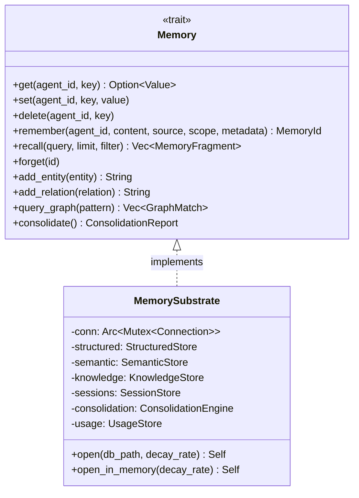
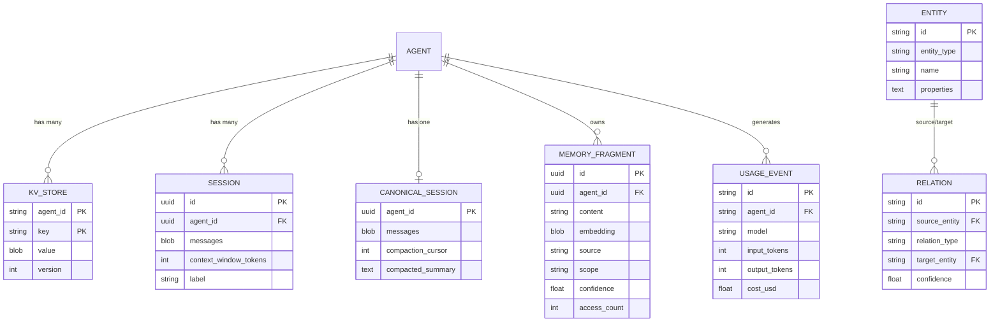

# 02 - 数据模型

## Memory Trait（统一接口）

这是整个记忆系统的核心抽象。上层所有 crate 通过此 trait 与记忆交互。

```rust
#[async_trait]
pub trait Memory: Send + Sync {
    // ===== KV 存储（按 Agent 隔离）=====
    async fn get(&self, agent_id: AgentId, key: &str)
        -> Result<Option<serde_json::Value>>;
    async fn set(&self, agent_id: AgentId, key: &str, value: serde_json::Value)
        -> Result<()>;
    async fn delete(&self, agent_id: AgentId, key: &str)
        -> Result<()>;

    // ===== 语义记忆 =====
    async fn remember(&self, agent_id: AgentId, content: &str,
        source: MemorySource, scope: &str,
        metadata: HashMap<String, Value>) -> Result<MemoryId>;
    async fn recall(&self, query: &str, limit: usize,
        filter: Option<MemoryFilter>) -> Result<Vec<MemoryFragment>>;
    async fn forget(&self, id: MemoryId) -> Result<()>;

    // ===== 知识图谱 =====
    async fn add_entity(&self, entity: Entity) -> Result<String>;
    async fn add_relation(&self, relation: Relation) -> Result<String>;
    async fn query_graph(&self, pattern: GraphPattern)
        -> Result<Vec<GraphMatch>>;

    // ===== 维护 =====
    async fn consolidate(&self) -> Result<ConsolidationReport>;
    async fn export(&self, format: ExportFormat) -> Result<Vec<u8>>;
    async fn import(&self, data: &[u8], format: ExportFormat)
        -> Result<ImportReport>;
}
```



## 核心类型定义

### ID 类型

```rust
// Agent 标识
pub struct AgentId(pub Uuid);

// 会话标识
pub struct SessionId(pub Uuid);

// 记忆片段标识
pub struct MemoryId(pub Uuid);
```

### MemorySource — 记忆来源

```rust
pub enum MemorySource {
    Conversation,   // 对话中提取
    Document,       // 文档导入
    Observation,    // 观察推断
    Inference,      // 推理产生
    UserProvided,   // 用户主动提供
    System,         // 系统写入
}
```

### MemoryFragment — 记忆片段（检索结果）

```rust
pub struct MemoryFragment {
    pub id: MemoryId,
    pub agent_id: AgentId,
    pub content: String,                           // 记忆文本内容
    pub embedding: Option<Vec<f32>>,               // 向量嵌入（可选）
    pub metadata: HashMap<String, Value>,          // 自定义元数据
    pub source: MemorySource,                      // 来源
    pub confidence: f32,                           // 置信度（0.0 ~ 1.0）
    pub created_at: DateTime<Utc>,
    pub accessed_at: DateTime<Utc>,                // 最后访问时间
    pub access_count: u64,                         // 访问计数
    pub scope: String,                             // 作用域（如 "episodic"）
}
```

### MemoryFilter — 检索过滤器

```rust
pub struct MemoryFilter {
    pub agent_id: Option<AgentId>,                 // 按 Agent 过滤
    pub source: Option<MemorySource>,              // 按来源过滤
    pub scope: Option<String>,                     // 按作用域过滤
    pub min_confidence: Option<f32>,               // 最低置信度
    pub after: Option<DateTime<Utc>>,              // 时间范围（起）
    pub before: Option<DateTime<Utc>>,             // 时间范围（止）
    pub metadata: HashMap<String, Value>,          // 元数据匹配
}
```

### Entity — 知识图谱实体

```rust
pub struct Entity {
    pub id: String,
    pub entity_type: EntityType,
    pub name: String,
    pub properties: HashMap<String, Value>,
    pub created_at: DateTime<Utc>,
    pub updated_at: DateTime<Utc>,
}

pub enum EntityType {
    Person, Organization, Project, Concept,
    Event, Location, Document, Tool,
    Custom(String),
}
```

### Relation — 知识图谱关系

```rust
pub struct Relation {
    pub source: String,                            // 源实体 ID
    pub relation: RelationType,
    pub target: String,                            // 目标实体 ID
    pub properties: HashMap<String, Value>,
    pub confidence: f32,
    pub created_at: DateTime<Utc>,
}

pub enum RelationType {
    WorksAt, KnowsAbout, RelatedTo, DependsOn,
    OwnedBy, CreatedBy, LocatedIn, PartOf,
    Uses, Produces, Custom(String),
}
```

### GraphPattern & GraphMatch — 图查询

```rust
// 查询模式（所有字段可选）
pub struct GraphPattern {
    pub source: Option<String>,                    // 源实体 ID 或名称
    pub relation: Option<RelationType>,            // 关系类型
    pub target: Option<String>,                    // 目标实体 ID 或名称
    pub max_depth: u32,                            // 最大深度
}

// 匹配结果（三元组）
pub struct GraphMatch {
    pub source: Entity,
    pub relation: Relation,
    pub target: Entity,
}
```

### Session — 会话

```rust
pub struct Session {
    pub id: SessionId,
    pub agent_id: AgentId,
    pub messages: Vec<Message>,                    // 消息历史
    pub context_window_tokens: u64,                // 估计 token 数
    pub label: Option<String>,                     // 可读标签
}
```

### CanonicalSession — 跨通道会话

```rust
pub struct CanonicalSession {
    pub agent_id: AgentId,
    pub messages: Vec<Message>,                    // 压缩后的消息窗口
    pub compaction_cursor: usize,                  // 压缩进度游标
    pub compacted_summary: Option<String>,         // 旧消息摘要
    pub updated_at: String,
}
```

### UsageRecord — 用量记录

```rust
pub struct UsageRecord {
    pub agent_id: AgentId,
    pub model: String,
    pub input_tokens: u64,
    pub output_tokens: u64,
    pub cost_usd: f64,
    pub tool_calls: u32,
}
```

## 类型关系图


