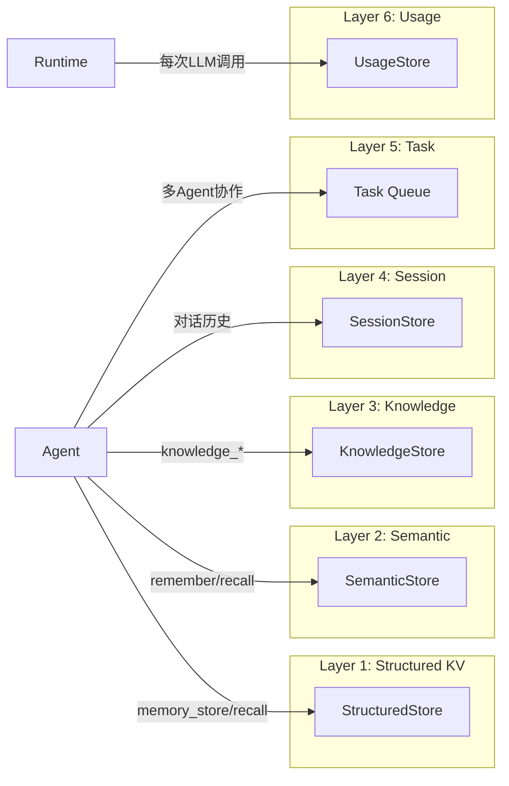
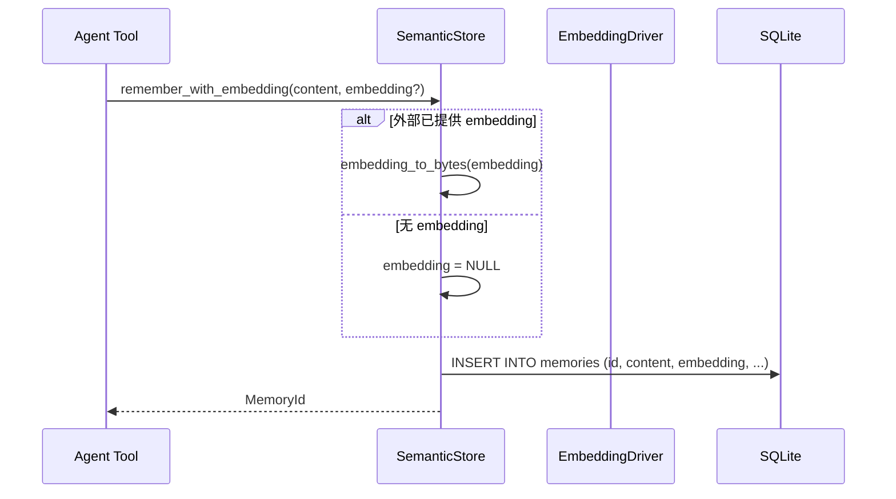
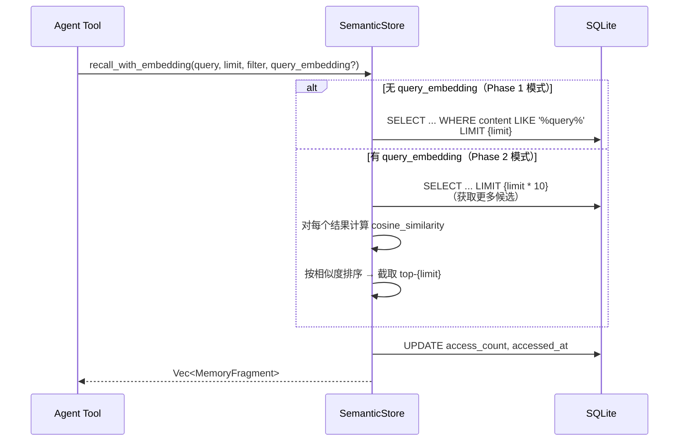
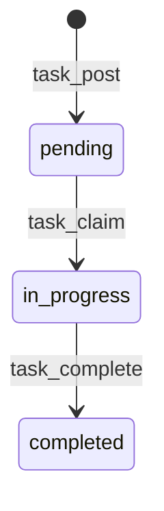

# 03 - 六层存储详解

## 存储分层概览



---

## Layer 1: Structured KV Store

### 功能
按 Agent 隔离的键值存储。每个 Agent 有独立的命名空间，另有一个共享命名空间（`agent_id = "00000000-...-01"`）供跨 Agent 数据共享。

### 表结构
```sql
CREATE TABLE kv_store (
    agent_id TEXT NOT NULL,
    key      TEXT NOT NULL,
    value    BLOB NOT NULL,        -- JSON 序列化为字节
    version  INTEGER NOT NULL DEFAULT 1,
    updated_at TEXT NOT NULL,
    PRIMARY KEY (agent_id, key)
);
```

### 核心操作

| 方法 | SQL | 说明 |
|------|-----|------|
| `get(agent_id, key)` | `SELECT value FROM kv_store WHERE agent_id=? AND key=?` | 反序列化 BLOB → JSON Value |
| `set(agent_id, key, value)` | `INSERT ... ON CONFLICT DO UPDATE SET value=?, version=version+1` | 自动版本递增 |
| `delete(agent_id, key)` | `DELETE FROM kv_store WHERE agent_id=? AND key=?` | 硬删除 |
| `list_kv(agent_id)` | `SELECT key, value FROM kv_store WHERE agent_id=? ORDER BY key` | 列出所有键值对 |

### 特殊功能：Agent 持久化

StructuredStore 还负责 Agent 注册信息的持久化（`agents` 表）：

```sql
CREATE TABLE agents (
    id         TEXT PRIMARY KEY,
    name       TEXT NOT NULL,
    manifest   BLOB NOT NULL,      -- MessagePack (named) 序列化
    state      TEXT NOT NULL,      -- JSON 字符串
    created_at TEXT NOT NULL,
    updated_at TEXT NOT NULL,
    session_id TEXT DEFAULT '',    -- v2 追加
    identity   TEXT DEFAULT '{}'   -- v2 追加
);
```

关键细节：
- manifest 使用 `rmp_serde::to_vec_named` 序列化（命名字段，向前兼容）
- `load_all_agents()` 实现了**自动修复**：schema 升级后重新序列化 manifest
- 加载时去重：同名 Agent 只保留第一个

---

## Layer 2: Semantic Store（语义记忆）

### 功能
基于文本内容和向量嵌入的语义记忆存储与检索。支持两种检索模式：
- **Phase 1**：SQL LIKE 文本匹配（无嵌入时的降级方案）
- **Phase 2**：余弦相似度向量检索（有嵌入时）

### 表结构
```sql
CREATE TABLE memories (
    id           TEXT PRIMARY KEY,
    agent_id     TEXT NOT NULL,
    content      TEXT NOT NULL,
    source       TEXT NOT NULL,        -- JSON 枚举："\"Conversation\""
    scope        TEXT NOT NULL DEFAULT 'episodic',
    confidence   REAL NOT NULL DEFAULT 1.0,
    metadata     TEXT NOT NULL DEFAULT '{}',
    created_at   TEXT NOT NULL,
    accessed_at  TEXT NOT NULL,
    access_count INTEGER NOT NULL DEFAULT 0,
    deleted      INTEGER NOT NULL DEFAULT 0,  -- 软删除标记
    embedding    BLOB DEFAULT NULL     -- v3 追加：f32[] 小端序
);
CREATE INDEX idx_memories_agent ON memories(agent_id);
CREATE INDEX idx_memories_scope ON memories(scope);
```

### 写入流程



### 检索流程



### 关键算法：余弦相似度

```rust
fn cosine_similarity(a: &[f32], b: &[f32]) -> f32 {
    let dot = Σ(a[i] * b[i]);
    let norm_a = √Σ(a[i]²);
    let norm_b = √Σ(b[i]²);
    dot / (norm_a * norm_b)
}
```

### 向量序列化

```rust
// f32[] → bytes（存储）
fn embedding_to_bytes(embedding: &[f32]) -> Vec<u8> {
    embedding.iter().flat_map(|v| v.to_le_bytes()).collect()
}

// bytes → f32[]（读取）
fn embedding_from_bytes(bytes: &[u8]) -> Vec<f32> {
    bytes.chunks_exact(4)
         .map(|c| f32::from_le_bytes([c[0], c[1], c[2], c[3]]))
         .collect()
}
```

### 软删除
`forget()` 仅将 `deleted` 标记设为 1，不物理删除。检索时自动过滤 `deleted = 0`。

---

## Layer 3: Knowledge Store（知识图谱）

### 功能
实体-关系存储，支持图模式查询。

### 表结构
```sql
CREATE TABLE entities (
    id          TEXT PRIMARY KEY,
    entity_type TEXT NOT NULL,        -- JSON 枚举
    name        TEXT NOT NULL,
    properties  TEXT NOT NULL DEFAULT '{}',
    created_at  TEXT NOT NULL,
    updated_at  TEXT NOT NULL
);

CREATE TABLE relations (
    id              TEXT PRIMARY KEY,
    source_entity   TEXT NOT NULL,
    relation_type   TEXT NOT NULL,     -- JSON 枚举
    target_entity   TEXT NOT NULL,
    properties      TEXT NOT NULL DEFAULT '{}',
    confidence      REAL NOT NULL DEFAULT 1.0,
    created_at      TEXT NOT NULL
);
CREATE INDEX idx_relations_source ON relations(source_entity);
CREATE INDEX idx_relations_target ON relations(target_entity);
CREATE INDEX idx_relations_type ON relations(relation_type);
```

### 查询实现

`query_graph(pattern: GraphPattern)` 使用三表 JOIN：

```sql
SELECT s.*, r.*, t.*
FROM relations r
JOIN entities s ON r.source_entity = s.id
JOIN entities t ON r.target_entity = t.id
WHERE 1=1
  [AND (s.id = ? OR s.name = ?)]      -- 按源实体
  [AND r.relation_type = ?]            -- 按关系类型
  [AND (t.id = ? OR t.name = ?)]       -- 按目标实体
LIMIT 100
```

注意：`source` 和 `target` 查询支持按 ID 或名称匹配。

---

## Layer 4: Session Store

### 功能
对话历史管理。每个 Agent 可有多个 Session，另有单独的 CanonicalSession（跨通道）。

### 表结构
```sql
CREATE TABLE sessions (
    id                     TEXT PRIMARY KEY,
    agent_id               TEXT NOT NULL,
    messages               BLOB NOT NULL,     -- MessagePack 序列化
    context_window_tokens  INTEGER DEFAULT 0,
    label                  TEXT,              -- v6 追加
    created_at             TEXT NOT NULL,
    updated_at             TEXT NOT NULL
);

CREATE TABLE canonical_sessions (           -- v5 追加
    agent_id           TEXT PRIMARY KEY,
    messages           BLOB NOT NULL,
    compaction_cursor  INTEGER NOT NULL DEFAULT 0,
    compacted_summary  TEXT,
    updated_at         TEXT NOT NULL
);
```

### JSONL 镜像

Session 支持导出为人类可读的 JSONL 格式：

```json
{"timestamp":"2025-...","role":"user","content":"Hello"}
{"timestamp":"2025-...","role":"assistant","content":"Hi!"}
{"timestamp":"2025-...","role":"assistant","content":"...","tool_use":[{"type":"tool_use","name":"memory_store",...}]}
```

---

## Layer 5: Task Queue（多 Agent 协作）

### 功能
共享任务队列，支持任务发布、认领、完成。

### 表结构
```sql
CREATE TABLE task_queue (
    id           TEXT PRIMARY KEY,
    agent_id     TEXT NOT NULL,
    task_type    TEXT NOT NULL,
    payload      BLOB NOT NULL,
    status       TEXT NOT NULL DEFAULT 'pending',
    priority     INTEGER NOT NULL DEFAULT 0,
    scheduled_at TEXT,
    created_at   TEXT NOT NULL,
    completed_at TEXT,
    -- v2 追加
    title        TEXT DEFAULT '',
    description  TEXT DEFAULT '',
    assigned_to  TEXT DEFAULT '',
    created_by   TEXT DEFAULT '',
    result       TEXT DEFAULT ''
);
CREATE INDEX idx_task_status_priority ON task_queue(status, priority DESC);
```

### 状态机



### 认领策略
```sql
-- 优先认领分配给自己的任务，其次认领未分配的
SELECT id, title, ...
FROM task_queue
WHERE status = 'pending'
  AND (assigned_to = ?agent_id OR assigned_to = '')
ORDER BY priority DESC, created_at ASC
LIMIT 1
```

---

## Layer 6: Usage Store（用量追踪）

### 功能
记录每次 LLM 调用的 token 消耗和成本。

### 表结构
```sql
CREATE TABLE usage_events (
    id            TEXT PRIMARY KEY,
    agent_id      TEXT NOT NULL,
    timestamp     TEXT NOT NULL,
    model         TEXT NOT NULL,
    input_tokens  INTEGER NOT NULL DEFAULT 0,
    output_tokens INTEGER NOT NULL DEFAULT 0,
    cost_usd      REAL NOT NULL DEFAULT 0.0,
    tool_calls    INTEGER NOT NULL DEFAULT 0
);
CREATE INDEX idx_usage_agent_time ON usage_events(agent_id, timestamp);
CREATE INDEX idx_usage_timestamp ON usage_events(timestamp);
```

### 查询粒度

| 方法 | 时间范围 | 范围 |
|------|---------|------|
| `query_hourly(agent_id)` | 最近 1 小时 | 单 Agent |
| `query_daily(agent_id)` | 今日零点起 | 单 Agent |
| `query_monthly(agent_id)` | 本月起 | 单 Agent |
| `query_global_hourly()` | 最近 1 小时 | 全局 |
| `query_global_monthly()` | 本月起 | 全局 |
| `query_summary(agent_id?)` | 全部 | 可选按 Agent |

### 聚合类型

```rust
pub struct UsageSummary {
    pub total_input_tokens: u64,
    pub total_output_tokens: u64,
    pub total_cost_usd: f64,
    pub call_count: u64,
    pub total_tool_calls: u64,
}

pub struct ModelUsage {        // 按模型分组
    pub model: String,
    pub total_cost_usd: f64,
    pub total_input_tokens: u64,
    pub total_output_tokens: u64,
    pub call_count: u64,
}

pub struct DailyBreakdown {    // 按日分组
    pub date: String,
    pub cost_usd: f64,
    pub tokens: u64,
    pub calls: u64,
}
```
