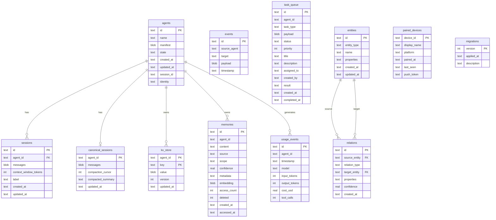

# 04 - Schema 迁移策略

## 迁移机制

OpenFang 使用 SQLite 的 `PRAGMA user_version` 作为 schema 版本号，无需额外的迁移框架。

```mermaid
graph LR
    A[读取 PRAGMA user_version] --> B{version < 1?}
    B -->|Yes| V1[migrate_v1: 核心表]
    B -->|No| C{version < 2?}
    V1 --> C
    C -->|Yes| V2[migrate_v2: 协作列]
    C -->|No| D{version < 3?}
    V2 --> D
    D -->|Yes| V3[migrate_v3: 向量列]
    D -->|No| E{version < 4?}
    V3 --> E
    E -->|Yes| V4[migrate_v4: 用量表]
    E -->|No| F{version < 5?}
    V4 --> F
    F -->|Yes| V5[migrate_v5: 跨通道会话]
    F -->|No| G{version < 6?}
    V5 --> G
    G -->|Yes| V6[migrate_v6: 会话标签]
    G -->|No| H{version < 7?}
    V6 --> H
    H -->|Yes| V7[migrate_v7: 设备配对]
    H -->|No| I[SET user_version = 7]
    V7 --> I
```



### 迁移守卫

由于 SQLite 没有 `ADD COLUMN IF NOT EXISTS`，使用辅助函数检测列是否存在：

```rust
fn column_exists(conn: &Connection, table: &str, column: &str) -> bool {
    let mut stmt = conn.prepare(&format!("PRAGMA table_info({})", table)).ok()?;
    let names: Vec<String> = stmt.query_map([], |row| row.get::<_, String>(1))
        .filter_map(|r| r.ok()).collect();
    names.iter().any(|n| n == column)
}
```

---

## 版本详解

### V1 — 核心表（初始 Schema）

创建 8 张核心表：

| 表 | 用途 |
|----|------|
| `agents` | Agent 注册信息 |
| `sessions` | 对话历史 |
| `events` | 事件日志 |
| `kv_store` | KV 存储 |
| `task_queue` | 任务队列 |
| `memories` | 语义记忆 |
| `entities` | 知识图谱实体 |
| `relations` | 知识图谱关系 |
| `migrations` | 迁移追踪 |

索引：
- `idx_events_timestamp` / `idx_events_source`
- `idx_task_status_priority`
- `idx_memories_agent` / `idx_memories_scope`
- `idx_relations_source` / `idx_relations_target` / `idx_relations_type`

### V2 — 协作列

为 `task_queue` 添加多 Agent 协作所需字段：

```sql
ALTER TABLE task_queue ADD COLUMN title TEXT DEFAULT '';
ALTER TABLE task_queue ADD COLUMN description TEXT DEFAULT '';
ALTER TABLE task_queue ADD COLUMN assigned_to TEXT DEFAULT '';
ALTER TABLE task_queue ADD COLUMN created_by TEXT DEFAULT '';
ALTER TABLE task_queue ADD COLUMN result TEXT DEFAULT '';
```

### V3 — 向量嵌入

为 `memories` 表添加嵌入列：

```sql
ALTER TABLE memories ADD COLUMN embedding BLOB DEFAULT NULL;
```

`embedding` 存储格式：`f32[]` 按小端序排列的字节数组，每个 float 占 4 字节。

### V4 — 用量追踪

新建 `usage_events` 表：

```sql
CREATE TABLE usage_events (
    id TEXT PRIMARY KEY,
    agent_id TEXT NOT NULL,
    timestamp TEXT NOT NULL,
    model TEXT NOT NULL,
    input_tokens INTEGER NOT NULL DEFAULT 0,
    output_tokens INTEGER NOT NULL DEFAULT 0,
    cost_usd REAL NOT NULL DEFAULT 0.0,
    tool_calls INTEGER NOT NULL DEFAULT 0
);
CREATE INDEX idx_usage_agent_time ON usage_events(agent_id, timestamp);
CREATE INDEX idx_usage_timestamp ON usage_events(timestamp);
```

### V5 — 跨通道会话

新建 `canonical_sessions` 表：

```sql
CREATE TABLE canonical_sessions (
    agent_id TEXT PRIMARY KEY,         -- 每 Agent 一条
    messages BLOB NOT NULL,
    compaction_cursor INTEGER NOT NULL DEFAULT 0,
    compacted_summary TEXT,
    updated_at TEXT NOT NULL
);
```

### V6 — 会话标签

为 `sessions` 表添加人类可读标签：

```sql
ALTER TABLE sessions ADD COLUMN label TEXT;
```

### V7 — 设备配对

新建 `paired_devices` 表（桌面端功能）：

```sql
CREATE TABLE paired_devices (
    device_id TEXT PRIMARY KEY,
    display_name TEXT NOT NULL,
    platform TEXT NOT NULL,
    paired_at TEXT NOT NULL,
    last_seen TEXT NOT NULL,
    push_token TEXT
);
```

---

## 完整 ERD（v7 最终 Schema）



## 迁移测试保障

```rust
#[test]
fn test_migration_creates_tables() {
    let conn = Connection::open_in_memory().unwrap();
    run_migrations(&conn).unwrap();
    // 验证所有表存在
}

#[test]
fn test_migration_idempotent() {
    let conn = Connection::open_in_memory().unwrap();
    run_migrations(&conn).unwrap();
    run_migrations(&conn).unwrap(); // 重复执行不报错
}
```
