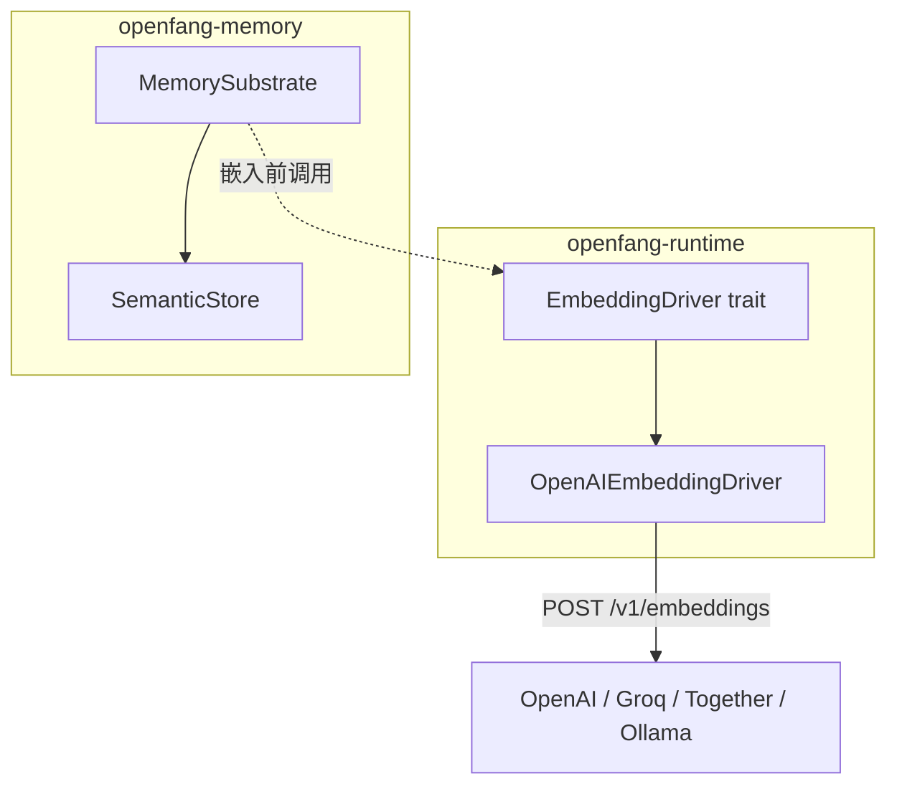
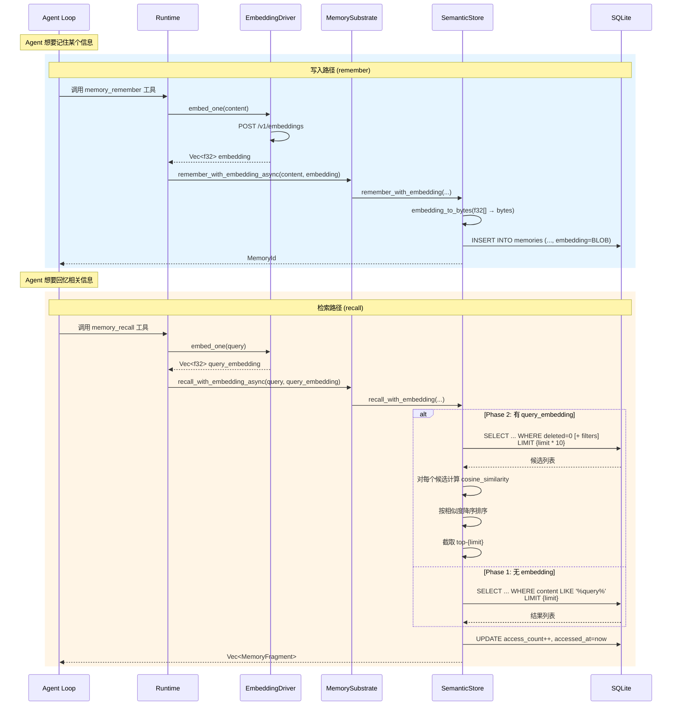
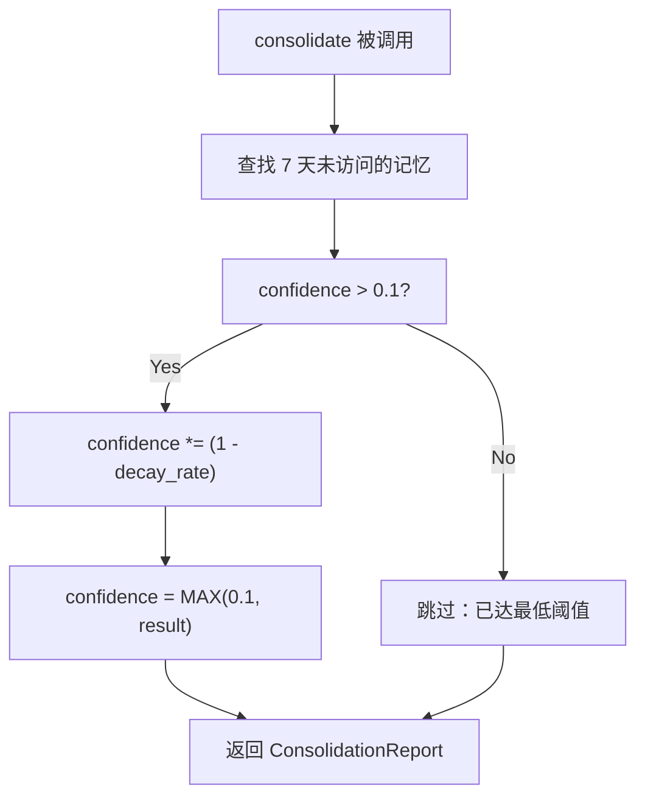

# 05 - 向量嵌入与语义检索

## 嵌入驱动架构



## EmbeddingDriver Trait

```rust
#[async_trait]
pub trait EmbeddingDriver: Send + Sync {
    /// 批量嵌入多段文本
    async fn embed(&self, texts: &[&str]) -> Result<Vec<Vec<f32>>, EmbeddingError>;

    /// 嵌入单段文本（默认实现：调用 embed 取第一个）
    async fn embed_one(&self, text: &str) -> Result<Vec<f32>, EmbeddingError> {
        let results = self.embed(&[text]).await?;
        results.into_iter().next().ok_or(EmbeddingError::EmptyResponse)
    }

    /// 返回向量维度
    fn dimensions(&self) -> usize;
}
```

## OpenAIEmbeddingDriver 实现

### 配置

```rust
pub struct EmbeddingConfig {
    pub provider: String,    // "openai", "groq", "together", "ollama" 等
    pub model: String,       // "text-embedding-3-small" 等
    pub api_key: String,     // API 密钥
    pub base_url: String,    // API 基础 URL
}
```

### 兼容的提供者

| Provider | Base URL | 需要 API Key |
|----------|----------|-------------|
| OpenAI | `https://api.openai.com` | Yes |
| Groq | `https://api.groq.com/openai` | Yes |
| Together | `https://api.together.xyz` | Yes |
| Fireworks | `https://api.fireworks.ai/inference` | Yes |
| Ollama | `http://localhost:11434` | No |
| vLLM | `http://localhost:8000` | No |
| LM Studio | `http://localhost:1234` | No |

### 维度自动推断

```rust
fn infer_dimensions(model: &str) -> usize {
    match model {
        m if m.contains("text-embedding-3-small") => 1536,
        m if m.contains("text-embedding-3-large") => 3072,
        m if m.contains("text-embedding-ada")     => 1536,
        m if m.contains("MiniLM") || m.contains("minilm") => 384,
        m if m.contains("nomic")                   => 768,
        m if m.contains("bge")                     => 1024,
        _                                          => 1536, // 默认
    }
}
```

### API Key 安全

```rust
// 使用 Zeroizing 包装，内存释放时自动清零
api_key: Zeroizing<String>
```

## 语义检索流程（完整）



## 向量存储格式

```
内存 f32 数组:  [0.123, -0.456, 0.789, ...]
                  │         │        │
                  ▼         ▼        ▼
SQLite BLOB:    [7B 14 FC 3D | 1F 85 E9 BE | B4 C8 49 3F | ...]
                 └─ 4 bytes ─┘ └─ 4 bytes ─┘ └─ 4 bytes ─┘
                  (little-endian f32)
```

维度示例：
- `text-embedding-3-small`：1536 维 → 6144 bytes per embedding
- `text-embedding-3-large`：3072 维 → 12288 bytes per embedding
- `all-MiniLM-L6-v2`：384 维 → 1536 bytes per embedding

## 检索策略对比

| 特性 | Phase 1 (LIKE) | Phase 2 (Vector) |
|------|----------------|-------------------|
| 查询方式 | SQL LIKE 文本匹配 | 余弦相似度重排序 |
| 候选获取 | `LIMIT {limit}` | `LIMIT {limit * 10}` |
| 排序依据 | `accessed_at DESC, access_count DESC` | `cosine_similarity DESC` |
| 精度 | 低（精确子串匹配） | 高（语义近似） |
| 依赖 | 无 | 需要 EmbeddingDriver |
| 降级 | 默认模式 | 无 embedding 时自动降级 |

## 记忆衰减机制（ConsolidationEngine）



### 衰减公式

```
new_confidence = MAX(0.1, confidence * (1 - decay_rate))
```

- `decay_rate` 典型值：0.1（每次衰减 10%）
- 最低保证：0.1（永不完全遗忘）
- 触发条件：`accessed_at` 超过 7 天

### 访问即强化

每次 `recall` 返回记忆时：
```sql
UPDATE memories SET access_count = access_count + 1, accessed_at = NOW()
WHERE id = ?
```

这样频繁被访问的记忆保持高置信度，不会被衰减。

## 备注：无外部向量数据库

openfang 的语义搜索完全在 SQLite 内部完成——向量存为 BLOB，检索时全部加载到内存中排序。这对于中小规模（数万条记忆）是可行的，但大规模场景需要引入专用向量数据库（如 Qdrant、Milvus）。
