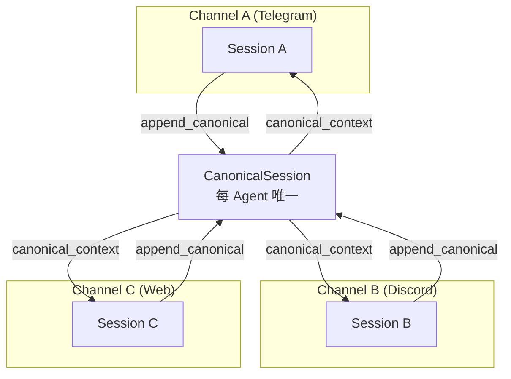
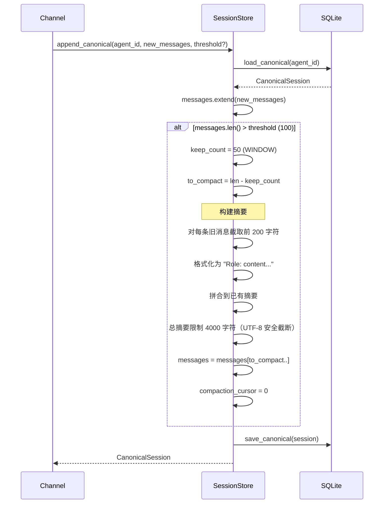
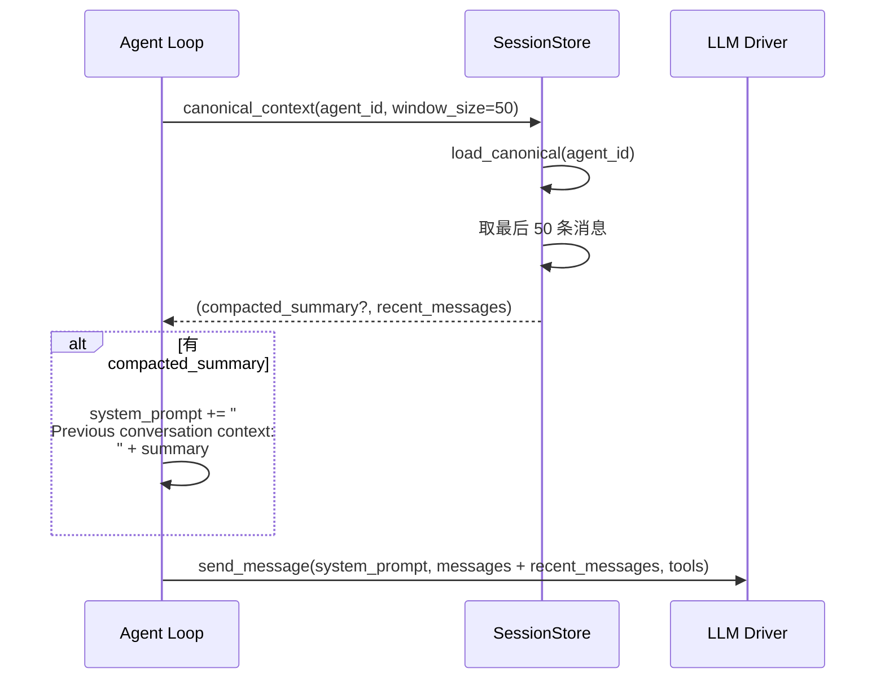
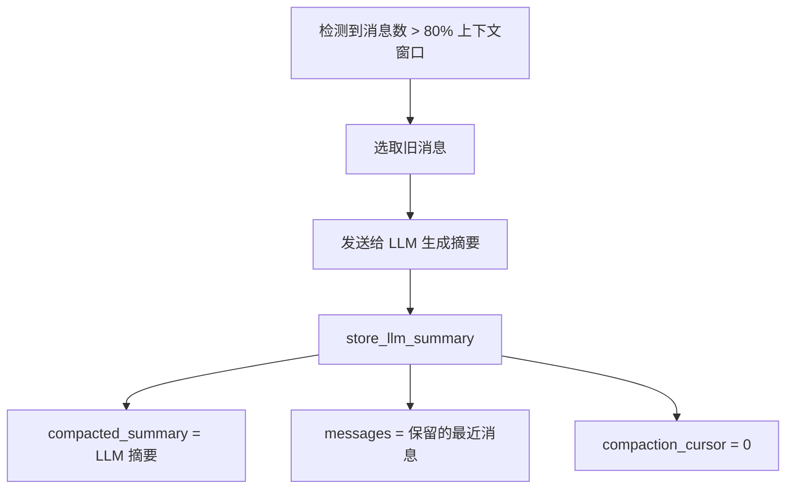
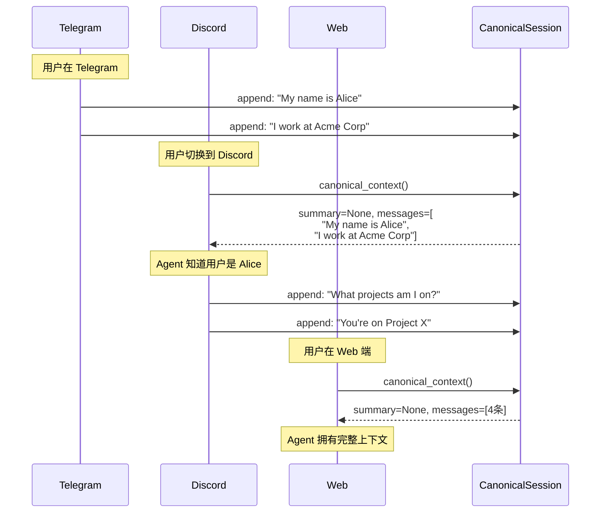

# 06 - 跨通道记忆与会话压缩

## 问题背景

用户可能通过 Telegram 跟 Agent 聊天，中途切换到 Discord 继续。传统设计下每个通道（Channel）有独立会话，切换后会丢失上下文。

OpenFang 通过 **CanonicalSession** 解决了这个问题。

## CanonicalSession 设计



### 核心原理

1. **写入**：每个通道的对话消息实时追加到 CanonicalSession
2. **读取**：新通道对话开始时，从 CanonicalSession 获取摘要 + 最近消息注入 system prompt
3. **压缩**：消息数超过阈值时，旧消息被摘要化

## 数据结构

```rust
pub struct CanonicalSession {
    pub agent_id: AgentId,              // 所属 Agent
    pub messages: Vec<Message>,         // 压缩窗口内的消息
    pub compaction_cursor: usize,       // 压缩进度
    pub compacted_summary: Option<String>, // 旧消息摘要文本
    pub updated_at: String,
}
```

常量：
```rust
const DEFAULT_CANONICAL_WINDOW: usize = 50;      // 保留最近 50 条消息
const DEFAULT_COMPACTION_THRESHOLD: usize = 100;  // 超过 100 条触发压缩
```

## 压缩流程



## 摘要构建算法

```python
# 伪代码
def build_summary(existing_summary, messages_to_compact):
    parts = []
    if existing_summary:
        parts.append(existing_summary)

    for msg in messages_to_compact:
        role = msg.role  # "User" / "Assistant" / "System"
        text = msg.text_content()
        if text:
            truncated = text[:200] + "..." if len(text) > 200 else text
            parts.append(f"{role}: {truncated}")

    full = "\n".join(parts)

    # 限制总长度为 4000 字符（从尾部保留）
    if len(full) > 4000:
        full = full[-4000:]  # UTF-8 安全边界处理

    return full
```

### 关键细节

1. **尾部保留**：摘要超长时从尾部截断（保留最近的摘要，丢弃最远的）
2. **UTF-8 安全**：截断时找到合法字符边界 `is_char_boundary()`
3. **200 字符截断**：每条消息在摘要中最多保留 200 字符

## 上下文注入流程



## LLM 摘要压缩（高级模式）

除了基于文本截断的压缩，OpenFang 还支持 LLM 生成摘要：

```rust
pub fn store_llm_summary(
    &self,
    agent_id: AgentId,
    summary: &str,               // LLM 生成的智能摘要
    kept_messages: Vec<Message>,  // 保留的最近消息
) -> OpenFangResult<()>
```

这个方法由 `openfang-runtime` 中的 **LLM session compactor** 调用：
1. 检测到会话消息数超过上下文窗口 80%
2. 将旧消息发送给 LLM 生成摘要
3. 用 `store_llm_summary` 替换旧消息



## 完整的跨通道场景



## 与 Regular Session 的区别

| 特性 | Regular Session | Canonical Session |
|------|-----------------|-------------------|
| 数量 | 每 Agent 多个 | 每 Agent 唯一 |
| 创建 | 每次新对话 | Agent 首次交互 |
| 关联 | 绑定特定通道/交互 | 跨所有通道 |
| 压缩 | 由 runtime compactor 处理 | 内建压缩逻辑 |
| 用途 | 当前对话上下文 | 持久记忆（"认识你"） |
| 存储表 | `sessions` | `canonical_sessions` |
