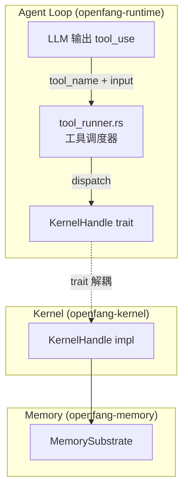
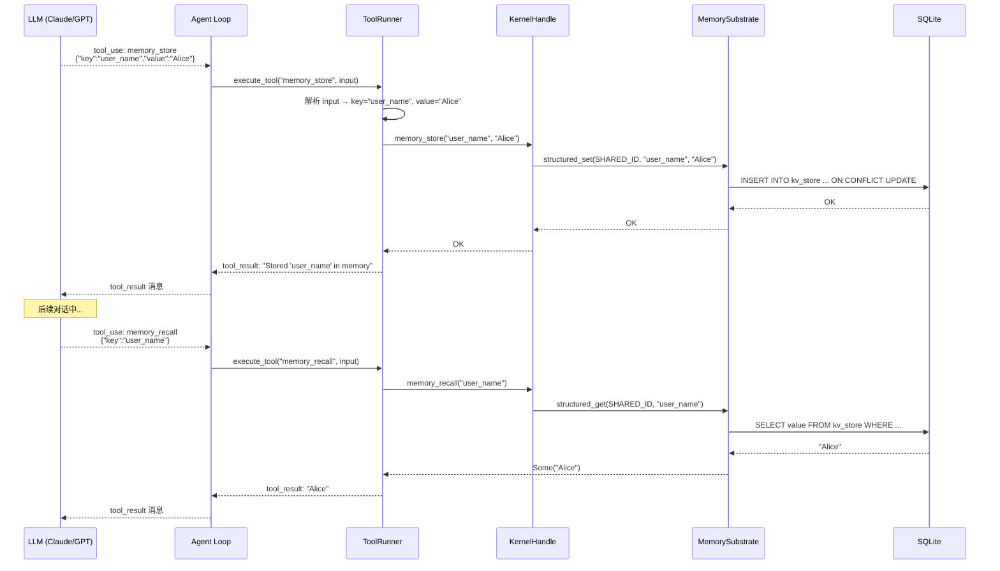
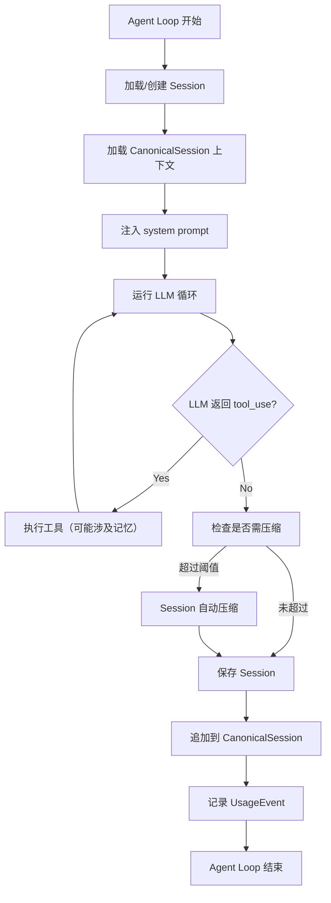

# 07 - Agent 工具层对接记忆系统

## 架构层次

Agent 通过 **工具（Tool）** 与记忆系统交互。工具定义在 `openfang-runtime` 中，通过 `KernelHandle` trait 调用 `openfang-kernel`，再委托到 `MemorySubstrate`。



## 记忆相关工具清单

| 工具名 | 功能 | 必填参数 | 可选参数 |
|--------|------|---------|---------|
| `memory_store` | 存储 KV 到共享记忆 | `key`, `value` | — |
| `memory_recall` | 按 key 从共享记忆检索 | `key` | — |
| `knowledge_add_entity` | 添加知识图谱实体 | `name`, `entity_type` | `properties` |
| `knowledge_add_relation` | 添加实体间关系 | `source`, `relation`, `target` | `confidence`, `properties` |
| `knowledge_query` | 查询知识图谱 | — | `source`, `relation`, `target` |

## 工具定义（ToolDefinition）

### memory_store

```json
{
  "name": "memory_store",
  "description": "Store a value in shared memory accessible by all agents. Use this to save important information, preferences, or state that should persist across conversations.",
  "parameters": {
    "type": "object",
    "properties": {
      "key": {
        "type": "string",
        "description": "The key to store the value under"
      },
      "value": {
        "type": "string",
        "description": "The value to store (will be saved as JSON)"
      }
    },
    "required": ["key", "value"]
  }
}
```

### memory_recall

```json
{
  "name": "memory_recall",
  "description": "Recall a value from shared memory by key. Use this to retrieve previously stored information.",
  "parameters": {
    "type": "object",
    "properties": {
      "key": {
        "type": "string",
        "description": "The key to look up"
      }
    },
    "required": ["key"]
  }
}
```

### knowledge_add_entity

```json
{
  "name": "knowledge_add_entity",
  "description": "Add an entity to the knowledge graph. Entities represent people, organizations, projects, concepts, etc.",
  "parameters": {
    "type": "object",
    "properties": {
      "name": { "type": "string", "description": "Entity name" },
      "entity_type": {
        "type": "string",
        "enum": ["Person", "Organization", "Project", "Concept", "Event", "Location", "Document", "Tool"],
        "description": "Type of entity"
      },
      "properties": {
        "type": "object",
        "description": "Additional properties as key-value pairs"
      }
    },
    "required": ["name", "entity_type"]
  }
}
```

### knowledge_add_relation

```json
{
  "name": "knowledge_add_relation",
  "description": "Add a relation between two entities in the knowledge graph.",
  "parameters": {
    "type": "object",
    "properties": {
      "source": { "type": "string", "description": "Source entity name or ID" },
      "relation": {
        "type": "string",
        "enum": ["WorksAt", "KnowsAbout", "RelatedTo", "DependsOn", "OwnedBy", "CreatedBy", "LocatedIn", "PartOf", "Uses", "Produces"],
        "description": "Relation type"
      },
      "target": { "type": "string", "description": "Target entity name or ID" },
      "confidence": { "type": "number", "description": "Confidence score 0.0-1.0" },
      "properties": { "type": "object", "description": "Additional properties" }
    },
    "required": ["source", "relation", "target"]
  }
}
```

### knowledge_query

```json
{
  "name": "knowledge_query",
  "description": "Query the knowledge graph. Returns entities and their relationships matching the pattern.",
  "parameters": {
    "type": "object",
    "properties": {
      "source": { "type": "string", "description": "Source entity name/ID filter" },
      "relation": { "type": "string", "description": "Relation type filter" },
      "target": { "type": "string", "description": "Target entity name/ID filter" }
    }
  }
}
```

## KernelHandle Trait（桥接接口）

`KernelHandle` 定义在 `openfang-runtime` 中，由 `openfang-kernel` 实现。这种设计避免了 runtime → kernel 的循环依赖。

```rust
pub trait KernelHandle: Send + Sync {
    // KV 记忆
    fn memory_store(&self, key: &str, value: serde_json::Value) -> Result<(), String>;
    fn memory_recall(&self, key: &str) -> Result<Option<serde_json::Value>, String>;

    // 知识图谱
    async fn knowledge_add_entity(&self, entity: Entity) -> Result<String, String>;
    async fn knowledge_add_relation(&self, relation: Relation) -> Result<String, String>;
    async fn knowledge_query(&self, pattern: GraphPattern) -> Result<Vec<GraphMatch>, String>;

    // ... 其他非记忆相关方法
}
```

### Kernel 端实现

```rust
// openfang-kernel 中
impl KernelHandle for OpenFangKernel {
    fn memory_store(&self, key: &str, value: Value) -> Result<(), String> {
        // 使用共享 Agent ID (00000000-...-01) → 全局命名空间
        self.memory.structured_set(SHARED_AGENT_ID, key, value)
            .map_err(|e| e.to_string())
    }

    fn memory_recall(&self, key: &str) -> Result<Option<Value>, String> {
        self.memory.structured_get(SHARED_AGENT_ID, key)
            .map_err(|e| e.to_string())
    }
}
```

## 工具调用全流程



## 能力权限控制

工具调用受 **Capability** 系统约束：

```rust
pub enum Capability {
    ToolInvoke(String),   // 允许调用特定工具
    ToolAll,              // 允许调用所有工具
    // ...
}
```

Agent manifest 中声明所需能力：

```toml
[capabilities]
tools = ["memory_store", "memory_recall", "knowledge_add_entity"]
```

未声明的工具不会出现在 LLM 可用工具列表中。

## Agent Loop 中记忆的自动管理

除了工具调用外，Agent Loop 还有自动的记忆管理行为：



关键自动行为：
1. **启动时**：从 CanonicalSession 提取上下文摘要注入 system prompt
2. **结束时**：将新消息追加到 CanonicalSession
3. **超限时**：自动压缩 Session（block-aware compaction）
4. **每次调用**：记录 UsageEvent
