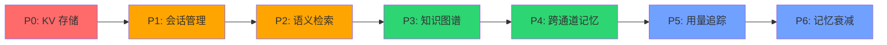
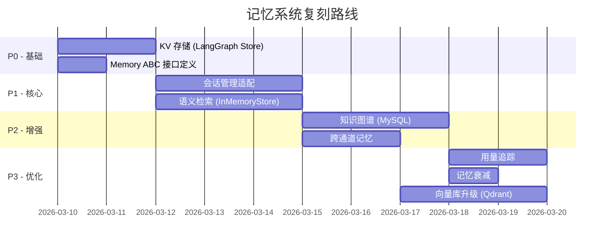

# 08 - 复刻方案与适配建议

## 目标

将 OpenFang（Rust/SQLite）的记忆系统复刻到我们的项目（Python/LangGraph + MySQL）。

## 原版 vs 适配对照

| 维度 | OpenFang 原版 | 我们的适配方案 |
|------|--------------|---------------|
| 语言 | Rust | Python 3.11+ |
| 存储 | SQLite (单文件) | MySQL (已有) 或 SQLite |
| 异步框架 | Tokio | asyncio |
| 序列化 | MessagePack + JSON | JSON (统一) |
| 向量搜索 | SQLite BLOB + 内存排序 | LangGraph Store / 外部向量库 |
| Agent 框架 | 自研 Agent Loop | LangGraph |
| 工具系统 | 自研 ToolRunner | LangGraph ToolNode |

## 复刻优先级



## 模块级复刻方案

### 1. Memory Trait → Python ABC

```python
from abc import ABC, abstractmethod
from typing import Optional
from datetime import datetime

class MemoryStore(ABC):
    """统一记忆接口 — 对应 OpenFang Memory trait"""

    # === KV 存储 ===
    @abstractmethod
    async def get(self, agent_id: str, key: str) -> Optional[dict]:
        ...

    @abstractmethod
    async def set(self, agent_id: str, key: str, value: dict) -> None:
        ...

    @abstractmethod
    async def delete(self, agent_id: str, key: str) -> None:
        ...

    # === 语义记忆 ===
    @abstractmethod
    async def remember(self, agent_id: str, content: str,
                       source: str, scope: str = "episodic",
                       metadata: dict = None) -> str:
        """存储记忆片段，返回 memory_id"""
        ...

    @abstractmethod
    async def recall(self, query: str, limit: int = 10,
                     agent_id: str = None,
                     min_confidence: float = None) -> list[dict]:
        """语义检索记忆"""
        ...

    @abstractmethod
    async def forget(self, memory_id: str) -> None:
        """软删除记忆"""
        ...

    # === 知识图谱 ===
    @abstractmethod
    async def add_entity(self, name: str, entity_type: str,
                         properties: dict = None) -> str:
        ...

    @abstractmethod
    async def add_relation(self, source: str, relation: str,
                           target: str, confidence: float = 1.0) -> str:
        ...

    @abstractmethod
    async def query_graph(self, source: str = None,
                          relation: str = None,
                          target: str = None) -> list[dict]:
        ...
```

### 2. LangGraph Store 适配

LangGraph 已内置 [Store API](https://langchain-ai.github.io/langgraph/concepts/persistence/#memory-store)，可直接映射 KV 存储层：

```python
from langgraph.store.base import BaseStore

class LangGraphMemoryAdapter(MemoryStore):
    """将 LangGraph Store 适配为我们的 MemoryStore 接口"""

    def __init__(self, store: BaseStore):
        self.store = store

    async def get(self, agent_id: str, key: str) -> Optional[dict]:
        namespace = ("memories", agent_id)
        item = await self.store.aget(namespace, key)
        return item.value if item else None

    async def set(self, agent_id: str, key: str, value: dict) -> None:
        namespace = ("memories", agent_id)
        await self.store.aput(namespace, key, value)

    async def delete(self, agent_id: str, key: str) -> None:
        namespace = ("memories", agent_id)
        await self.store.adelete(namespace, key)
```

### 3. MySQL Schema（适配版）

```sql
-- KV 存储
CREATE TABLE memory_kv (
    agent_id    VARCHAR(36) NOT NULL,
    `key`       VARCHAR(255) NOT NULL,
    value       JSON NOT NULL,
    version     INT NOT NULL DEFAULT 1,
    updated_at  DATETIME NOT NULL DEFAULT CURRENT_TIMESTAMP ON UPDATE CURRENT_TIMESTAMP,
    PRIMARY KEY (agent_id, `key`)
) ENGINE=InnoDB DEFAULT CHARSET=utf8mb4;

-- 语义记忆
CREATE TABLE memory_fragments (
    id          VARCHAR(36) PRIMARY KEY,
    agent_id    VARCHAR(36) NOT NULL,
    content     TEXT NOT NULL,
    source      ENUM('conversation','document','observation','inference','user_provided','system') NOT NULL,
    scope       VARCHAR(50) NOT NULL DEFAULT 'episodic',
    confidence  FLOAT NOT NULL DEFAULT 1.0,
    metadata    JSON,
    embedding   BLOB,                     -- 向量嵌入
    access_count INT NOT NULL DEFAULT 0,
    deleted     TINYINT NOT NULL DEFAULT 0,
    created_at  DATETIME NOT NULL DEFAULT CURRENT_TIMESTAMP,
    accessed_at DATETIME NOT NULL DEFAULT CURRENT_TIMESTAMP,
    INDEX idx_agent (agent_id),
    INDEX idx_scope (scope),
    INDEX idx_confidence (confidence)
) ENGINE=InnoDB DEFAULT CHARSET=utf8mb4;

-- 知识图谱
CREATE TABLE knowledge_entities (
    id          VARCHAR(36) PRIMARY KEY,
    entity_type VARCHAR(50) NOT NULL,
    name        VARCHAR(255) NOT NULL,
    properties  JSON,
    created_at  DATETIME NOT NULL DEFAULT CURRENT_TIMESTAMP,
    updated_at  DATETIME NOT NULL DEFAULT CURRENT_TIMESTAMP ON UPDATE CURRENT_TIMESTAMP,
    INDEX idx_name (name),
    INDEX idx_type (entity_type)
) ENGINE=InnoDB DEFAULT CHARSET=utf8mb4;

CREATE TABLE knowledge_relations (
    id              VARCHAR(36) PRIMARY KEY,
    source_entity   VARCHAR(36) NOT NULL,
    relation_type   VARCHAR(50) NOT NULL,
    target_entity   VARCHAR(36) NOT NULL,
    properties      JSON,
    confidence      FLOAT NOT NULL DEFAULT 1.0,
    created_at      DATETIME NOT NULL DEFAULT CURRENT_TIMESTAMP,
    INDEX idx_source (source_entity),
    INDEX idx_target (target_entity),
    INDEX idx_type (relation_type),
    FOREIGN KEY (source_entity) REFERENCES knowledge_entities(id),
    FOREIGN KEY (target_entity) REFERENCES knowledge_entities(id)
) ENGINE=InnoDB DEFAULT CHARSET=utf8mb4;

-- 跨通道会话
CREATE TABLE canonical_sessions (
    agent_id            VARCHAR(36) PRIMARY KEY,
    messages            JSON NOT NULL,
    compaction_cursor   INT NOT NULL DEFAULT 0,
    compacted_summary   TEXT,
    updated_at          DATETIME NOT NULL DEFAULT CURRENT_TIMESTAMP ON UPDATE CURRENT_TIMESTAMP
) ENGINE=InnoDB DEFAULT CHARSET=utf8mb4;

-- 用量追踪
CREATE TABLE usage_events (
    id            VARCHAR(36) PRIMARY KEY,
    agent_id      VARCHAR(36) NOT NULL,
    model         VARCHAR(100) NOT NULL,
    input_tokens  INT NOT NULL DEFAULT 0,
    output_tokens INT NOT NULL DEFAULT 0,
    cost_usd      DECIMAL(10,6) NOT NULL DEFAULT 0,
    tool_calls    INT NOT NULL DEFAULT 0,
    created_at    DATETIME NOT NULL DEFAULT CURRENT_TIMESTAMP,
    INDEX idx_agent_time (agent_id, created_at),
    INDEX idx_time (created_at)
) ENGINE=InnoDB DEFAULT CHARSET=utf8mb4;
```

### 4. 工具定义（LangGraph）

```python
from langchain_core.tools import tool

@tool
def memory_store(key: str, value: str) -> str:
    """Store a value in shared memory accessible across conversations.
    Use this to save important information, user preferences, or state.

    Args:
        key: The key to store the value under
        value: The value to store
    """
    # 通过 config 获取 store 实例
    ...

@tool
def memory_recall(key: str) -> str:
    """Recall a previously stored value from shared memory.

    Args:
        key: The key to look up
    """
    ...

@tool
def knowledge_add_entity(name: str, entity_type: str,
                         properties: dict = None) -> str:
    """Add an entity to the knowledge graph.

    Args:
        name: Entity name (e.g. "Alice")
        entity_type: One of Person/Organization/Project/Concept/Event/Location
        properties: Optional key-value properties
    """
    ...

@tool
def knowledge_query(source: str = None, relation: str = None,
                    target: str = None) -> str:
    """Query the knowledge graph for entity relationships.

    Args:
        source: Source entity name/ID (optional)
        relation: Relation type filter (optional)
        target: Target entity name/ID (optional)
    """
    ...
```

### 5. 向量搜索适配

**方案 A：LangGraph InMemoryStore + 语义搜索**（推荐起步）
```python
from langgraph.store.memory import InMemoryStore

store = InMemoryStore(
    index={
        "dims": 1536,
        "embed": embeddings_model,  # OpenAI embeddings
    }
)
```

**方案 B：MySQL + 独立向量库**（生产环境）
```python
# 文本数据存 MySQL，向量存 Qdrant/Milvus
class HybridMemoryStore(MemoryStore):
    def __init__(self, mysql_pool, vector_store):
        self.mysql = mysql_pool
        self.vectors = vector_store

    async def remember(self, agent_id, content, source, scope, metadata):
        # 1. 生成嵌入
        embedding = await self.embedder.embed_one(content)
        # 2. 存入 MySQL
        memory_id = await self.mysql.insert_fragment(...)
        # 3. 存入向量库
        await self.vectors.upsert(memory_id, embedding, metadata)
        return memory_id

    async def recall(self, query, limit, agent_id=None):
        # 1. 向量检索 top-k
        embedding = await self.embedder.embed_one(query)
        candidates = await self.vectors.search(embedding, limit * 3)
        # 2. 从 MySQL 加载完整片段
        fragments = await self.mysql.get_fragments(candidate_ids)
        # 3. 过滤（agent_id, confidence, deleted）
        # 4. 更新访问计数
        return fragments[:limit]
```

## 实施路线图



## 关键移植决策清单

| # | 决策项 | OpenFang 做法 | 建议做法 | 理由 |
|---|--------|--------------|---------|------|
| 1 | 存储引擎 | SQLite 单文件 | MySQL（已有） | 已有基础设施 |
| 2 | KV 存储 | 自建 kv_store 表 | LangGraph Store | 框架原生支持 |
| 3 | 向量搜索 | BLOB + 内存排序 | InMemoryStore → Qdrant | 渐进升级 |
| 4 | 序列化 | MessagePack | JSON | Python 生态更友好 |
| 5 | 共享命名空间 | 固定 agent_id | namespace = ("shared",) | LangGraph 范式 |
| 6 | 跨通道记忆 | CanonicalSession | LangGraph cross-thread store | 待评估 |
| 7 | 记忆衰减 | 7天+decay_rate | 可选：定时任务 | 非核心，后期实现 |
| 8 | 知识图谱 | SQLite 三表 JOIN | MySQL（同构移植） | 结构简单可直接移植 |
| 9 | LLM 摘要压缩 | runtime compactor | LangGraph summarizer | 需自建 |
| 10 | 工具权限 | Capability 枚举 | LangGraph tool filtering | 按需实现 |
