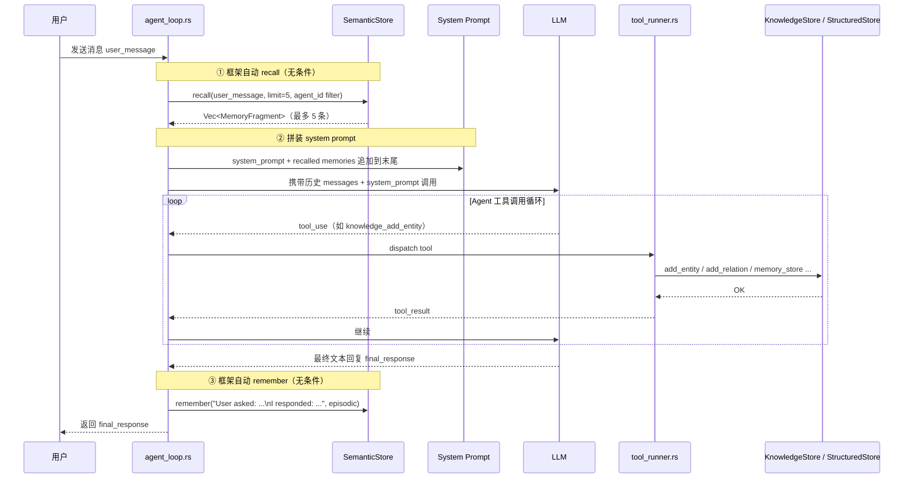

# 09 - Agent Loop 运行时记忆触发机制

> 本文补充现有文档未覆盖的核心问题：**记忆读写在运行时是如何被触发的？谁触发？何时触发？**

---

## 关键结论

| 操作 | 触发时机 | 触发方 | Agent 是否感知 |
|------|---------|--------|--------------|
| SemanticStore `recall` | 每次用户发消息，LLM 调用前 | 框架自动 | 否 |
| SemanticStore `remember` | 每次 Agent 回复完成后 | 框架自动 | 否 |
| ConsolidationEngine `consolidate` | 后台定时任务 | 框架自动 | 否 |
| KnowledgeStore `add_entity/add_relation` | Agent 主动调 `knowledge_add_entity` 工具 | **Agent 决定** | 是 |
| StructuredStore `memory_store/recall` | Agent 主动调 `memory_store`/`memory_recall` 工具 | **Agent 决定** | 是 |

---

## Agent Loop 完整触发时序



---

## ① recall — 每轮 100% 触发

**代码位置**：`openfang-runtime/src/agent_loop.rs`，`run_agent_loop()` 函数开头。

```rust
// 无任何条件判断，直接执行
let memories = if let Some(emb) = embedding_driver {
    // 有 embedding driver：向量相似度召回
    match emb.embed_one(user_message).await {
        Ok(query_vec) => memory.recall_with_embedding_async(
            user_message, 5,
            Some(MemoryFilter { agent_id: Some(session.agent_id), ..Default::default() }),
            Some(&query_vec),
        ).await.unwrap_or_default(),
        Err(e) => {
            warn!("Embedding recall failed, falling back to text search: {e}");
            memory.recall(user_message, 5, ...).await.unwrap_or_default()
        }
    }
} else {
    // 无 embedding driver：LIKE 文本匹配召回
    memory.recall(user_message, 5, ...).await.unwrap_or_default()
};
```

### 重要细节：min_confidence 未设置

recall 时的 `MemoryFilter` 只设置了 `agent_id`，**没有 `min_confidence`**：

```rust
Some(MemoryFilter {
    agent_id: Some(session.agent_id),
    ..Default::default()   // min_confidence = None
})
```

`min_confidence = None` 意味着 SQL 中**不加 confidence 过滤条件**，`confidence = 0.1`（衰减到最低值）的记忆也有可能被召回并注入 context。  
这是一个潜在的噪音风险：长期未访问的低质量记忆仍可能出现在 context 中。

### 召回结果的注入方式

召回结果追加到 system prompt 末尾（不是作为独立 message）：

```rust
if !memories.is_empty() {
    system_prompt.push_str("\n\n");
    system_prompt.push_str(&crate::prompt_builder::build_memory_section(&mem_pairs));
}
```

---

## ② remember — 每轮 100% 触发

**代码位置**：`agent_loop.rs`，`run_agent_loop()` 成功返回前。

```rust
// 固定格式，无条件写入
let interaction_text = format!(
    "User asked: {}\nI responded: {}",
    user_message, final_response
);
memory.remember_with_embedding_async(
    session.agent_id,
    &interaction_text,
    MemorySource::Conversation,
    "episodic",          // scope 固定为 episodic
    HashMap::new(),      // 不附加 metadata
    Some(&vec),
).await;
```

### 固定写入规律

每轮对话在 `memories` 表产生**恰好 1 条**新记录：

- `source` 固定为 `Conversation`
- `scope` 固定为 `episodic`
- `confidence` 初始为 `1.0`（`remember` 的 SQL INSERT 硬编码）
- 内容格式固定为 `User asked: ...\nI responded: ...`
- Agent 无法控制是否写入、写什么

---

## ③ 为什么衰减机制是必须的

`recall` 和 `remember` 每轮都执行意味着 `memories` 表**无限单调增长**：

```
第 1 轮 → 1 条 episodic 记录（confidence=1.0）
第 2 轮 → 2 条 episodic 记录
...
第 100 轮 → 100 条 episodic 记录
```

没有衰减的话：
1. 召回的 5 条越来越难以代表"当前相关"的内容（旧记录也会被随机召回）
2. 数据库无限膨胀

`ConsolidationEngine` 定期将 **7 天未访问** 的记忆 confidence 乘以 `(1 - decay_rate)`，最低降到 `0.1`。这使旧的 episodic 记忆在向量召回的排序中竞争力下降（被更新的、访问更多的记忆排在前面）。

> 但注意：因为没有 `min_confidence` 过滤，`0.1` 的记忆被 LIKE 召回时不会被阻挡。

---

## 框架自动 vs Agent 主动的分界线

### 框架全自动（Agent 完全无感知）

```
每次消息到来
  └─► recall(user_message, 5) → 注入 system prompt

每次回复完成  
  └─► remember("User asked: X\nI responded: Y", episodic)

后台定时（BackgroundWorker）
  └─► consolidate() → decay confidence of memories.accessed_at < now-7days
```

### Agent 主动调工具（Agent 决定是否执行）

```
Agent 判断"这个信息值得结构化存储"
  └─► knowledge_add_entity(name, entity_type, properties)
  └─► knowledge_add_relation(source, relation, target)
  └─► knowledge_query(pattern)

Agent 判断"这个键值需要跨会话保留"
  └─► memory_store(key, value)
  └─► memory_recall(key)
```

知识图谱和 KV 存储的**写入质量和时机由 Agent 的判断决定**，framework 不会自动填充 `entities`/`relations`/`kv_store`。

---

## 与 nanobot 的对比

| 维度 | nanobot | openfang |
|------|---------|---------|
| 短期记忆 | session.messages（内存列表） | SessionStore（SQLite BLOB） |
| 长期记忆写入 | LLM 主动提炼 → 写 MEMORY.md | 框架自动写 episodic memories |
| 长期记忆召回 | 全量注入 context | 语义召回最多 5 条 |
| 遗忘机制 | 无，靠 LLM 整合覆盖 | confidence 衰减 |
| 结构化关系 | 无 | 知识图谱（Agent 主动） |
| 触发方式 | 阈值触发 + `/new` 命令 | 每轮自动 + Agent 主动 |

nanobot 的长期记忆**依赖 LLM 来决定写什么**（LLM 调用 `save_memory` tool），质量更高但成本也更高。openfang 是**框架无脑全量写，靠衰减来降噪**，吞吐更高但 memories 表噪音更多。
